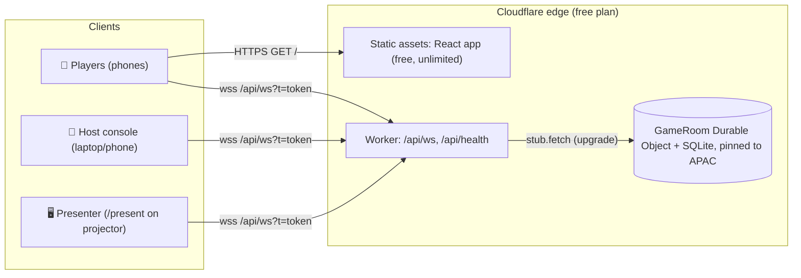
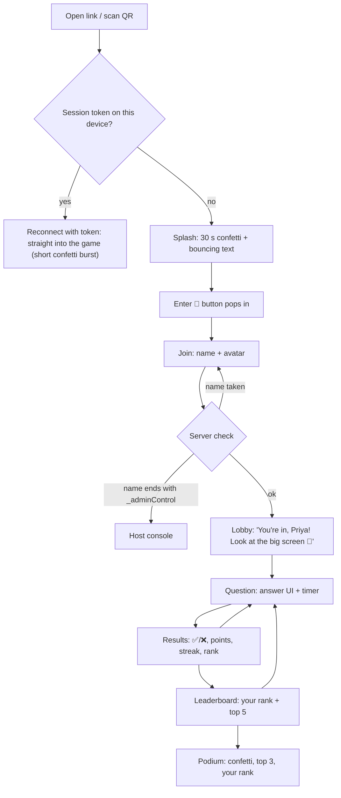
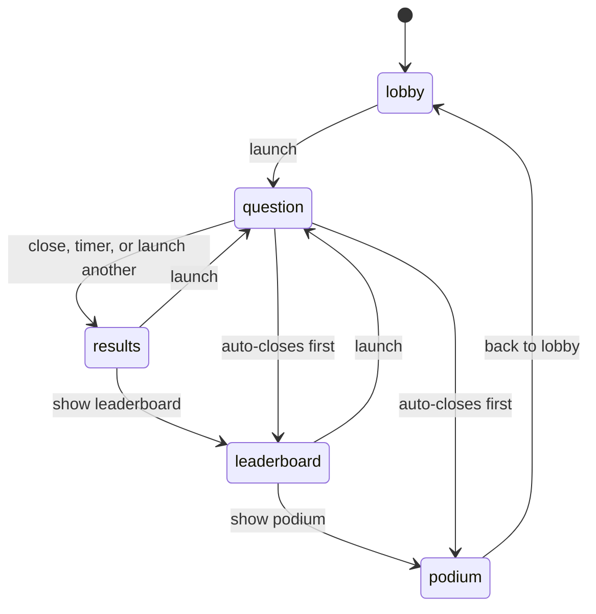

# CorpFun Day 🥳 — Live Icebreaker Web App · Implementation Plan

> Give this file to a coding agent. It has everything needed to build, run, deploy and operate the app starting from an empty folder: the stack, the architecture, the wire protocol, full source for the backend and client core, UI specs, deployment steps and an event-day runbook.
>
> Research date: 2026-09-27. Package versions and free-tier numbers were checked on that date.

---

## 0. TL;DR

| Topic | Decision |
|---|---|
| What | A mobile-first icebreaker game that people join from a shared link or QR code: polls, quiz, word cloud, open text, rating, guess-the-number. It has a big-screen **presenter view** and a **host console**, and is used once for about 30 minutes before a leadership townhall. |
| Login | No auth. A player types a name and a profile is created for it (score, avatar, streak). A name ending in `_adminControl` opens the **host console** instead; the server does this check. |
| Splash | For 30 seconds, fast confetti that keeps switching styles plays while the text `Yayyyyyyyy, itssss CorpFun Dayyyy 🥳🤩` bounces around the screen like the old DVD logo. After that the **Enter** button appears. |
| Frontend | React 19 + TypeScript + Vite 8 (Rolldown) + Tailwind CSS 4, `canvas-confetti`, `motion`, `qrcode.react`, `partysocket`. |
| Realtime + storage | A single Cloudflare **Durable Object** with SQLite storage holds all game state. It talks over WebSockets using the Hibernation API. |
| Hosting | Cloudflare **Workers Free** plan. Static assets, the Worker and the Durable Object ship in one deploy to `https://cf-india-day.<your-subdomain>.workers.dev`. |
| Deploy | From your laptop: run `npx wrangler login` once, then `npm run deploy`. The code lives in your personal GitHub repo; auto-deploy through Workers Builds is optional. |
| Cost | $0, and no card is needed. About 400 players use well under half of every daily free limit, and under 10 % of the request limits (see §17). |
| Tests | None, as requested. A manual rehearsal checklist (§21.2) replaces them. |

---

## 1. Goals, constraints, non-goals

**Must have (from the brief)**

1. The app opens on a phone from a shared link (and a QR code on the big screen).
2. There is no authentication. "Login" is honorary: the player enters a name, and a profile with that name exists from then on.
3. A name with the suffix `_adminControl` (for example `tushar_adminControl`) loads the **admin/host interface** instead of the player UI.
4. Everyone gets a **30 s splash**: fast confetti that keeps changing, plus bouncing animated text reading exactly `Yayyyyyyyy, itssss CorpFun Dayyyy 🥳🤩`. Only then does the Enter/login button appear.
5. The host can **add questions**, and results can be shown in **several output formats**, which the host can switch live.
6. Updates are realtime, fast and reliable for the whole event, and nobody gets blocked.
7. Everything is free. Deployment can be done from the local machine, and the code is pushed to a personal GitHub account.
8. The code stays simple and minimal, with **no test files**.

**Non-goals**

Accounts/SSO, PII, analytics, long-term storage, multiple rooms or events, translations, native apps, and automated tests.

**Assumptions**

- Around 100–500 attendees, mostly in India, on phones (iOS Safari, Android Chrome, and the Teams/Outlook in-app browsers).
- One host and one projector laptop.
- Mobile data or venue Wi-Fi.

---

## 2. Research summary

### 2.1 How popular live-engagement apps do it (and what we borrow)

| Product | Pattern observed | What this app adopts |
|---|---|---|
| **Kahoot!** | The host paces each question on a shared screen while players answer on their phones. A correct answer earns speed-based points, `points = round(1000 × (1 − (responseTime ÷ timer) ÷ 2))`, so the range is 500–1000. It also has answer streaks, a leaderboard between questions, and a podium at the end. | A **Quiz** type with the same base formula, a streak bonus, and **Leaderboard** and **Podium** phases. |
| **Mentimeter** | Many interaction types (multiple choice, word cloud, open ended, scales, ranking, Q&A, quiz). One question can be shown several ways (bars, donut, pie, dots). People join by code or QR, and the audience can send reactions. | 6 question types, 14 switchable **display formats**, QR join, and **emoji reactions** that float on the big screen. |
| **Slido** | Polls, quiz, word cloud, rating, open text and ranking, plus moderated Q&A with upvotes. Presenter mode is separate from admin mode. | A presenter/host split, **moderation** (approve or hide entries), and Q&A as a stretch goal. |
| **AhaSlides** | Icebreaker templates, a spinner wheel, team play. | A built-in **starter pack** of icebreaker questions and a **Lucky Draw** name picker. |
| **Crowdpurr** | The presentation view shows a QR code and URL for latecomers, with real-time results, a live leaderboard, and everything in the browser with no app. | A **corner QR** on every presenter screen and a live leaderboard. |

### 2.2 Realtime + storage options on free tiers

| Option (free tier) | Concurrent realtime users | Other limits that matter | Verdict |
|---|---|---|---|
| **Cloudflare Workers + Durable Objects (SQLite)** | Thousands of WebSockets per object with Hibernation; no free-tier connection cap is documented | 100k DO requests/day (incoming WS messages billed 20:1, outgoing and protocol pings free), 13,000 GB-s/day, 5M rows read/day, 100k rows written/day, 5 GB; static asset requests are free and unlimited | ✅ **Chosen** |
| Firebase Realtime Database (Spark) | **100 simultaneous connections** | — | ❌ The 101st person is blocked |
| Cloud Firestore (free) | Listeners are fine | 50k reads/day and 20k writes/day, and every listener update is a read. 300 phones × 100 updates = 30k reads in a single question | ❌ The quota runs out mid-game |
| Supabase (Free) | **200** concurrent Realtime connections, 100 msgs/s | Projects pause after a week of inactivity | ❌ Too small for a townhall |
| Pusher / Ably free sandboxes | about 100–200 connections | Message caps | ❌ |
| Node + Socket.IO on a free VM (Render etc.) | OK | Sleeps when idle (about 1 min cold start), one region far from India | ❌ Risky on event day |

**Why Durable Objects fit "fast, reliable, no hiccups":**

- A single-threaded object is the only writer. That means no race conditions, no eventual-consistency surprises, and no double-scored answers.
- Clients connect to Cloudflare's edge next to them, and the object is pinned near India with `locationHint: "apac"`.
- The Hibernation API keeps thousands of sockets open while the object sleeps between events, so idle time costs nothing.
- State lives in the object's SQLite database, so it survives restarts. Clients auto-reconnect and resume with a saved token.
- Static site, API and database are one deployable unit, one command and one free account.

### 2.3 Hosting options

GitHub Pages, Netlify and Vercel can serve the static React app for free, but none of them can host a long-lived WebSocket server. We would need a second realtime provider, and §2.2 already rules those out. **Cloudflare Workers with Static Assets** serves the app and the realtime backend from the same origin (no CORS, one CSP), deploys from the laptop with a single command, and gives a free `*.workers.dev` HTTPS URL.

---

## 3. Tech stack

| Layer | Package | Version | Why |
|---|---|---|---|
| Runtime (dev machine) | Node.js | **≥ 22.12** | Vite 8 needs `^20.19 \|\| >=22.12`; Wrangler needs `>=22` |
| Language | `typescript` | `~6.0.2` | Same version as the current `create-vite` template. TS 7 exists, but the tooling around it is newer. |
| Bundler / dev server | `vite` | `^8.3.0` | Rolldown-based: the fastest builds and HMR. Has an official Cloudflare plugin. |
| React plugin | `@vitejs/plugin-react` | `^6.1.1` | Oxc-based Fast Refresh with no Babel |
| UI | `react`, `react-dom` | `^19.3.0` | |
| Styling | `tailwindcss`, `@tailwindcss/vite` | `^4.3.3` | Zero-config and a tiny CSS output |
| Animation | `motion` | `^13.4.0` | Layout animations (leaderboard reordering, word cloud reflow) and `AnimatePresence` |
| Confetti | `canvas-confetti` + `@types/canvas-confetti` | `^1.9.4` / `^1.9.0` | About 10 kB, renders on an OffscreenCanvas in a worker, supports emoji shapes |
| QR code | `qrcode.react` | `^4.2.0` | `QRCodeSVG` |
| Socket | `partysocket` | `^1.3.0` | Reconnecting WebSocket from Cloudflare/PartyKit with a URL provider function |
| Font | `@fontsource-variable/baloo-2` | `^5.3.0` | Playful display font designed in India, self-hosted (no Google Fonts call) |
| Cloudflare dev/build | `@cloudflare/vite-plugin` | `^1.56.0` | Runs the Worker and the Durable Object inside `workerd` during `vite dev` and emits the deploy output |
| Cloudflare CLI | `wrangler` | `^4.135.0` | Deploy, type generation, live logs (`wrangler tail`) |

There is no router library, no state library and no chart library. The app has three screens, one store (`useSyncExternalStore`) and hand-written SVG/CSS charts, which keeps the phone bundle small.

---

## 4. Architecture



- **One room = one Durable Object instance**, addressed as `env.GAME.idFromName("cf-india-day")`. Every socket from every device ends up in this object, and it is the single source of truth.
- **Worker** (`worker/index.ts`): routes `/api/ws` WebSocket upgrades to the object. Everything else is a static asset (SPA fallback to `index.html`).
- **Durable Object** (`worker/game-room.ts`): accepts sockets through `ctx.acceptWebSocket()` (Hibernation API), validates every message, stores state in SQLite, computes results and scores, and fans updates out.
- **Clients**: one React app. After joining, the server decides whether the user is a *player* or a *host*. `/present` renders the read-only big-screen view for a host session.

### 4.1 Key design decisions

| # | Decision | Reason |
|---|---|---|
| D1 | Single DO, `get(id, { locationHint: "apac" })` | Strong consistency and a single writer; the object is created near India on first use. |
| D2 | Hibernation WebSocket API, with all durable state in DO SQLite and in-memory caches rebuilt in the constructor | Survives eviction and restarts. Idle time is not billed. |
| D3 | Server decides roles at join time, and every host action is checked against the socket's attachment | The client can't make itself host by editing JS. |
| D4 | The session token travels in the WebSocket URL (`/api/ws?t=…`) and is checked during the upgrade | Reconnects are transparent, and messages queued while offline are authenticated as soon as the socket opens. |
| D5 | Fan-out has two tiers: phase changes send a **personalised `view`** to every phone immediately; frequent changes (answers, joins) set dirty flags that are flushed every **250 ms** as one shared `live` message to phones and one `admin` message to host screens | A burst of 400 answers costs a handful of broadcasts instead of 160,000 sends. |
| D6 | Answers are idempotent through a client-generated `ref` | Safe to retry after a network blip, so nothing gets double-counted. |
| D7 | The server enforces timers with a DO **alarm**; phones show a countdown corrected by the server clock offset | Fair even if a phone's clock is wrong; questions auto-close even if the host's laptop sleeps. |
| D8 | The presenter is just another host session on `/present` | Nothing extra to secure. It can run on the projector laptop while the host drives from a phone. |
| D9 | Host console and presenter are `React.lazy` chunks | Phones only download the player bundle. |
| D10 | Custom SVG/CSS visualisations | No chart library weight, and full control of animation. |
| D11 | Splash confetti runs in canvas-confetti's worker (OffscreenCanvas), and the bouncing text is pure CSS transforms (compositor thread) | Smooth on low-end Android phones. |
| D12 | Returning players (token saved on the device) skip the 30 s splash and rejoin the game directly | A reload or phone lock during the game must never cost someone a question. This is the only deliberate deviation from "everyone sees 30 s". |

---

## 5. Features

### 5.1 Core (from the brief)

- **Splash**: 30 s of confetti that switches mode every ~2.6 s (side cannons, fireworks, emoji rain, star bursts, glitter snow, tricolour streams), plus DVD-style bouncing text with a per-letter wave, wobble and colour cycling. When it ends there's a finale burst and the **Enter 🚀** button pops in.
- **Honorary login**: name (2–20 characters) plus an optional avatar emoji. The profile persists on the server (score, rank, streak). Saying the same name on the same device resumes the profile; a name that someone else already has on another device is refused politely ("add an initial").
- **Admin by suffix**: a name ending in `_adminControl` (case-insensitive) opens the host console. The suffix is stripped for display ("tushar"). Hosts don't appear on leaderboards and can be logged in on several devices at once.
- **Add questions, many output formats**:

| Type | Player input | Display formats (host switches live) | Scoring |
|---|---|---|---|
| `poll` | Tap one option (can change the vote until close) | `bars`, `columns`, `donut`, `bubbles`, `versus` (2 options only) | none |
| `quiz` | Tap one option (locked in) | `bars`, `columns`, `donut` (correct answer highlighted on reveal) | speed + streak |
| `wordcloud` | 1–3 short entries (≤ 25 chars) | `cloud`, `bubbles`, `list` | none |
| `open` | 1–3 texts (≤ 140 chars) | `wall` (sticky notes), `spotlight` (one at a time) | none |
| `scale` | Tap a rating (1–5 or 1–10, can change) | `histogram`, `gauge`, `average` | none |
| `number` | Type a number in [min, max] | `dots` (number line), `histogram`, `closest` | top-3 closest |

### 5.2 Add-ons included (they matter for a townhall)

- **Presenter screen** `/present`: a huge QR code and URL in the lobby, names popping in, a live count, then questions and results in big type. A corner QR is always visible for latecomers, and there is a fullscreen button.
- **Timers**: per question (0 = host closes manually), a **+15 s** button, and **"Close in 10 s"** for untimed questions.
- **Leaderboard** (top 10 with animated reordering) and **Podium** (3rd → 2nd → 1st reveal with confetti on every phone).
- **Emoji reactions** (❤️ 😂 🔥 👏 🎉 🤯) from phones float up the big screen. They are rate-limited and can be switched off.
- **Lucky Draw** 🎰: a slot-machine name shuffle on the big screen that lands on a random online player. The winner's phone lights up, and the same person isn't picked twice.
- **Moderation**: per-question "approve before showing" for word clouds and open text, a hide/unhide button on every entry, and kicking a player (their entries get hidden and their name stays blocked).
- **Starter pack** of 12 India/townhall icebreakers, plus **JSON export/import** as a backup of the questions.
- **Reliability UX**: keeps the phone screen awake (Wake Lock), shows a "Reconnecting…" banner, retries answers automatically, vibrates on each new question (Android), and resumes the session after a reload.
- **Answer feedback on phones**: ✅/❌, points earned, 🔥 streak, current rank.

### 5.3 Stretch ideas (NOT in scope; build only if there's time left)

Audience Q&A with upvotes for the leadership segment, team battles, presenter sound effects, CSV export of results, and a Hindi/English UI toggle.

---

## 6. User flows

### 6.1 Participant (phone)



The WebSocket connects **while the splash is still playing**, so by the time someone taps Enter, the TLS handshake and Durable Object wake-up have already happened and joining feels instant.

### 6.2 Host (console + presenter)

1. Before the event: open the link, enter `tushar_adminControl`, and the host console loads. Add questions or the starter pack, then **Export JSON** as a backup.
2. On the projector laptop: log in as host the same way and click **Open presenter ↗**, which opens `/present` in a new tab. Press **F** or click ⛶ for fullscreen.
3. Drive the game from the console (laptop or phone). Typical loop: **Start next ▶** → (timer or **Close ⏹**) → change format / **Leaderboard 🏆** → **Start next ▶**. Finish with **Podium 🥇** and optionally a **Lucky draw 🎰**.

### 6.3 Game phases (server state machine)



| Phase | Phones show | Presenter shows |
|---|---|---|
| `lobby` | "You're in" card, player count, edit name/avatar, reactions | Big QR + URL, count, names popping in |
| `question` | The question + answer UI + timer; after answering, "Locked in 🔒" (quiz) or the vote can still change (poll/scale) | Question, timer, answered count; live results if **Live results on screen** is on (default on, off for quiz/number) |
| `results` | Quiz/number: correct/incorrect + points + rank. Others: mini results or "Look at the big screen 👀" | Results in the chosen format; quiz shows the correct answer and the fastest correct player |
| `leaderboard` | "You're #12 · 3,450 pts" + top 5 | Top 10, animated |
| `podium` | Confetti, top 3, own rank ("YOU'RE #1 🏆" for winners) | 3rd → 2nd → 1st reveal + confetti |
| any + Lucky draw | Winner: full-screen "You've been picked!" After the reveal delay, everyone else sees a toast | Slot machine for 4.5 s, then the winner + confetti (overlay auto-hides after 15 s) |

### 6.4 Screen inventory

| Route / role | Screens |
|---|---|
| `/`, not joined | `Splash` → `Join` |
| `/`, player | `PlayerApp` → `PlayerLobby`, `AnswerChoice`, `AnswerText`, `AnswerScale`, `AnswerNumber`, `PlayerResult`, `PlayerRank`, `PlayerPodium`, overlay `DrawOverlay` |
| `/`, host | `AdminApp` → tabs **Live**, **Questions**, **People**, **More** (import/export, danger zone) + `QuestionEditor` modal + `TemplatesModal` |
| `/present`, host | `PresenterApp` → `LobbyScreen`, `QuestionScreen`, `ResultsScreen`, `LeaderboardScreen`, `PodiumScreen` + overlays `FloatingReactions`, `DrawOverlay`, `CornerQR` |
| `/present`, not host | "Log in as host on this device first" card with a link to `/` |

---

## 7. Project structure

```text
cf-india-day/
├─ PLAN.md                      ← this file
├─ package.json
├─ vite.config.ts
├─ wrangler.jsonc
├─ tsconfig.json                ← references app + worker projects
├─ tsconfig.app.json
├─ tsconfig.worker.json
├─ worker-configuration.d.ts    ← generated by `npm run cf-typegen` (commit it)
├─ index.html
├─ .gitignore
├─ public/
│  ├─ _headers                  ← security headers (applied in preview + production)
│  └─ favicon.svg
├─ shared/                      ← imported by BOTH worker and client
│  ├─ protocol.ts               ← types for state + messages
│  └─ constants.ts              ← limits, emoji lists, formats, defaultQuestion()
├─ worker/
│  ├─ index.ts                  ← Worker entry, exports GameRoom
│  ├─ game-room.ts              ← the Durable Object (all game logic)
│  └─ validate.ts               ← input sanitising/validation
└─ src/
   ├─ main.tsx
   ├─ App.tsx                   ← role/path switch, lazy chunks
   ├─ index.css                 ← Tailwind + theme + keyframes
   ├─ lib/
   │  ├─ client.ts              ← WebSocket client + store + useGame()
   │  ├─ hooks.ts               ← useServerNow, useSecondsLeft
   │  ├─ splashShow.ts          ← worker-mode confetti scheduler for the splash
   │  ├─ celebrate.ts           ← main-thread confetti for in-game bursts
   │  └─ wakelock.ts
   ├─ components/               ← Button, Shape, TimerBar, ConnectionBanner, Toast,
   │                               ReactionBar, AvatarPicker, Modal, DrawOverlay, CornerQR
   ├─ screens/                  ← Splash.tsx, Join.tsx
   ├─ player/                   ← PlayerApp + answer/result screens
   ├─ admin/                    ← AdminApp, LivePanel, QuestionList, QuestionEditor,
   │                               TemplatesModal, PeoplePanel, ModerationPanel, DangerZone, templates.ts
   ├─ presenter/                ← PresenterApp + phase screens, FloatingReactions
   └─ viz/                      ← ResultView (switch) + one component per format + adapters.ts
```

## 8. Config files (create exactly as written)

### 8.1 `package.json`

```json
{
  "name": "cf-india-day",
  "private": true,
  "version": "1.0.0",
  "type": "module",
  "scripts": {
    "dev": "vite",
    "build": "tsc -b && vite build",
    "preview": "npm run build && vite preview",
    "deploy": "npm run build && wrangler deploy",
    "cf-typegen": "wrangler types",
    "typecheck": "tsc -b"
  },
  "dependencies": {
    "@fontsource-variable/baloo-2": "^5.3.0",
    "canvas-confetti": "^1.9.4",
    "motion": "^13.4.0",
    "partysocket": "^1.3.0",
    "qrcode.react": "^4.2.0",
    "react": "^19.3.0",
    "react-dom": "^19.3.0"
  },
  "devDependencies": {
    "@cloudflare/vite-plugin": "^1.56.0",
    "@tailwindcss/vite": "^4.3.3",
    "@types/canvas-confetti": "^1.9.0",
    "@types/react": "^19.3.0",
    "@types/react-dom": "^19.3.0",
    "@vitejs/plugin-react": "^6.1.1",
    "tailwindcss": "^4.3.3",
    "typescript": "~6.0.2",
    "vite": "^8.3.0",
    "wrangler": "^4.135.0"
  }
}
```

### 8.2 `vite.config.ts`

```ts
import { defineConfig } from 'vite';
import react from '@vitejs/plugin-react';
import tailwindcss from '@tailwindcss/vite';
import { cloudflare } from '@cloudflare/vite-plugin';

export default defineConfig({
  plugins: [react(), tailwindcss(), cloudflare()],
  // Expose the dev server on the LAN so a real phone on the same Wi-Fi can open http://<laptop-ip>:5173
  server: { host: true },
});
```

### 8.3 `wrangler.jsonc`

```jsonc
{
  "$schema": "node_modules/wrangler/config-schema.json",
  "name": "cf-india-day",
  "main": "worker/index.ts",
  // >= 2026-04-07 so the runtime auto-replies to WebSocket close frames;
  // kept before 2026-08-04 (when nodejs_compat becomes default) and well within the local workerd's support window.
  "compatibility_date": "2026-07-01",
  "observability": { "enabled": true },
  "assets": {
    "not_found_handling": "single-page-application",
    "run_worker_first": ["/api/*"]
  },
  "vars": { "ADMIN_SUFFIX": "_adminControl" },
  "durable_objects": {
    "bindings": [{ "name": "GAME", "class_name": "GameRoom" }]
  },
  "migrations": [{ "tag": "v1", "new_sqlite_classes": ["GameRoom"] }]
}
```

- `new_sqlite_classes` is required: the Free plan only allows SQLite-backed Durable Objects.
- The Vite plugin fills in `assets.directory` automatically at build time; don't add it.
- To keep the host suffix out of a public repo, deploy with `npx wrangler deploy --var ADMIN_SUFFIX:_yourSecretSuffix` (see §16).

### 8.4 TypeScript configs

`tsconfig.json`

```json
{
  "files": [],
  "references": [{ "path": "./tsconfig.app.json" }, { "path": "./tsconfig.worker.json" }]
}
```

`tsconfig.app.json` (browser code)

```json
{
  "compilerOptions": {
    "tsBuildInfoFile": "./node_modules/.tmp/tsconfig.app.tsbuildinfo",
    "target": "es2023",
    "lib": ["ES2023", "DOM"],
    "module": "esnext",
    "moduleResolution": "bundler",
    "types": ["vite/client"],
    "jsx": "react-jsx",
    "strict": true,
    "skipLibCheck": true,
    "noEmit": true,
    "isolatedModules": true,
    "verbatimModuleSyntax": true,
    "moduleDetection": "force",
    "allowImportingTsExtensions": true,
    "noFallthroughCasesInSwitch": true
  },
  "include": ["src", "shared"]
}
```

`tsconfig.worker.json` (Workers runtime; no DOM types)

```json
{
  "compilerOptions": {
    "tsBuildInfoFile": "./node_modules/.tmp/tsconfig.worker.tsbuildinfo",
    "target": "es2023",
    "lib": ["ES2023"],
    "module": "esnext",
    "moduleResolution": "bundler",
    "types": [],
    "strict": true,
    "skipLibCheck": true,
    "noEmit": true,
    "isolatedModules": true,
    "verbatimModuleSyntax": true,
    "moduleDetection": "force",
    "allowImportingTsExtensions": true,
    "noFallthroughCasesInSwitch": true
  },
  "include": ["worker", "shared", "worker-configuration.d.ts"]
}
```

Rules that follow from these configs:

- Use `import type { … }` for type-only imports (`verbatimModuleSyntax`).
- Code in `shared/` must not touch DOM or Workers APIs.
- `vite.config.ts` is deliberately not type-checked by `tsc -b`, which avoids needing `@types/node`.

### 8.5 `index.html`

```html
<!doctype html>
<html lang="en">
  <head>
    <meta charset="UTF-8" />
    <meta name="viewport" content="width=device-width, initial-scale=1, viewport-fit=cover" />
    <meta name="theme-color" content="#120a2a" />
    <title>CorpFun Day 🥳</title>
    <meta name="description" content="Join the CorpFun Day icebreaker — no sign-up, just your name!" />
    <meta property="og:title" content="CorpFun Day 🥳" />
    <meta property="og:description" content="Tap to join the icebreaker game — just enter your name." />
    <link rel="icon" href="/favicon.svg" type="image/svg+xml" />
  </head>
  <body>
    <div id="root"></div>
    <script type="module" src="/src/main.tsx"></script>
  </body>
</html>
```

### 8.6 `public/_headers`

```text
/*
  Content-Security-Policy: default-src 'self'; script-src 'self'; style-src 'self' 'unsafe-inline'; img-src 'self' data: blob:; font-src 'self' data:; connect-src 'self' wss:; worker-src 'self' blob:; frame-ancestors 'none'; base-uri 'self'; form-action 'self'; object-src 'none'
  X-Content-Type-Options: nosniff
  Referrer-Policy: no-referrer
  Permissions-Policy: camera=(), microphone=(), geolocation=(), payment=()
/assets/*
  Cache-Control: public, max-age=31536000, immutable
```

- `worker-src blob:` is needed because canvas-confetti starts its worker from a Blob URL.
- `_headers` is applied by `vite preview` and in production, but **not** by `vite dev`, so it never interferes with HMR.

### 8.7 `public/favicon.svg`

```svg
<svg xmlns="http://www.w3.org/2000/svg" viewBox="0 0 100 100"><text y=".9em" font-size="90">🥳</text></svg>
```

### 8.8 `.gitignore`

```text
node_modules
dist
.wrangler
.dev.vars*
*.log
.DS_Store
```

---

## 9. Shared code

### 9.1 `shared/protocol.ts` (complete)

```ts
export type QuestionType = 'poll' | 'quiz' | 'wordcloud' | 'open' | 'scale' | 'number';

export type Display =
  | 'bars' | 'columns' | 'donut' | 'bubbles' | 'versus'
  | 'cloud' | 'list'
  | 'wall' | 'spotlight'
  | 'histogram' | 'gauge' | 'average'
  | 'dots' | 'closest';

export interface Question {
  id: string;
  type: QuestionType;
  text: string;
  options: string[]; // poll/quiz: 2–6 labels, otherwise []
  correct: number | null; // quiz: correct option index; number: the true value. Sent as null to phones until results
  timer: number; // seconds; 0 = host closes manually
  points: 0 | 1 | 2; // quiz/number: 0 = practice, 1 = normal, 2 = double
  maxEntries: number; // wordcloud/open: entries per person (1–3); others 1
  min: number; // scale/number range
  max: number;
  minLabel: string; // scale end labels
  maxLabel: string;
  unit: string; // number, e.g. "km"
  display: Display;
  showOnPhones: boolean; // poll/scale: mirror live results on phones
  moderate: boolean; // wordcloud/open: host approves each entry before it is shown
}

export type Phase = 'lobby' | 'question' | 'results' | 'leaderboard' | 'podium';

export interface Draw {
  winnerId: string;
  name: string;
  avatar: string;
  at: number; // server ms; also the unique key of this draw
  pool: string[]; // up to 30 shuffled names (includes the winner) for the slot animation
}

export interface GameState {
  phase: Phase;
  qid: string | null; // current / last question
  startedAt: number;
  endsAt: number | null;
  liveOnScreen: boolean;
  reactions: boolean;
  draw: Draw | null;
}

export type AnswerValue = { choice: number } | { text: string } | { rating: number } | { number: number };

export interface Closest {
  name: string;
  avatar: string;
  value: number;
}

export type Results =
  | { kind: 'choice'; counts: number[]; total: number; fastest: { name: string; ms: number } | null }
  | { kind: 'words'; words: { text: string; count: number }[]; total: number }
  | { kind: 'texts'; items: { id: number; text: string }[]; total: number }
  | { kind: 'scale'; counts: number[]; avg: number; total: number }
  | { kind: 'numbers'; values: number[]; median: number | null; closest: Closest[]; total: number };

export interface LeaderRow {
  id: string;
  name: string;
  avatar: string;
  score: number;
  rank: number;
  streak: number;
}

export interface Me {
  id: string;
  name: string;
  avatar: string;
  score: number;
  rank: number;
  streak: number;
  answers: AnswerValue[]; // my submissions for the current question
  result: { correct: boolean; points: number } | null; // quiz/number in the results phase
}

export interface AdminPlayer {
  id: string;
  name: string;
  avatar: string;
  score: number;
  online: boolean;
  joinedAt: number;
}

export interface ModItem {
  id: number;
  text: string;
  name: string;
  hidden: boolean;
  at: number;
}

export interface Asked {
  n: number; // players who answered
  at: number; // closed at
}

export type ErrorCode =
  | 'BAD_REQUEST' | 'NAME_INVALID' | 'NAME_TAKEN' | 'SESSION_INVALID' | 'KICKED' | 'ROOM_FULL'
  | 'NOT_ALLOWED' | 'CLOSED' | 'ALREADY_ANSWERED' | 'LIMIT' | 'RATE_LIMIT' | 'NOT_FOUND';

export interface ViewMsg {
  t: 'view';
  now: number;
  game: GameState;
  q: Question | null;
  qNo: number;
  qTotal: number;
  me: Me;
  results: Results | null;
  online: number;
  answered: number;
  top: LeaderRow[];
}

export interface LiveMsg {
  t: 'live';
  now: number;
  qid: string | null;
  online: number;
  answered: number;
  results: Results | null;
}

export interface AdminMsg {
  t: 'admin';
  now: number;
  game: GameState;
  questions?: Question[]; // only when changed (or on first send)
  asked?: Record<string, Asked>;
  players?: AdminPlayer[]; // only when changed (or on first send)
  results: Results | null; // presenter-safe: hidden entries excluded, no names on texts
  mod: ModItem[] | null; // all text entries incl. hidden, with names (host console only)
  online: number;
  total: number;
  answered: number;
  top: LeaderRow[];
}

export type AdminState = Omit<AdminMsg, 'questions' | 'asked' | 'players'> & {
  questions: Question[];
  asked: Record<string, Asked>;
  players: AdminPlayer[];
};

export type ServerMsg =
  | { t: 'welcome'; token: string; role: 'player' | 'admin'; id: string; name: string; avatar: string }
  | ViewMsg
  | LiveMsg
  | AdminMsg
  | { t: 'rx'; r: Record<string, number> }
  | { t: 'ack'; ref: string; ok: boolean; code?: ErrorCode }
  | { t: 'error'; code: ErrorCode; message: string };

export type ClientMsg =
  // anyone (anonymous socket)
  | { t: 'join'; name: string; avatar: string }
  // players
  | { t: 'rename'; name: string }
  | { t: 'avatar'; avatar: string }
  | { t: 'answer'; ref: string; qid: string; value: AnswerValue }
  | { t: 'react'; r: Record<string, number> }
  // players + hosts: ask for a fresh snapshot (sent when the tab becomes visible again)
  | { t: 'sync' }
  // hosts only
  | { t: 'q:save'; q: Question } // id '' = create
  | { t: 'q:delete'; id: string }
  | { t: 'q:move'; id: string; dir: -1 | 1 }
  | { t: 'q:import'; questions: Question[]; replace: boolean }
  | { t: 'launch'; qid: string }
  | { t: 'close' }
  | { t: 'extend'; seconds: number }
  | { t: 'phase'; phase: 'lobby' | 'leaderboard' | 'podium' }
  | { t: 'display'; display: Display } // current question
  | { t: 'toggle'; key: 'liveOnScreen' | 'reactions' | 'showOnPhones'; value: boolean }
  | { t: 'hide'; answerId: number; hidden: boolean }
  | { t: 'kick'; playerId: string }
  | { t: 'draw' }
  | { t: 'draw:clear' }
  | { t: 'reset'; scope: 'answers' | 'players' | 'wipe' };
```

Wire rules:

- Every frame is JSON **except** the heartbeat. The client sends the literal text `ping` and the runtime answers `pong` without waking the Durable Object (`setWebSocketAutoResponse`).
- `reset` scopes:
  - `answers`: zero all scores and delete all answers, keeping players and questions.
  - `players`: remove all players and answers, so everyone rejoins; questions and hosts stay.
  - `wipe`: delete everything, including questions and host sessions. Use it at the end of the event.

---

### 9.2 `shared/constants.ts` (complete)

```ts
import type { Display, Question, QuestionType } from './protocol';

export const ROOM_NAME = 'cf-india-day';
export const DEFAULT_ADMIN_SUFFIX = '_adminControl';
export const SPLASH_TEXT = 'Yayyyyyyyy, itssss CorpFun Dayyyy 🥳🤩'; // exact copy from the brief
export const SPLASH_MS = 30_000;

export const LIMITS = {
  players: 1500,
  questions: 60,
  nameMin: 2,
  nameMax: 20,
  question: 200,
  option: 60,
  optionsMin: 2,
  optionsMax: 6,
  word: 25,
  text: 140,
  label: 30,
  unit: 12,
};

export const GRACE_MS = 1000; // late answers accepted this long after the timer ends (network latency)
export const FLUSH_MS = 250; // server batching window for live/admin updates
export const DRAW_SPIN_MS = 4500;
export const DRAW_SHOW_MS = 15_000;

export const AVATARS: string[] = [
  '🦁', '🐯', '🐼', '🦊', '🐸', '🐵', '🦄', '🐙', '🦉', '🐧', '🐨', '🐶',
  '🐱', '🐰', '🦖', '🐝', '🦋', '🐬', '🌻', '🍕', '🚀', '⚡', '🎸', '🏏',
];
export const REACTIONS: string[] = ['❤️', '😂', '🔥', '👏', '🎉', '🤯'];
export const OPTION_COLORS = ['#e21b3c', '#1368ce', '#d89e00', '#26890c', '#864cbf', '#0aa3a3'];
export const PALETTE = ['#FF9933', '#22c55e', '#38bdf8', '#f472b6', '#facc15', '#a78bfa', '#fb7185', '#2dd4bf', '#f97316', '#60a5fa'];

export const FORMATS: Record<QuestionType, Display[]> = {
  poll: ['bars', 'columns', 'donut', 'bubbles', 'versus'],
  quiz: ['bars', 'columns', 'donut'],
  wordcloud: ['cloud', 'bubbles', 'list'],
  open: ['wall', 'spotlight'],
  scale: ['histogram', 'gauge', 'average'],
  number: ['dots', 'histogram', 'closest'],
};

export const DISPLAY_LABELS: Record<Display, string> = {
  bars: '📊 Bars',
  columns: '📶 Columns',
  donut: '🍩 Donut',
  bubbles: '🫧 Bubbles',
  versus: '⚔️ Versus',
  cloud: '☁️ Cloud',
  list: '📋 Ranked list',
  wall: '🗒️ Sticky wall',
  spotlight: '🔦 Spotlight',
  histogram: '📶 Histogram',
  gauge: '🎚️ Gauge',
  average: '🔢 Big average',
  dots: '•••• Number line',
  closest: '🎯 Closest guesses',
};

export const TYPE_INFO: Record<QuestionType, { label: string; icon: string; hint: string }> = {
  poll: { label: 'Poll', icon: '📊', hint: 'Pick one — no wrong answers' },
  quiz: { label: 'Quiz', icon: '🏆', hint: 'Right + fast = more points' },
  wordcloud: { label: 'Word cloud', icon: '☁️', hint: 'A word or two' },
  open: { label: 'Open text', icon: '💬', hint: 'Share a short thought' },
  scale: { label: 'Rating', icon: '🎚️', hint: 'Tap your rating' },
  number: { label: 'Guess the number', icon: '🔢', hint: 'Closest guess wins' },
};

export function defaultQuestion(type: QuestionType): Question {
  const base: Question = {
    id: '', type, text: '', options: [], correct: null, timer: 0, points: 0, maxEntries: 1,
    min: 1, max: 5, minLabel: '', maxLabel: '', unit: '',
    display: FORMATS[type][0], showOnPhones: false, moderate: false,
  };
  switch (type) {
    case 'poll':
      return { ...base, options: ['', ''], showOnPhones: true };
    case 'quiz':
      return { ...base, options: ['', '', '', ''], correct: 0, timer: 20, points: 1 };
    case 'wordcloud':
      return { ...base, maxEntries: 3 };
    case 'open':
      return base;
    case 'scale':
      return { ...base, minLabel: 'Meh', maxLabel: 'Love it!', showOnPhones: true };
    case 'number':
      return { ...base, min: 0, max: 1000, timer: 30, points: 1 };
  }
}
```

---

## 10. Backend (Cloudflare Worker + Durable Object)

### 10.1 `worker/index.ts` (complete)

```ts
import { ROOM_NAME } from '../shared/constants';

export { GameRoom } from './game-room';

export default {
  async fetch(request, env): Promise<Response> {
    const url = new URL(request.url);
    if (url.pathname === '/api/ws') {
      if (request.headers.get('Upgrade')?.toLowerCase() !== 'websocket') {
        return new Response('Expected a WebSocket upgrade', { status: 426 });
      }
      // The hint only applies when the object is first created; "apac" keeps latency low for India.
      const stub = env.GAME.get(env.GAME.idFromName(ROOM_NAME), { locationHint: 'apac' });
      return stub.fetch(request);
    }
    if (url.pathname === '/api/health') return Response.json({ ok: true });
    return new Response('Not found', { status: 404 });
  },
} satisfies ExportedHandler<Env>;
```

The Origin header isn't checked on purpose. There are no cookies or other ambient credentials (the session token is in the URL), so cross-site WebSocket hijacking gains an attacker nothing. Abuse is handled by rate limits and caps (§16).

### 10.2 `worker/validate.ts` (complete)

```ts
import type { AnswerValue, Display, Question, QuestionType } from '../shared/protocol';
import { FORMATS, LIMITS, defaultQuestion } from '../shared/constants';

// Control chars, zero-width chars (except ZWJ U+200D used by emoji), bidi overrides, BOM.
const INVISIBLE = /[\u0000-\u001F\u007F-\u009F\u200B\u200C\u200E\u200F\u202A-\u202E\u2060-\u2064\uFEFF]/g;

export function clean(v: unknown): string {
  return typeof v === 'string' ? v.normalize('NFKC').replace(/\s+/g, ' ').replace(INVISIBLE, '').trim() : '';
}

export const len = (s: string) => Array.from(s).length;
export const cut = (s: string, n: number) => Array.from(s).slice(0, n).join('');

const int = (v: unknown, min: number, max: number, fallback: number) =>
  Number.isInteger(v) && (v as number) >= min && (v as number) <= max ? (v as number) : fallback;
const num = (v: unknown, fallback: number) => (typeof v === 'number' && Number.isFinite(v) ? v : fallback);

export type NameResult = { ok: true; name: string; key: string; admin: boolean } | { ok: false; error: string };

export function parseName(raw: unknown, suffix: string): NameResult {
  const s = clean(raw);
  if (suffix && s.length > suffix.length && s.slice(-suffix.length).toLowerCase() === suffix.toLowerCase()) {
    return { ok: true, name: cut(s.slice(0, -suffix.length).trim() || 'Host', LIMITS.nameMax), key: '', admin: true };
  }
  const n = len(s);
  if (n < LIMITS.nameMin) return { ok: false, error: `Please enter at least ${LIMITS.nameMin} characters` };
  if (n > LIMITS.nameMax) return { ok: false, error: `Please keep it to ${LIMITS.nameMax} characters` };
  return { ok: true, name: s, key: s.toLowerCase(), admin: false };
}

export function parseAnswer(q: Question, raw: unknown): AnswerValue | null {
  if (!raw || typeof raw !== 'object') return null;
  const o = raw as Record<string, unknown>;
  switch (q.type) {
    case 'poll':
    case 'quiz':
      return Number.isInteger(o.choice) && (o.choice as number) >= 0 && (o.choice as number) < q.options.length
        ? { choice: o.choice as number }
        : null;
    case 'wordcloud':
    case 'open': {
      const text = clean(o.text);
      const max = q.type === 'wordcloud' ? LIMITS.word : LIMITS.text;
      return text && len(text) <= max ? { text } : null;
    }
    case 'scale':
      return Number.isInteger(o.rating) && (o.rating as number) >= q.min && (o.rating as number) <= q.max
        ? { rating: o.rating as number }
        : null;
    case 'number':
      return typeof o.number === 'number' && Number.isFinite(o.number) && o.number >= q.min && o.number <= q.max
        ? { number: Math.round(o.number * 100) / 100 }
        : null;
  }
}

export function parseQuestion(raw: unknown): Question | null {
  if (!raw || typeof raw !== 'object') return null;
  const o = raw as Record<string, unknown>;
  if (typeof o.type !== 'string' || !Object.hasOwn(FORMATS, o.type)) return null;
  const q = defaultQuestion(o.type as QuestionType);
  q.id = typeof o.id === 'string' && /^[a-z0-9]{1,16}$/.test(o.id) ? o.id : '';
  q.text = clean(o.text);
  if (!q.text || len(q.text) > LIMITS.question) return null;
  q.timer = int(o.timer, 0, 300, q.timer);

  if (q.type === 'poll' || q.type === 'quiz') {
    const opts = Array.isArray(o.options) ? o.options.map(clean) : [];
    if (opts.length < LIMITS.optionsMin || opts.length > LIMITS.optionsMax) return null;
    if (opts.some((x) => !x || len(x) > LIMITS.option)) return null;
    q.options = opts;
  }
  if (q.type === 'quiz') {
    if (!Number.isInteger(o.correct) || (o.correct as number) < 0 || (o.correct as number) >= q.options.length) return null;
    q.correct = o.correct as number;
  }
  if (q.type === 'quiz' || q.type === 'number') {
    q.points = o.points === 0 || o.points === 1 || o.points === 2 ? o.points : q.points;
  }
  if (q.type === 'wordcloud' || q.type === 'open') {
    q.maxEntries = int(o.maxEntries, 1, 3, q.maxEntries);
    q.moderate = o.moderate === true;
  }
  if (q.type === 'scale') {
    q.min = int(o.min, 0, 1, q.min);
    q.max = int(o.max, q.min + 2, 10, q.max);
    q.minLabel = cut(clean(o.minLabel), LIMITS.label);
    q.maxLabel = cut(clean(o.maxLabel), LIMITS.label);
  }
  if (q.type === 'number') {
    q.min = num(o.min, q.min);
    q.max = num(o.max, q.max);
    if (q.max <= q.min) return null;
    q.unit = cut(clean(o.unit), LIMITS.unit);
    const c = o.correct;
    q.correct = typeof c === 'number' && Number.isFinite(c) && c >= q.min && c <= q.max ? c : null;
  }
  if (q.type === 'poll' || q.type === 'scale') q.showOnPhones = o.showOnPhones !== false;

  const d = o.display as Display;
  if (FORMATS[q.type].includes(d) && !(d === 'versus' && q.options.length !== 2)) q.display = d;
  return q;
}
```

---

### 10.3 `worker/game-room.ts` (complete; three blocks, paste them one after another into the same file)

How it works:

- **Durable state** lives in SQLite: `meta` (game, asked, winners), `players`, `admins` (host sessions), `questions`, `answers`. Every mutation writes through immediately.
- **In-memory caches** (players map, current question's answers, ranking) are rebuilt in the constructor. That happens after every hibernation wake and restart, and costs about 2k row reads.
- **Per-socket identity** is the WebSocket attachment (`anon` / `player` / `admin`), which survives hibernation.
- **Broadcasts**: `broadcast()` sends personalised views to every phone right away (phase changes); `touch()` + `flush()` batch everything else every 250 ms.

#### Block 1/3: types, schema, constructor, connection handling

```ts
import { DurableObject } from 'cloudflare:workers';
import type {
  AdminMsg, AdminPlayer, AnswerValue, Asked, ClientMsg, ErrorCode, GameState, LeaderRow, LiveMsg, Me, ModItem,
  Question, Results, ServerMsg, ViewMsg,
} from '../shared/protocol';
import { AVATARS, DEFAULT_ADMIN_SUFFIX, FLUSH_MS, FORMATS, GRACE_MS, LIMITS, REACTIONS } from '../shared/constants';
import { parseAnswer, parseName, parseQuestion } from './validate';

type Att = { kind: 'anon'; joins: number } | { kind: 'player'; pid: string } | { kind: 'admin'; token: string; name: string };
type Dirty = 'admin' | 'questions' | 'players' | 'live';

interface Player {
  id: string;
  token: string;
  name: string;
  key: string;
  avatar: string;
  score: number;
  streak: number;
  kicked: boolean;
  joinedAt: number;
}

interface Answer {
  id: number;
  pid: string;
  ref: string;
  value: AnswerValue;
  at: number;
  elapsed: number;
  points: number;
  hidden: boolean;
}

// sql.exec<T> requires `type` aliases here; interfaces don't satisfy its Record<string, SqlStorageValue> constraint.
type PlayerRow = {
  id: string; token: string; name: string; name_key: string; avatar: string;
  score: number; streak: number; kicked: number; joined_at: number;
};
type AnswerRow = { id: number; pid: string; ref: string; value: string; at: number; elapsed: number; points: number; hidden: number };

const SCHEMA = [
  'CREATE TABLE IF NOT EXISTS meta (k TEXT PRIMARY KEY, v TEXT NOT NULL)',
  'CREATE TABLE IF NOT EXISTS players (id TEXT PRIMARY KEY, token TEXT NOT NULL, name TEXT NOT NULL, name_key TEXT NOT NULL, avatar TEXT NOT NULL, score INTEGER NOT NULL DEFAULT 0, streak INTEGER NOT NULL DEFAULT 0, kicked INTEGER NOT NULL DEFAULT 0, joined_at INTEGER NOT NULL)',
  'CREATE TABLE IF NOT EXISTS admins (token TEXT PRIMARY KEY, name TEXT NOT NULL)',
  'CREATE TABLE IF NOT EXISTS questions (id TEXT PRIMARY KEY, pos INTEGER NOT NULL, data TEXT NOT NULL)',
  'CREATE TABLE IF NOT EXISTS answers (id INTEGER PRIMARY KEY, qid TEXT NOT NULL, pid TEXT NOT NULL, ref TEXT NOT NULL, value TEXT NOT NULL, at INTEGER NOT NULL, elapsed INTEGER NOT NULL, points INTEGER NOT NULL DEFAULT 0, hidden INTEGER NOT NULL DEFAULT 0)',
  'CREATE INDEX IF NOT EXISTS answers_qid ON answers (qid)',
];

const NUMBER_PRIZES = [1000, 750, 500];
const ID_CHARS = 'abcdefghijkmnpqrstuvwxyz23456789'; // 32 chars, so b % 32 is unbiased

const freshGame = (reactions = true): GameState => ({
  phase: 'lobby', qid: null, startedAt: 0, endsAt: null, liveOnScreen: true, reactions, draw: null,
});
const randomId = () => Array.from(crypto.getRandomValues(new Uint8Array(10)), (b) => ID_CHARS[b % 32]).join('');
const randomInt = (n: number) => crypto.getRandomValues(new Uint32Array(1))[0] % n;

function shuffle<T>(list: T[]): T[] {
  const a = [...list];
  for (let i = a.length - 1; i > 0; i--) {
    const j = randomInt(i + 1);
    [a[i], a[j]] = [a[j], a[i]];
  }
  return a;
}

// Kahoot-style: 500–1000 by speed (1000 if untimed), times the multiplier, plus +100 per streak step (max +500).
function quizPoints(elapsedMs: number, timerSec: number, multiplier: number, streak: number): number {
  const speed = timerSec > 0 ? 1 - Math.min(elapsedMs / (timerSec * 1000), 1) / 2 : 1;
  return Math.round(1000 * speed) * multiplier + Math.min(Math.max(streak - 1, 0), 5) * 100;
}

export class GameRoom extends DurableObject<Env> {
  private sql: SqlStorage;
  private game: GameState;
  private questions: Question[];
  private asked: Record<string, Asked>;
  private winners: string[];
  private players = new Map<string, Player>();
  private byToken = new Map<string, string>();
  private byKey = new Map<string, string>();
  private admins = new Map<string, string>(); // token -> host display name
  private answers: Answer[] = []; // answers of game.qid only
  private ranked: Player[] | null = null;
  private rankOf = new Map<string, number>();
  private dirty = new Set<Dirty>();
  private flushTimer: ReturnType<typeof setTimeout> | null = null;
  private rx: Record<string, number> = {};
  private buckets = new WeakMap<WebSocket, { tokens: number; at: number }>();

  constructor(ctx: DurableObjectState, env: Env) {
    super(ctx, env);
    this.sql = ctx.storage.sql;
    for (const s of SCHEMA) this.sql.exec(s);
    this.game = this.meta<GameState>('game') ?? freshGame();
    this.asked = this.meta<Record<string, Asked>>('asked') ?? {};
    this.winners = this.meta<string[]>('winners') ?? [];
    this.questions = this.sql
      .exec<{ data: string }>('SELECT data FROM questions ORDER BY pos')
      .toArray()
      .map((r) => JSON.parse(r.data) as Question);
    for (const r of this.sql.exec<PlayerRow>('SELECT * FROM players')) {
      this.remember({
        id: r.id, token: r.token, name: r.name, key: r.name_key, avatar: r.avatar,
        score: r.score, streak: r.streak, kicked: r.kicked === 1, joinedAt: r.joined_at,
      });
    }
    for (const r of this.sql.exec<{ token: string; name: string }>('SELECT token, name FROM admins')) {
      this.admins.set(r.token, r.name);
    }
    if (this.game.qid) this.loadAnswers(this.game.qid);
    ctx.setWebSocketAutoResponse(new WebSocketRequestResponsePair('ping', 'pong'));
  }

  async fetch(request: Request): Promise<Response> {
    const token = new URL(request.url).searchParams.get('t') ?? '';
    const [client, server] = Object.values(new WebSocketPair());
    this.ctx.acceptWebSocket(server);
    const att = this.resume(token);
    server.serializeAttachment(att ?? { kind: 'anon', joins: 0 });
    if (att) this.welcome(server, att);
    else if (token) this.fail(server, this.byToken.has(token) ? 'KICKED' : 'SESSION_INVALID', 'Please join again');
    return new Response(null, { status: 101, webSocket: client });
  }

  async webSocketMessage(ws: WebSocket, raw: string | ArrayBuffer) {
    const att = ws.deserializeAttachment() as Att | null;
    if (!att || typeof raw !== 'string' || raw.length > (att.kind === 'admin' ? 256_000 : 4_000)) return;
    if (att.kind !== 'admin' && !this.allow(ws)) return;
    let msg: ClientMsg;
    try {
      msg = JSON.parse(raw) as ClientMsg;
    } catch {
      return;
    }
    if (!msg || typeof msg.t !== 'string') return;
    try {
      if (att.kind === 'anon') {
        if (msg.t === 'join') this.join(ws, att, msg);
        return;
      }
      if (msg.t === 'sync') return this.welcome(ws, att);
      if (att.kind === 'player') this.onPlayer(ws, att.pid, msg);
      else await this.onAdmin(ws, msg);
    } catch (err) {
      console.error('message failed', msg.t, err);
      this.fail(ws, 'BAD_REQUEST', 'Something went wrong');
    }
  }

  async webSocketClose() {
    this.touch('players', 'live');
  }

  async webSocketError() {
    this.touch('players', 'live');
  }

  async alarm() {
    if (this.game.phase !== 'question' || this.game.endsAt === null) return;
    if (Date.now() < this.game.endsAt + GRACE_MS - 100) {
      await this.ctx.storage.setAlarm(this.game.endsAt + GRACE_MS);
      return;
    }
    await this.closeQuestion();
  }

  // Token bucket per socket: burst 20, refill 5 msg/s. Resets on hibernation, which is fine.
  private allow(ws: WebSocket): boolean {
    const now = Date.now();
    const b = this.buckets.get(ws) ?? { tokens: 20, at: now };
    b.tokens = Math.min(20, b.tokens + ((now - b.at) / 1000) * 5);
    b.at = now;
    this.buckets.set(ws, b);
    if (b.tokens < 1) return false;
    b.tokens -= 1;
    return true;
  }

  private join(ws: WebSocket, att: { kind: 'anon'; joins: number }, msg: { name: string; avatar: string }) {
    if (att.joins >= 10) return this.fail(ws, 'RATE_LIMIT', 'Too many attempts — please refresh the page');
    ws.serializeAttachment({ kind: 'anon', joins: att.joins + 1 });
    const parsed = parseName(msg.name, this.env.ADMIN_SUFFIX || DEFAULT_ADMIN_SUFFIX);
    if (!parsed.ok) return this.fail(ws, 'NAME_INVALID', parsed.error);
    if (parsed.admin) {
      const token = crypto.randomUUID();
      this.sql.exec('INSERT INTO admins (token, name) VALUES (?, ?)', token, parsed.name);
      this.admins.set(token, parsed.name);
      return this.attach(ws, { kind: 'admin', token, name: parsed.name });
    }
    if (this.byKey.has(parsed.key)) {
      return this.fail(ws, 'NAME_TAKEN', `“${parsed.name}” is already taken — add an initial or an emoji`);
    }
    if (this.players.size >= LIMITS.players) return this.fail(ws, 'ROOM_FULL', 'Sorry, the room is full');
    const p: Player = {
      id: randomId(),
      token: crypto.randomUUID(),
      name: parsed.name,
      key: parsed.key,
      avatar: AVATARS.includes(msg.avatar) ? msg.avatar : AVATARS[randomInt(AVATARS.length)],
      score: 0,
      streak: 0,
      kicked: false,
      joinedAt: Date.now(),
    };
    this.sql.exec(
      'INSERT INTO players (id, token, name, name_key, avatar, joined_at) VALUES (?, ?, ?, ?, ?, ?)',
      p.id, p.token, p.name, p.key, p.avatar, p.joinedAt,
    );
    this.remember(p);
    this.ranked = null;
    this.attach(ws, { kind: 'player', pid: p.id });
  }

  private attach(ws: WebSocket, att: Att) {
    ws.serializeAttachment(att);
    this.welcome(ws, att);
  }

  private resume(token: string): Att | null {
    if (!token) return null;
    const host = this.admins.get(token);
    if (host !== undefined) return { kind: 'admin', token, name: host };
    const p = this.players.get(this.byToken.get(token) ?? '');
    return p && !p.kicked ? { kind: 'player', pid: p.id } : null;
  }

  private welcome(ws: WebSocket, att: Att) {
    if (att.kind === 'admin') {
      this.send(ws, { t: 'welcome', token: att.token, role: 'admin', id: 'host', name: att.name, avatar: '🎤' });
      this.raw(ws, this.adminMsg(true));
    } else if (att.kind === 'player') {
      const p = this.players.get(att.pid);
      if (!p) return;
      this.send(ws, { t: 'welcome', token: p.token, role: 'player', id: p.id, name: p.name, avatar: p.avatar });
      this.raw(ws, this.viewMsg(p));
      this.touch('players', 'live');
    }
  }
```

#### Block 2/3: player and host actions

```ts
  // ---------- player actions ----------

  private onPlayer(ws: WebSocket, pid: string, msg: ClientMsg) {
    const p = this.players.get(pid);
    if (!p || p.kicked) return;
    switch (msg.t) {
      case 'answer':
        return this.answer(ws, p, msg.ref, msg.qid, msg.value);
      case 'react':
        return this.react(msg.r);
      case 'avatar': {
        if (!AVATARS.includes(msg.avatar)) return;
        p.avatar = msg.avatar;
        this.sql.exec('UPDATE players SET avatar = ? WHERE id = ?', p.avatar, p.id);
        return this.refresh(p, true);
      }
      case 'rename': {
        const n = parseName(msg.name, this.env.ADMIN_SUFFIX || DEFAULT_ADMIN_SUFFIX);
        if (!n.ok) return this.fail(ws, 'NAME_INVALID', n.error);
        if (n.admin) return this.fail(ws, 'NAME_INVALID', 'That name is reserved');
        if (n.key !== p.key && this.byKey.has(n.key)) return this.fail(ws, 'NAME_TAKEN', `“${n.name}” is already taken`);
        this.byKey.delete(p.key);
        p.name = n.name;
        p.key = n.key;
        this.byKey.set(p.key, p.id);
        this.sql.exec('UPDATE players SET name = ?, name_key = ? WHERE id = ?', p.name, p.key, p.id);
        return this.refresh(p, true);
      }
      default:
        return this.fail(ws, 'NOT_ALLOWED', 'Not allowed');
    }
  }

  private answer(ws: WebSocket, p: Player, ref: unknown, qid: unknown, value: unknown) {
    if (typeof ref !== 'string' || !ref || ref.length > 40) return;
    const q = this.current();
    const g = this.game;
    const now = Date.now();
    if (!q || g.phase !== 'question' || q.id !== qid || (g.endsAt !== null && now > g.endsAt + GRACE_MS)) {
      return this.ack(ws, ref, false, 'CLOSED');
    }
    const mine = this.answers.filter((a) => a.pid === p.id);
    if (mine.some((a) => a.ref === ref)) return this.ack(ws, ref, true); // retry of an answer we already stored
    const v = parseAnswer(q, value);
    if (!v) return this.ack(ws, ref, false, 'BAD_REQUEST');
    const elapsed = Math.max(0, now - g.startedAt);
    if ((q.type === 'poll' || q.type === 'scale') && mine.length > 0) {
      const a = mine[0];
      Object.assign(a, { value: v, ref, at: now, elapsed });
      this.sql.exec(
        'UPDATE answers SET value = ?, ref = ?, at = ?, elapsed = ? WHERE id = ?',
        JSON.stringify(v), ref, now, elapsed, a.id,
      );
    } else {
      if (mine.length >= q.maxEntries) {
        return this.ack(ws, ref, false, q.type === 'quiz' || q.type === 'number' ? 'ALREADY_ANSWERED' : 'LIMIT');
      }
      const row = this.sql
        .exec<{ id: number }>(
          'INSERT INTO answers (qid, pid, ref, value, at, elapsed, hidden) VALUES (?, ?, ?, ?, ?, ?, ?) RETURNING id',
          q.id, p.id, ref, JSON.stringify(v), now, elapsed, q.moderate ? 1 : 0,
        )
        .one();
      this.answers.push({ id: row.id, pid: p.id, ref, value: v, at: now, elapsed, points: 0, hidden: q.moderate });
    }
    this.ack(ws, ref, true);
    this.refresh(p);
    this.touch('live');
  }

  private react(r: unknown) {
    if (!this.game.reactions || !r || typeof r !== 'object') return;
    for (const [emoji, n] of Object.entries(r)) {
      if (REACTIONS.includes(emoji) && Number.isInteger(n) && n > 0) {
        this.rx[emoji] = (this.rx[emoji] ?? 0) + Math.min(n, 10);
      }
    }
    this.touch();
  }

  private refresh(p: Player, withWelcome = false) {
    const view = this.viewMsg(p);
    for (const { ws, att } of this.conns()) {
      if (att?.kind !== 'player' || att.pid !== p.id) continue;
      if (withWelcome) this.send(ws, { t: 'welcome', token: p.token, role: 'player', id: p.id, name: p.name, avatar: p.avatar });
      this.raw(ws, view);
    }
    if (withWelcome) this.touch('players');
  }

  // ---------- host actions (the socket attachment already proved kind === 'admin') ----------

  private async onAdmin(ws: WebSocket, msg: ClientMsg) {
    switch (msg.t) {
      case 'q:save':
        return this.saveQuestion(ws, msg.q);
      case 'q:delete': {
        if (this.game.phase === 'question' && this.game.qid === msg.id) {
          return this.fail(ws, 'NOT_ALLOWED', 'Close the question first');
        }
        this.questions = this.questions.filter((q) => q.id !== msg.id);
        return this.persistQuestions();
      }
      case 'q:move': {
        const i = this.questions.findIndex((q) => q.id === msg.id);
        const j = i + (msg.dir === -1 ? -1 : 1);
        if (i < 0 || j < 0 || j >= this.questions.length) return;
        [this.questions[i], this.questions[j]] = [this.questions[j], this.questions[i]];
        return this.persistQuestions();
      }
      case 'q:import': {
        if (msg.replace && this.game.phase === 'question') return this.fail(ws, 'NOT_ALLOWED', 'Close the question first');
        const list = Array.isArray(msg.questions) ? msg.questions.map((q) => parseQuestion(q)) : [];
        const valid = list.filter((q): q is Question => q !== null).map((q) => ({ ...q, id: randomId() }));
        this.questions = (msg.replace ? valid : [...this.questions, ...valid]).slice(0, LIMITS.questions);
        this.persistQuestions();
        if (valid.length < list.length) {
          this.fail(ws, 'BAD_REQUEST', `${list.length - valid.length} invalid question(s) were skipped`);
        }
        return;
      }
      case 'launch':
        return this.launch(msg.qid);
      case 'close':
        return this.closeQuestion();
      case 'extend':
        return this.extend(msg.seconds);
      case 'phase':
        return this.setPhase(msg.phase);
      case 'display': {
        const q = this.current();
        if (!q || !FORMATS[q.type].includes(msg.display)) return;
        if (msg.display === 'versus' && q.options.length !== 2) return;
        q.display = msg.display;
        return this.updateQuestion(q, false);
      }
      case 'toggle': {
        const value = msg.value === true;
        if (msg.key === 'showOnPhones') {
          const q = this.current();
          if (!q) return;
          q.showOnPhones = value;
          return this.updateQuestion(q, true);
        }
        if (msg.key === 'liveOnScreen') this.game = { ...this.game, liveOnScreen: value };
        else if (msg.key === 'reactions') this.game = { ...this.game, reactions: value };
        else return;
        this.saveGame();
        return this.broadcast();
      }
      case 'hide': {
        const a = this.answers.find((x) => x.id === msg.answerId);
        if (!a) return;
        a.hidden = msg.hidden === true;
        this.sql.exec('UPDATE answers SET hidden = ? WHERE id = ?', a.hidden ? 1 : 0, a.id);
        return this.touch('live');
      }
      case 'kick':
        return this.kick(msg.playerId);
      case 'draw':
        return this.draw(ws);
      case 'draw:clear': {
        this.game = { ...this.game, draw: null };
        this.saveGame();
        return this.broadcast();
      }
      case 'reset':
        return this.reset(msg.scope);
      default:
        return this.fail(ws, 'NOT_ALLOWED', 'Unknown action');
    }
  }

  private saveQuestion(ws: WebSocket, raw: unknown) {
    const q = parseQuestion(raw);
    if (!q) return this.fail(ws, 'BAD_REQUEST', 'Please check the question — something is missing or too long');
    const i = this.questions.findIndex((x) => x.id === q.id);
    if (i >= 0) {
      this.questions[i] = q;
      return this.updateQuestion(q, this.game.qid === q.id);
    }
    if (this.questions.length >= LIMITS.questions) return this.fail(ws, 'LIMIT', 'Question limit reached');
    this.questions.push({ ...q, id: randomId() });
    this.persistQuestions();
  }

  private updateQuestion(q: Question, notifyPlayers: boolean) {
    this.sql.exec('UPDATE questions SET data = ? WHERE id = ?', JSON.stringify(q), q.id);
    this.touch('questions');
    if (notifyPlayers) this.broadcast();
  }

  // Rewrites the whole list (≤ 60 rows) so the order is always consistent; about 2 rows written per question per save.
  private persistQuestions() {
    this.ctx.storage.transactionSync(() => {
      this.sql.exec('DELETE FROM questions');
      this.questions.forEach((q, pos) => {
        this.sql.exec('INSERT INTO questions (id, pos, data) VALUES (?, ?, ?)', q.id, pos, JSON.stringify(q));
      });
    });
    this.touch('questions');
  }

  private kick(playerId: unknown) {
    const p = typeof playerId === 'string' ? this.players.get(playerId) : undefined;
    if (!p || p.kicked) return;
    p.kicked = true;
    this.sql.exec('UPDATE players SET kicked = 1 WHERE id = ?', p.id);
    for (const a of this.answers) {
      if (a.pid !== p.id || a.hidden) continue;
      a.hidden = true;
      this.sql.exec('UPDATE answers SET hidden = 1 WHERE id = ?', a.id);
    }
    for (const { ws, att } of this.conns()) {
      if (att?.kind !== 'player' || att.pid !== p.id) continue;
      this.fail(ws, 'KICKED', 'The host removed you from the game');
      ws.serializeAttachment({ kind: 'anon', joins: 0 });
    }
    this.ranked = null;
    this.touch('players', 'live');
  }

  private draw(ws: WebSocket) {
    const online = this.onlinePids();
    const eligible = (skipPastWinners: boolean) =>
      [...this.players.values()].filter(
        (p) => !p.kicked && online.has(p.id) && !(skipPastWinners && this.winners.includes(p.id)),
      );
    let pool = eligible(true);
    if (pool.length === 0) {
      this.winners = [];
      pool = eligible(false);
    }
    if (pool.length === 0) return this.fail(ws, 'NOT_FOUND', 'Nobody is online to pick from');
    const winner = pool[randomInt(pool.length)];
    this.winners.push(winner.id);
    this.setMeta('winners', this.winners);
    const others = shuffle(pool.filter((p) => p.id !== winner.id)).slice(0, 29).map((p) => p.name);
    this.game = {
      ...this.game,
      draw: { winnerId: winner.id, name: winner.name, avatar: winner.avatar, at: Date.now(), pool: shuffle([...others, winner.name]) },
    };
    this.saveGame();
    this.broadcast();
  }
```

#### Block 3/3: game flow, views, batching, storage helpers

```ts
  // ---------- game flow ----------

  private async launch(qid: string) {
    const q = this.questions.find((x) => x.id === qid);
    if (!q) return;
    if (this.game.phase === 'question') this.finishQuestion();
    this.clearAnswers(q.id); // re-running a question starts it fresh and takes back its points
    const now = Date.now();
    this.game = {
      ...this.game,
      phase: 'question',
      qid: q.id,
      startedAt: now,
      endsAt: q.timer > 0 ? now + q.timer * 1000 : null,
      liveOnScreen: q.type !== 'quiz' && q.type !== 'number',
      draw: null,
    };
    this.saveGame();
    this.broadcast();
    if (this.game.endsAt !== null) await this.ctx.storage.setAlarm(this.game.endsAt + GRACE_MS);
    else await this.ctx.storage.deleteAlarm();
  }

  private clearAnswers(qid: string) {
    const scored = this.sql
      .exec<{ pid: string; points: number }>('SELECT pid, points FROM answers WHERE qid = ? AND points > 0', qid)
      .toArray();
    this.ctx.storage.transactionSync(() => {
      for (const r of scored) {
        const p = this.players.get(r.pid);
        if (!p) continue;
        p.score = Math.max(0, p.score - r.points);
        this.sql.exec('UPDATE players SET score = ? WHERE id = ?', p.score, p.id);
      }
      this.sql.exec('DELETE FROM answers WHERE qid = ?', qid);
    });
    this.answers = [];
    if (this.asked[qid]) {
      delete this.asked[qid];
      this.setMeta('asked', this.asked);
    }
    this.ranked = null;
  }

  private finishQuestion() {
    const q = this.current();
    if (this.game.phase !== 'question' || !q) return;
    this.score(q);
    this.asked[q.id] = { n: this.answeredCount(), at: Date.now() };
    this.setMeta('asked', this.asked);
    this.game = { ...this.game, phase: 'results', endsAt: null };
    this.saveGame();
    this.touch('questions', 'players');
  }

  private async closeQuestion() {
    this.finishQuestion();
    this.broadcast();
    await this.ctx.storage.deleteAlarm();
  }

  private score(q: Question) {
    if (q.points === 0 || (q.type !== 'quiz' && q.type !== 'number') || q.correct === null) return;
    const target = q.correct;
    const earned = new Map<string, number>();
    if (q.type === 'quiz') {
      for (const a of this.answers) {
        const p = this.players.get(a.pid);
        if (!p || p.kicked || !('choice' in a.value) || a.value.choice !== target) continue;
        a.points = quizPoints(a.elapsed, q.timer, q.points, p.streak + 1);
        earned.set(a.pid, a.points);
      }
    } else {
      const guesses = this.answers
        .filter((a) => !a.hidden && 'number' in a.value)
        .map((a) => ({ a, d: Math.abs((a.value as { number: number }).number - target) }))
        .sort((x, y) => x.d - y.d || x.a.elapsed - y.a.elapsed);
      let place = 0;
      guesses.forEach((g, i) => {
        if (i > 0 && g.d !== guesses[i - 1].d) place = i; // ties share a place
        if (place < NUMBER_PRIZES.length) {
          g.a.points = NUMBER_PRIZES[place] * q.points;
          earned.set(g.a.pid, g.a.points);
        }
      });
    }
    this.ctx.storage.transactionSync(() => {
      for (const a of this.answers) {
        if (a.points > 0) this.sql.exec('UPDATE answers SET points = ? WHERE id = ?', a.points, a.id);
      }
      for (const p of this.players.values()) {
        if (p.kicked) continue;
        const pts = earned.get(p.id) ?? 0;
        const streak = q.type === 'quiz' ? (pts > 0 ? p.streak + 1 : 0) : p.streak;
        if (pts === 0 && streak === p.streak) continue;
        p.score += pts;
        p.streak = streak;
        this.sql.exec('UPDATE players SET score = ?, streak = ? WHERE id = ?', p.score, p.streak, p.id);
      }
    });
    this.ranked = null;
  }

  private async extend(seconds: unknown) {
    if (this.game.phase !== 'question' || !Number.isInteger(seconds)) return;
    const s = seconds as number;
    if (s < 5 || s > 120) return;
    const now = Date.now();
    const endsAt = Math.max(this.game.endsAt ?? now, now) + s * 1000; // untimed question: "close in s seconds"
    this.game = { ...this.game, endsAt };
    this.saveGame();
    this.broadcast();
    await this.ctx.storage.setAlarm(endsAt + GRACE_MS);
  }

  private async setPhase(phase: unknown) {
    if (phase !== 'lobby' && phase !== 'leaderboard' && phase !== 'podium') return;
    if (this.game.phase === 'question') {
      this.finishQuestion();
      await this.ctx.storage.deleteAlarm();
    }
    this.game = { ...this.game, phase };
    this.saveGame();
    this.broadcast();
  }

  private async reset(scope: unknown) {
    if (scope !== 'answers' && scope !== 'players' && scope !== 'wipe') return;
    await this.ctx.storage.deleteAlarm();
    if (scope === 'wipe') {
      await this.ctx.storage.deleteAll();
      for (const s of SCHEMA) this.sql.exec(s);
      this.questions = [];
      this.admins.clear();
    } else {
      this.ctx.storage.transactionSync(() => {
        this.sql.exec('DELETE FROM answers');
        this.sql.exec(scope === 'players' ? 'DELETE FROM players' : 'UPDATE players SET score = 0, streak = 0');
        this.sql.exec("DELETE FROM meta WHERE k IN ('asked', 'winners')");
      });
    }
    if (scope === 'answers') {
      for (const p of this.players.values()) {
        p.score = 0;
        p.streak = 0;
      }
    } else {
      this.players.clear();
      this.byToken.clear();
      this.byKey.clear();
    }
    this.answers = [];
    this.asked = {};
    this.winners = [];
    this.ranked = null;
    this.game = freshGame(this.game.reactions);
    this.saveGame();
    for (const { ws, att } of this.conns()) {
      const drop = scope === 'wipe' ? att?.kind !== 'anon' : scope === 'players' && att?.kind === 'player';
      if (!drop) continue;
      this.fail(ws, 'SESSION_INVALID', 'The game was reset — please join again');
      ws.serializeAttachment({ kind: 'anon', joins: 0 });
    }
    this.broadcast();
    this.touch('questions', 'players');
  }

  // ---------- views ----------

  private current(): Question | null {
    return this.game.qid ? (this.questions.find((q) => q.id === this.game.qid) ?? null) : null;
  }

  private conns(): { ws: WebSocket; att: Att | null }[] {
    return this.ctx.getWebSockets().map((ws) => ({ ws, att: ws.deserializeAttachment() as Att | null }));
  }

  private onlinePids(): Set<string> {
    const s = new Set<string>();
    for (const { att } of this.conns()) if (att?.kind === 'player') s.add(att.pid);
    return s;
  }

  private answeredCount(): number {
    return new Set(this.answers.map((a) => a.pid)).size;
  }

  private byPlayer(): Map<string, Answer[]> {
    const m = new Map<string, Answer[]>();
    for (const a of this.answers) {
      const list = m.get(a.pid);
      if (list) list.push(a);
      else m.set(a.pid, [a]);
    }
    return m;
  }

  private ranking(): Player[] {
    if (this.ranked) return this.ranked;
    const list = [...this.players.values()]
      .filter((p) => !p.kicked)
      .sort((a, b) => b.score - a.score || a.joinedAt - b.joinedAt);
    this.rankOf.clear();
    list.forEach((p, i) => {
      const prev = list[i - 1];
      this.rankOf.set(p.id, prev && prev.score === p.score ? (this.rankOf.get(prev.id) ?? i + 1) : i + 1);
    });
    this.ranked = list;
    return list;
  }

  private top(n: number): LeaderRow[] {
    return this.ranking()
      .slice(0, n)
      .map((p) => ({ id: p.id, name: p.name, avatar: p.avatar, score: p.score, rank: this.rankOf.get(p.id) ?? 0, streak: p.streak }));
  }

  private me(p: Player, byPid: Map<string, Answer[]>): Me {
    this.ranking();
    const q = this.current();
    const mine = byPid.get(p.id) ?? [];
    let result: Me['result'] = null;
    if (q && this.game.phase === 'results' && (q.type === 'quiz' || (q.type === 'number' && q.correct !== null))) {
      const a = mine[0];
      const correct = !!a && (q.type === 'quiz' ? 'choice' in a.value && a.value.choice === q.correct : a.points > 0);
      result = { correct, points: a?.points ?? 0 };
    }
    return {
      id: p.id, name: p.name, avatar: p.avatar, score: p.score,
      rank: this.rankOf.get(p.id) ?? 0, streak: p.streak, answers: mine.map((a) => a.value), result,
    };
  }

  private viewBase(): Omit<ViewMsg, 'me'> {
    const g = this.game;
    const q = this.current();
    const inQ = q !== null && (g.phase === 'question' || g.phase === 'results');
    // Phones get small aggregates only: no open-text walls, no raw number lists.
    const phoneResults =
      q !== null && inQ && q.type !== 'open' && q.type !== 'number' &&
      (g.phase === 'results' || (q.showOnPhones && (q.type === 'poll' || q.type === 'scale')));
    return {
      t: 'view',
      now: Date.now(),
      game: g,
      q: q && inQ ? (g.phase === 'question' ? { ...q, correct: null } : q) : null,
      qNo: q ? this.questions.indexOf(q) + 1 : 0,
      qTotal: this.questions.length,
      results: q && phoneResults ? this.results(q) : null,
      online: this.onlinePids().size,
      answered: inQ ? this.answeredCount() : 0,
      top: g.phase === 'leaderboard' || g.phase === 'podium' ? this.top(5) : [],
    };
  }

  private viewMsg(p: Player): string {
    return JSON.stringify({ ...this.viewBase(), me: this.me(p, this.byPlayer()) } satisfies ViewMsg);
  }

  // Serialise the shared part once and splice each player's "me" in.
  private broadcast() {
    const head = JSON.stringify(this.viewBase()).slice(0, -1);
    const byPid = this.byPlayer();
    for (const { ws, att } of this.conns()) {
      if (att?.kind !== 'player') continue;
      const p = this.players.get(att.pid);
      if (p && !p.kicked) this.raw(ws, `${head},"me":${JSON.stringify(this.me(p, byPid))}}`);
    }
    this.touch('admin');
  }

  private results(q: Question): Results {
    const vis = this.answers.filter((a) => !a.hidden);
    if (q.type === 'poll' || q.type === 'quiz') {
      const counts = q.options.map(() => 0);
      let fastest: { name: string; ms: number } | null = null;
      for (const a of vis) {
        if (!('choice' in a.value) || a.value.choice >= counts.length) continue;
        counts[a.value.choice]++;
        const right = q.type === 'quiz' && this.game.phase !== 'question' && a.value.choice === q.correct;
        if (right && (!fastest || a.elapsed < fastest.ms)) fastest = { name: this.players.get(a.pid)?.name ?? '?', ms: a.elapsed };
      }
      return { kind: 'choice', counts, total: vis.length, fastest };
    }
    if (q.type === 'wordcloud') {
      const words = new Map<string, { text: string; count: number }>();
      for (const a of vis) {
        if (!('text' in a.value)) continue;
        const lower = a.value.text.toLowerCase();
        const key = lower.replace(/^[\p{P}\s]+|[\p{P}\s]+$/gu, '') || lower;
        const hit = words.get(key);
        if (hit) hit.count++;
        else words.set(key, { text: a.value.text, count: 1 });
      }
      return { kind: 'words', words: [...words.values()].sort((x, y) => y.count - x.count).slice(0, 80), total: vis.length };
    }
    if (q.type === 'open') {
      const items = vis.slice(-150).reverse().flatMap((a) => ('text' in a.value ? [{ id: a.id, text: a.value.text }] : []));
      return { kind: 'texts', items, total: vis.length };
    }
    if (q.type === 'scale') {
      const counts = Array.from({ length: q.max - q.min + 1 }, () => 0);
      let sum = 0;
      let n = 0;
      for (const a of vis) {
        if (!('rating' in a.value)) continue;
        const i = a.value.rating - q.min;
        if (i < 0 || i >= counts.length) continue;
        counts[i]++;
        sum += a.value.rating;
        n++;
      }
      return { kind: 'scale', counts, avg: n ? Math.round((sum / n) * 10) / 10 : 0, total: n };
    }
    const guesses = vis.flatMap((a) => ('number' in a.value ? [{ a, v: a.value.number }] : []));
    const sorted = guesses.map((g) => g.v).sort((x, y) => x - y);
    const target = q.correct;
    const closest =
      this.game.phase !== 'question' && target !== null
        ? [...guesses]
            .sort((x, y) => Math.abs(x.v - target) - Math.abs(y.v - target) || x.a.elapsed - y.a.elapsed)
            .slice(0, 3)
            .map(({ a, v }) => ({ name: this.players.get(a.pid)?.name ?? '?', avatar: this.players.get(a.pid)?.avatar ?? '🙂', value: v }))
        : [];
    return {
      kind: 'numbers',
      values: guesses.slice(0, 1000).map((g) => g.v),
      median: sorted.length ? sorted[Math.floor(sorted.length / 2)] : null,
      closest,
      total: guesses.length,
    };
  }

  private modItems(): ModItem[] {
    return this.answers
      .slice(-300)
      .reverse()
      .flatMap((a) =>
        'text' in a.value ? [{ id: a.id, text: a.value.text, name: this.players.get(a.pid)?.name ?? '?', hidden: a.hidden, at: a.at }] : [],
      );
  }

  private roster(): AdminPlayer[] {
    const online = this.onlinePids();
    return this.ranking().map((p) => ({ id: p.id, name: p.name, avatar: p.avatar, score: p.score, online: online.has(p.id), joinedAt: p.joinedAt }));
  }

  private adminMsg(full: boolean, dirty: Set<Dirty> = new Set()): string {
    const q = this.current();
    const inQ = q !== null && (this.game.phase === 'question' || this.game.phase === 'results');
    const msg: AdminMsg = {
      t: 'admin',
      now: Date.now(),
      game: this.game,
      results: q && inQ ? this.results(q) : null,
      mod: q && inQ && (q.type === 'open' || q.type === 'wordcloud') ? this.modItems() : null,
      online: this.onlinePids().size,
      total: this.ranking().length,
      answered: inQ ? this.answeredCount() : 0,
      top: this.top(10),
    };
    if (full || dirty.has('questions')) {
      msg.questions = this.questions;
      msg.asked = this.asked;
    }
    if (full || dirty.has('players')) msg.players = this.roster();
    return JSON.stringify(msg);
  }

  // ---------- batching ----------

  private touch(...keys: Dirty[]) {
    for (const k of keys) this.dirty.add(k);
    this.flushTimer ??= setTimeout(() => this.flush(), FLUSH_MS);
  }

  private flush() {
    this.flushTimer = null;
    const dirty = this.dirty;
    this.dirty = new Set();
    const conns = this.conns();
    if (dirty.has('live') || dirty.has('players')) {
      const q = this.current();
      const inQ = q !== null && (this.game.phase === 'question' || this.game.phase === 'results');
      const live: LiveMsg = {
        t: 'live',
        now: Date.now(),
        qid: this.game.qid,
        online: this.onlinePids().size,
        answered: inQ ? this.answeredCount() : 0,
        results:
          q && this.game.phase === 'question' && q.showOnPhones && (q.type === 'poll' || q.type === 'scale') ? this.results(q) : null,
      };
      const s = JSON.stringify(live);
      for (const { ws, att } of conns) if (att?.kind === 'player') this.raw(ws, s);
    }
    const hosts = conns.filter((c) => c.att?.kind === 'admin');
    if (hosts.length > 0 && dirty.size > 0) {
      const s = this.adminMsg(false, dirty);
      for (const { ws } of hosts) this.raw(ws, s);
    }
    if (hosts.length > 0 && Object.keys(this.rx).length > 0) {
      const s = JSON.stringify({ t: 'rx', r: this.rx } satisfies ServerMsg);
      for (const { ws } of hosts) this.raw(ws, s);
    }
    this.rx = {};
  }

  // ---------- storage + socket helpers ----------

  private remember(p: Player) {
    this.players.set(p.id, p);
    this.byToken.set(p.token, p.id);
    this.byKey.set(p.key, p.id);
  }

  private loadAnswers(qid: string) {
    this.answers = this.sql
      .exec<AnswerRow>('SELECT id, pid, ref, value, at, elapsed, points, hidden FROM answers WHERE qid = ? ORDER BY id', qid)
      .toArray()
      .map((r) => ({
        id: r.id, pid: r.pid, ref: r.ref, value: JSON.parse(r.value) as AnswerValue,
        at: r.at, elapsed: r.elapsed, points: r.points, hidden: r.hidden === 1,
      }));
  }

  private meta<T>(k: string): T | null {
    const row = this.sql.exec<{ v: string }>('SELECT v FROM meta WHERE k = ?', k).toArray()[0];
    return row ? (JSON.parse(row.v) as T) : null;
  }

  private setMeta(k: string, v: unknown) {
    this.sql.exec('INSERT INTO meta (k, v) VALUES (?, ?) ON CONFLICT (k) DO UPDATE SET v = excluded.v', k, JSON.stringify(v));
  }

  private saveGame() {
    this.setMeta('game', this.game);
  }

  private send(ws: WebSocket, m: ServerMsg) {
    this.raw(ws, JSON.stringify(m));
  }

  private raw(ws: WebSocket, s: string) {
    try {
      ws.send(s);
    } catch {
      // socket is already closing; the reconnect path will resync it
    }
  }

  private fail(ws: WebSocket, code: ErrorCode, message: string) {
    this.send(ws, { t: 'error', code, message });
  }

  private ack(ws: WebSocket, ref: string, ok: boolean, code?: ErrorCode) {
    this.send(ws, { t: 'ack', ref, ok, code });
  }
}
```

---

## 11. Frontend core

### 11.1 `src/lib/client.ts` (complete)

A single socket and store for the whole app. The socket opens at module load, while the splash is still playing.

```ts
import { useSyncExternalStore } from 'react';
import { WebSocket as ReconnectingWebSocket } from 'partysocket';
import type { AdminState, AnswerValue, ClientMsg, ErrorCode, ServerMsg, ViewMsg } from '../../shared/protocol';

export interface Session {
  token: string;
  role: 'player' | 'admin';
  id: string;
  name: string;
  avatar: string;
}

export interface ClientState {
  status: 'connecting' | 'open' | 'closed';
  session: Session | null;
  view: ViewMsg | null;
  admin: AdminState | null;
  error: { code: ErrorCode; message: string; at: number } | null;
  offset: number; // serverNow - Date.now()
  pending: Record<string, true>; // answer refs awaiting ack
}

const SESSION_KEY = 'cfid.session.v1';

function loadSession(): Session | null {
  try {
    const raw = localStorage.getItem(SESSION_KEY);
    return raw ? (JSON.parse(raw) as Session) : null;
  } catch {
    return null;
  }
}

function saveSession(s: Session | null) {
  try {
    if (s) localStorage.setItem(SESSION_KEY, JSON.stringify(s));
    else localStorage.removeItem(SESSION_KEY);
  } catch {
    // storage blocked (private mode): the session lives in memory for this tab only
  }
}

const FRIENDLY: Partial<Record<ErrorCode, string>> = {
  CLOSED: 'Too late — voting just closed ⏰',
  ALREADY_ANSWERED: 'You already answered this one 🔒',
  LIMIT: "That's the max for this question",
  RATE_LIMIT: 'Whoa, slow down a little 🙂',
  BAD_REQUEST: "Hmm, that didn't work — try again",
};

// Not security-sensitive: only used to de-duplicate retried answers.
const randomRef = () => Math.random().toString(36).slice(2, 10) + Date.now().toString(36);

class GameClient {
  state: ClientState = {
    status: 'connecting', session: loadSession(), view: null, admin: null, error: null, offset: 0, pending: {},
  };
  private listeners = new Set<() => void>();
  private rxListeners = new Set<(r: Record<string, number>) => void>();
  private ws: ReconnectingWebSocket;
  private lastMsgAt = Date.now();
  private rxBatch: Record<string, number> = {};
  private rxTimer: ReturnType<typeof setTimeout> | null = null;

  constructor() {
    this.ws = new ReconnectingWebSocket(() => this.url(), [], {
      minReconnectionDelay: 300 + Math.random() * 1200, // jitter so 400 phones don't reconnect in lockstep
      maxReconnectionDelay: 5000,
      reconnectionDelayGrowFactor: 1.5,
      connectionTimeout: 5000,
      maxEnqueuedMessages: 20,
    });
    this.ws.addEventListener('open', () => {
      this.lastMsgAt = Date.now();
      this.set({ status: 'open' });
    });
    this.ws.addEventListener('close', () => this.set({ status: 'closed' }));
    this.ws.addEventListener('message', (e) => this.onMessage(String(e.data)));
    setInterval(() => this.heartbeat(), 15_000);
    document.addEventListener('visibilitychange', () => {
      if (document.visibilityState === 'visible') this.wake();
    });
    window.addEventListener('online', () => this.wake());
  }

  subscribe = (fn: () => void) => {
    this.listeners.add(fn);
    return () => {
      this.listeners.delete(fn);
    };
  };

  onReactions(fn: (r: Record<string, number>) => void) {
    this.rxListeners.add(fn);
    return () => {
      this.rxListeners.delete(fn);
    };
  }

  send(m: ClientMsg) {
    this.ws.send(JSON.stringify(m));
  }

  join(name: string, avatar: string) {
    this.set({ error: null });
    this.send({ t: 'join', name, avatar });
  }

  answer(qid: string, value: AnswerValue) {
    const ref = randomRef();
    const msg: ClientMsg = { t: 'answer', ref, qid, value };
    this.set({ pending: { ...this.state.pending, [ref]: true } });
    this.send(msg);
    setTimeout(() => {
      if (this.state.pending[ref]) this.send(msg); // same ref, so the server de-duplicates
    }, 5000);
    setTimeout(() => {
      if (!this.state.pending[ref]) return;
      const pending = { ...this.state.pending };
      delete pending[ref];
      this.set({ pending, error: { code: 'BAD_REQUEST', message: "Couldn't reach the game — check your connection and tap again", at: Date.now() } });
    }, 12_000);
  }

  react(emoji: string) {
    if (this.ws.readyState !== WebSocket.OPEN) return;
    this.rxBatch[emoji] = (this.rxBatch[emoji] ?? 0) + 1;
    this.rxTimer ??= setTimeout(() => {
      this.send({ t: 'react', r: this.rxBatch });
      this.rxBatch = {};
      this.rxTimer = null;
    }, 400);
  }

  clearError() {
    this.set({ error: null });
  }

  leave() {
    saveSession(null);
    this.set({ session: null, view: null, admin: null });
    this.ws.reconnect();
  }

  private url() {
    const proto = location.protocol === 'https:' ? 'wss' : 'ws';
    const t = this.state.session?.token;
    return `${proto}://${location.host}/api/ws${t ? `?t=${encodeURIComponent(t)}` : ''}`;
  }

  private heartbeat() {
    if (this.ws.readyState !== WebSocket.OPEN) return;
    if (Date.now() - this.lastMsgAt > 40_000) {
      this.ws.reconnect(); // the socket looks open but is dead (common after a phone sleeps)
      return;
    }
    this.ws.send('ping');
  }

  private wake() {
    if (this.ws.readyState !== WebSocket.OPEN) {
      this.ws.reconnect();
      return;
    }
    const before = this.lastMsgAt;
    this.ws.send('ping');
    if (this.state.session) this.send({ t: 'sync' });
    setTimeout(() => {
      if (this.lastMsgAt === before) this.ws.reconnect();
    }, 4000);
  }

  private onMessage(data: string) {
    this.lastMsgAt = Date.now();
    if (data === 'pong') return;
    let m: ServerMsg;
    try {
      m = JSON.parse(data) as ServerMsg;
    } catch {
      return;
    }
    const offset = 'now' in m ? m.now - Date.now() : this.state.offset;
    switch (m.t) {
      case 'welcome': {
        const session: Session = { token: m.token, role: m.role, id: m.id, name: m.name, avatar: m.avatar };
        saveSession(session);
        this.set({ session, error: null });
        return;
      }
      case 'view':
        this.set({ view: m, offset });
        return;
      case 'live': {
        const v = this.state.view;
        if (!v) return;
        const same = v.game.qid === m.qid;
        this.set({
          offset,
          view: {
            ...v,
            online: m.online,
            answered: same ? m.answered : v.answered,
            results: same && v.game.phase === 'question' ? m.results : v.results,
          },
        });
        return;
      }
      case 'admin': {
        const prev = this.state.admin;
        this.set({
          offset,
          admin: {
            ...m,
            questions: m.questions ?? prev?.questions ?? [],
            asked: m.asked ?? prev?.asked ?? {},
            players: m.players ?? prev?.players ?? [],
          },
        });
        return;
      }
      case 'rx':
        this.rxListeners.forEach((fn) => fn(m.r));
        return;
      case 'ack': {
        const pending = { ...this.state.pending };
        delete pending[m.ref];
        const code = m.code ?? 'BAD_REQUEST';
        this.set({ pending, error: m.ok ? this.state.error : { code, message: FRIENDLY[code] ?? 'Something went wrong', at: Date.now() } });
        return;
      }
      case 'error':
        if (m.code === 'SESSION_INVALID' || m.code === 'KICKED') {
          saveSession(null);
          this.set({ session: null, view: null, admin: null, error: { code: m.code, message: m.message, at: Date.now() } });
        } else {
          this.set({ error: { code: m.code, message: m.message, at: Date.now() } });
        }
    }
  }

  private set(patch: Partial<ClientState>) {
    this.state = { ...this.state, ...patch };
    this.listeners.forEach((fn) => fn());
  }
}

export const client = new GameClient();

// Selectors must return existing references or primitives (never build new objects/arrays here).
export function useGame<T>(select: (s: ClientState) => T): T {
  return useSyncExternalStore(client.subscribe, () => select(client.state));
}
```

Notes:

- Don't use `crypto.randomUUID()` on the client. It needs a secure context, and LAN testing over `http://192.168…` isn't one.
- Messages sent while the socket is reconnecting are queued by partysocket (max 20). Because the token is in the URL, they are processed as the right player once the socket reopens.

### 11.2 `src/lib/hooks.ts`

```ts
import { useEffect, useReducer } from 'react';
import { client } from './client';

export function useServerNow(everyMs = 250): number {
  const [, tick] = useReducer((n: number) => n + 1, 0);
  useEffect(() => {
    const id = setInterval(tick, everyMs);
    return () => clearInterval(id);
  }, [everyMs]);
  return Date.now() + client.state.offset;
}

export function useSecondsLeft(endsAt: number | null): number | null {
  const now = useServerNow(250);
  return endsAt === null ? null : Math.max(0, Math.ceil((endsAt - now) / 1000));
}
```

Use these only in small leaf components (timer bar, draw overlay); they re-render 4× per second.

### 11.3 `src/lib/wakelock.ts`

```ts
let wanted = false;
let lock: WakeLockSentinel | null = null;

async function acquire() {
  try {
    if ('wakeLock' in navigator && document.visibilityState === 'visible') lock = await navigator.wakeLock.request('screen');
  } catch {
    // unsupported, denied, or not HTTPS: the game still works, the screen may just dim
  }
}

// Call from a user gesture (Enter / Join button).
export function keepScreenOn() {
  if (wanted) return;
  wanted = true;
  void acquire();
  document.addEventListener('visibilitychange', () => {
    if (!lock || lock.released) void acquire();
  });
}
```

### 11.4 `src/lib/celebrate.ts` (in-game confetti on the main thread)

```ts
import confetti from 'canvas-confetti';

let fire: confetti.CreateTypes | null = null;

// Never call the default `confetti()` export: it also uses canvas-confetti's single shared worker
// and would steal the splash canvas (the worker keeps only the most recently transferred canvas).
function instance(): confetti.CreateTypes {
  if (fire) return fire;
  const canvas = document.createElement('canvas');
  canvas.style.cssText = 'position:fixed;inset:0;width:100%;height:100%;pointer-events:none;z-index:60';
  document.body.appendChild(canvas);
  fire = confetti.create(canvas, { resize: true, useWorker: false });
  return fire;
}

const COLORS = ['#FF9933', '#FFFFFF', '#138808', '#ffca3a', '#ff66c4', '#1982c4'];

export function burst(scale = 1) {
  instance()({ particleCount: Math.round(120 * scale), spread: 100, startVelocity: 45, origin: { y: 0.7 }, colors: COLORS, disableForReducedMotion: true });
}

export function sideCannons(ms = 2500) {
  const f = instance();
  const id = setInterval(() => {
    f({ particleCount: 6, angle: 60, spread: 55, origin: { x: 0, y: 0.8 }, colors: COLORS, disableForReducedMotion: true });
    f({ particleCount: 6, angle: 120, spread: 55, origin: { x: 1, y: 0.8 }, colors: COLORS, disableForReducedMotion: true });
  }, 150);
  setTimeout(() => clearInterval(id), ms);
}
```

### 11.5 `src/main.tsx` and `src/App.tsx`

```tsx
// src/main.tsx
import { StrictMode } from 'react';
import { createRoot } from 'react-dom/client';
import './index.css';
import './lib/client'; // open the socket immediately so it is warm when the splash ends
import App from './App';

createRoot(document.getElementById('root')!).render(
  <StrictMode>
    <App />
  </StrictMode>,
);
```

```tsx
// src/App.tsx
import { lazy, Suspense, useState } from 'react';
import { client, useGame } from './lib/client';
import Splash from './screens/Splash';
import Join from './screens/Join';
import PlayerApp from './player/PlayerApp';

const AdminApp = lazy(() => import('./admin/AdminApp'));
const PresenterApp = lazy(() => import('./presenter/PresenterApp'));

const Loading = () => <div className="grid min-h-dvh place-items-center text-2xl">Loading… ✨</div>;

export default function App() {
  const session = useGame((s) => s.session);
  // D12: people who already joined on this device skip the splash after a reload.
  const [entered, setEntered] = useState(() => client.state.session !== null);

  if (location.pathname.startsWith('/present')) {
    return (
      <Suspense fallback={<Loading />}>
        {session?.role === 'admin' ? <PresenterApp /> : <NotHost />}
      </Suspense>
    );
  }
  if (!entered) return <Splash onEnter={() => setEntered(true)} />;
  if (!session) return <Join />;
  if (session.role === 'admin') {
    return (
      <Suspense fallback={<Loading />}>
        <AdminApp />
      </Suspense>
    );
  }
  return <PlayerApp />;
}

function NotHost() {
  return (
    <div className="grid min-h-dvh place-items-center p-6 text-center">
      <div>
        <p className="text-3xl">🎤 Presenter screen</p>
        <p className="mt-3 opacity-80">Log in as the host on this device first, then reopen /present.</p>
        <a className="mt-6 inline-block rounded-full bg-white px-6 py-3 font-bold text-night" href="/">Go to login</a>
      </div>
    </div>
  );
}
```

---

## 12. Styling, splash and join

### 12.1 `src/index.css` (complete)

```css
@import "tailwindcss";
@import "@fontsource-variable/baloo-2/index.css";

@theme {
  --font-display: "Baloo 2 Variable", ui-rounded, system-ui, sans-serif;
  --font-sans: ui-sans-serif, system-ui, -apple-system, "Segoe UI", Roboto, sans-serif;
  --color-night: #120a2a;
  --color-saffron: #ff9933;
  --color-indiagreen: #138808;
  --animate-pop: pop 0.45s cubic-bezier(0.2, 1.6, 0.4, 1) both;
  --animate-float: float 4s ease-in-out infinite;
  --animate-wiggle: wiggle 0.8s ease-in-out infinite;
  --animate-glow: glow 1.6s ease-in-out infinite;

  @keyframes pop { from { transform: scale(0); opacity: 0; } to { transform: scale(1); opacity: 1; } }
  @keyframes float { 0%, 100% { transform: translateY(0); } 50% { transform: translateY(-10px); } }
  @keyframes wiggle { 0%, 100% { transform: rotate(-4deg); } 50% { transform: rotate(4deg); } }
  @keyframes glow { 0%, 100% { box-shadow: 0 0 0 0 rgb(255 153 51 / 0.7); } 50% { box-shadow: 0 0 0 18px rgb(255 153 51 / 0); } }
}

:root { --vh: 100vh; color-scheme: dark; }
@supports (height: 100dvh) { :root { --vh: 100dvh; } }

body {
  margin: 0;
  background: var(--color-night);
  color: #fff;
  font-family: var(--font-sans);
  -webkit-tap-highlight-color: transparent;
  overscroll-behavior-y: none;
}
button { touch-action: manipulation; cursor: pointer; }
input, textarea, select { font-size: 16px; } /* iOS zooms into smaller inputs */

/* ---------- splash ---------- */
.splash-bg {
  background:
    radial-gradient(circle at 25% 20%, #4c1d95 0, transparent 55%),
    radial-gradient(circle at 75% 80%, #0c4a6e 0, transparent 50%),
    radial-gradient(circle at 80% 15%, #9a3412 0, transparent 40%);
}
/* DVD-logo bounce: X and Y animate on nested elements with unrelated periods, so the path never repeats.
   translate % refers to the element's own size, so the text always stays fully on screen. */
.bounce-x { width: max-content; max-width: 88vw; animation: bounce-x 3.3s linear infinite alternate; will-change: transform; }
.bounce-y { animation: bounce-y 2.3s linear infinite alternate; will-change: transform; }
@keyframes bounce-x { from { transform: translateX(0); } to { transform: translateX(calc(100vw - 100%)); } }
@keyframes bounce-y { from { transform: translateY(0); } to { transform: translateY(calc(var(--vh) - 100%)); } }

.splash-text {
  font-size: clamp(2rem, 9vw, 5.5rem);
  line-height: 1.05;
  font-weight: 800;
  text-align: center;
  text-shadow: 0 0 18px rgb(255 255 255 / 0.35), 0 4px 0 rgb(0 0 0 / 0.35);
  animation: wobble 0.9s ease-in-out infinite, hue 4s linear infinite;
}
.wave-letter { display: inline-block; animation: wave 1s ease-in-out infinite; }
@keyframes wave { 0%, 100% { transform: translateY(0) rotate(0); } 50% { transform: translateY(-0.18em) rotate(-4deg); } }
@keyframes wobble { 0%, 100% { transform: rotate(-5deg) scale(1); } 50% { transform: rotate(5deg) scale(1.08); } }
@keyframes hue { to { filter: hue-rotate(360deg); } }
.splash-progress { transform-origin: left; animation: grow linear forwards; }
@keyframes grow { from { transform: scaleX(0); } to { transform: scaleX(1); } }

/* ---------- floating reactions (presenter) ---------- */
.float-rx { position: absolute; bottom: -4rem; animation: rise linear forwards; will-change: transform, opacity; }
@keyframes rise {
  0% { transform: translateY(0) scale(0.6); opacity: 0; }
  10% { opacity: 1; }
  100% { transform: translateY(-85vh) scale(1.3) rotate(20deg); opacity: 0; }
}

@media (prefers-reduced-motion: reduce) {
  .bounce-x { animation-duration: 12s; }
  .bounce-y { animation-duration: 9s; }
  .wave-letter, .splash-text { animation: none; }
}
```

### 12.2 `src/lib/splashShow.ts` (complete)

```ts
import confetti from 'canvas-confetti';

type Fire = confetti.CreateTypes;
interface Mode {
  every: number; // ms between bursts
  fire: (f: Fire) => void;
}

const rand = (a: number, b: number) => a + Math.random() * (b - a);
const RAINBOW = ['#ff595e', '#ffca3a', '#8ac926', '#1982c4', '#6a4c93', '#ff66c4'];
const TRICOLOR = ['#FF9933', '#FFFFFF', '#138808'];
const NEON = ['#00F5D4', '#F15BB5', '#FEE440', '#9B5DE5', '#00BBF9'];
const GOLD = ['#FFD700', '#FFC300', '#FFB000', '#FFF1A8'];

let emoji: confetti.Shape[] | null = null;
function emojiShapes(): confetti.Shape[] {
  if (emoji) return emoji;
  try {
    emoji = ['🥳', '🤩', '🎉', '✨', '🪔'].map((text) => confetti.shapeFromText({ text, scalar: 2 }));
  } catch {
    emoji = []; // needs OffscreenCanvas (iOS 16.4+); regular confetti still plays
  }
  return emoji;
}

const MODES: Mode[] = [
  {
    every: 140, // side cannons
    fire: (f) => {
      f({ particleCount: 10, angle: 60, spread: 55, startVelocity: 58, origin: { x: 0, y: 0.9 }, colors: RAINBOW });
      f({ particleCount: 10, angle: 120, spread: 55, startVelocity: 58, origin: { x: 1, y: 0.9 }, colors: RAINBOW });
    },
  },
  {
    every: 300, // fireworks
    fire: (f) =>
      f({ particleCount: 60, spread: 360, startVelocity: 30, ticks: 70, gravity: 0.9, origin: { x: rand(0.15, 0.85), y: rand(0.15, 0.5) }, colors: NEON }),
  },
  {
    every: 260, // emoji rain
    fire: (f) => {
      const shapes = emojiShapes();
      if (shapes.length) f({ particleCount: 5, shapes, scalar: 2, spread: 90, startVelocity: 18, gravity: 0.6, ticks: 240, flat: true, angle: 270, origin: { x: rand(0.05, 0.95), y: -0.1 } });
    },
  },
  {
    every: 380, // star bursts
    fire: (f) =>
      f({ particleCount: 36, shapes: ['star'], colors: GOLD, spread: 360, startVelocity: 26, ticks: 80, gravity: 0, decay: 0.94, scalar: 1.3, origin: { x: rand(0.3, 0.7), y: rand(0.3, 0.6) } }),
  },
  {
    every: 120, // glitter snow
    fire: (f) =>
      f({ particleCount: 4, shapes: ['circle'], colors: ['#ffffff', '#fde68a', '#bae6fd'], ticks: 300, gravity: 0.35, drift: rand(-0.5, 0.5), scalar: rand(0.5, 0.9), startVelocity: 2, origin: { x: Math.random(), y: -0.05 } }),
  },
  {
    every: 170, // tricolour streams
    fire: (f) => {
      f({ particleCount: 8, angle: 55, spread: 40, startVelocity: 50, origin: { x: 0, y: 0.65 }, colors: TRICOLOR });
      f({ particleCount: 8, angle: 125, spread: 40, startVelocity: 50, origin: { x: 1, y: 0.65 }, colors: TRICOLOR });
    },
  },
];

const GENTLE: Mode = {
  every: 1600, // keeps the screen alive after the Enter button appears
  fire: (f) => f({ particleCount: 40, spread: 80, startVelocity: 35, origin: { x: rand(0.2, 0.8), y: 0.9 }, colors: RAINBOW }),
};

function finale(f: Fire) {
  [0, 250, 500].forEach((d) =>
    setTimeout(() => f({ particleCount: 160, spread: 120, startVelocity: 55, origin: { x: 0.5, y: 0.75 }, colors: [...RAINBOW, ...TRICOLOR] }), d),
  );
}

// Switches to a different random mode every ~2.6 s ("fast and frequently changing"); calls onDone once.
export function startSplashShow(f: Fire, durationMs: number, onDone: () => void): () => void {
  const start = performance.now();
  let mode = 0;
  let modeAt = start;
  let lastFire = 0;
  let done = false;
  const id = setInterval(() => {
    const now = performance.now();
    if (now - modeAt > 2600) {
      mode = (mode + 1 + Math.floor(Math.random() * (MODES.length - 1))) % MODES.length;
      modeAt = now;
    }
    const m = done ? GENTLE : MODES[mode];
    if (now - lastFire >= m.every) {
      m.fire(f);
      lastFire = now;
    }
    if (!done && now - start >= durationMs) {
      done = true;
      finale(f);
      onDone();
    }
  }, 50);
  return () => clearInterval(id);
}
```

### 12.3 `src/screens/Splash.tsx` (complete)

```tsx
import confetti from 'canvas-confetti';
import { useEffect, useRef, useState } from 'react';
import { SPLASH_MS, SPLASH_TEXT } from '../../shared/constants';
import { startSplashShow } from '../lib/splashShow';
import { keepScreenOn } from '../lib/wakelock';

const SEEN_KEY = 'cfid.splashDone';
const LETTER_COLORS = ['#FF9933', '#FFFFFF', '#22c55e', '#facc15', '#f472b6', '#38bdf8', '#a78bfa'];

function seenThisTab() {
  try {
    return sessionStorage.getItem(SEEN_KEY) === '1';
  } catch {
    return false;
  }
}

export default function Splash({ onEnter }: { onEnter: () => void }) {
  const canvasRef = useRef<HTMLCanvasElement>(null);
  const [ready, setReady] = useState(false);
  const [skipWait] = useState(seenThisTab); // a reload in the same tab shows the Enter button right away

  useEffect(() => {
    // Worker mode: rendering happens off the main thread. canvas-confetti marks the canvas so StrictMode's second run doesn't re-transfer it.
    const fire = confetti.create(canvasRef.current!, { resize: true, useWorker: true });
    const stop = startSplashShow(fire, skipWait ? 0 : SPLASH_MS, () => {
      try {
        sessionStorage.setItem(SEEN_KEY, '1');
      } catch {
        // ignore
      }
      setReady(true);
    });
    return () => {
      stop();
      fire.reset();
    };
  }, [skipWait]);

  const words = SPLASH_TEXT.split(' ');
  let n = 0;
  return (
    <main className="fixed inset-0 overflow-hidden bg-night">
      <div className="splash-bg absolute inset-0" />
      <canvas ref={canvasRef} className="pointer-events-none absolute inset-0 h-full w-full" />
      <div className="bounce-x pointer-events-none absolute left-0 top-0">
        <div className="bounce-y">
          <h1 className="splash-text font-display" aria-label={SPLASH_TEXT}>
            {words.map((w, wi) => (
              <span key={wi} className="inline-block whitespace-nowrap" aria-hidden>
                {Array.from(w).map((ch) => {
                  const i = n++;
                  return (
                    <span key={i} className="wave-letter" style={{ animationDelay: `${i * 55}ms`, color: LETTER_COLORS[i % LETTER_COLORS.length] }}>
                      {ch}
                    </span>
                  );
                })}
                {wi < words.length - 1 ? '\u00A0' : null}
              </span>
            ))}
          </h1>
        </div>
      </div>
      {!ready && (
        <div className="splash-progress absolute bottom-0 left-0 h-1.5 w-full bg-white/60" style={{ animationDuration: `${skipWait ? 0 : SPLASH_MS}ms` }} />
      )}
      {ready && (
        <div className="absolute inset-x-0 bottom-[max(3rem,env(safe-area-inset-bottom))] z-10 flex justify-center">
          <div className="animate-pop">
            <button
              type="button"
              className="animate-glow rounded-full bg-saffron px-10 py-5 font-display text-3xl font-extrabold text-night shadow-2xl"
              onClick={() => {
                keepScreenOn();
                onEnter();
              }}
            >
              Enter 🚀
            </button>
          </div>
        </div>
      )}
    </main>
  );
}
```

### 12.4 `src/screens/Join.tsx` (complete)

```tsx
import { useState } from 'react';
import type { FormEvent } from 'react';
import { AVATARS, LIMITS } from '../../shared/constants';
import { client, useGame } from '../lib/client';
import { keepScreenOn } from '../lib/wakelock';

export default function Join() {
  const [name, setName] = useState('');
  const [avatar, setAvatar] = useState(() => AVATARS[Math.floor(Math.random() * AVATARS.length)]);
  const [sent, setSent] = useState(false);
  const error = useGame((s) => s.error);
  const status = useGame((s) => s.status);
  const trimmed = name.trim();
  const valid = Array.from(trimmed).length >= LIMITS.nameMin;
  const busy = sent && !error;

  const submit = (e: FormEvent) => {
    e.preventDefault();
    if (!valid || busy) return;
    keepScreenOn();
    setSent(true);
    client.join(trimmed, avatar);
  };

  return (
    <main className="mx-auto flex min-h-dvh max-w-md flex-col justify-center gap-6 p-6">
      <h1 className="text-center font-display text-4xl font-extrabold">Who's joining the party? 🎉</h1>
      <form onSubmit={submit} className="flex flex-col gap-5">
        <input
          autoFocus
          value={name}
          onChange={(e) => setName(e.target.value)}
          maxLength={40}
          autoComplete="nickname"
          autoCapitalize="words"
          enterKeyHint="go"
          placeholder="Your name (e.g. Priya S)"
          className="rounded-2xl bg-white/10 px-5 py-4 text-xl outline-none ring-2 ring-white/20 focus:ring-saffron"
        />
        <div className="grid grid-cols-6 gap-2" role="radiogroup" aria-label="Pick an avatar">
          {AVATARS.map((a) => (
            <button
              key={a}
              type="button"
              role="radio"
              aria-checked={a === avatar}
              onClick={() => setAvatar(a)}
              className={`aspect-square rounded-xl text-3xl ${a === avatar ? 'bg-saffron/90 ring-4 ring-white' : 'bg-white/10'}`}
            >
              {a}
            </button>
          ))}
        </div>
        {error && <p className="rounded-xl bg-red-500/20 px-4 py-3 text-center text-red-100">{error.message}</p>}
        <button disabled={!valid || busy} className="rounded-full bg-saffron py-4 font-display text-2xl font-extrabold text-night disabled:opacity-40">
          {busy ? 'Joining…' : 'Join the fun 🚀'}
        </button>
        <p className="text-center text-sm opacity-70">
          No sign-up — just the name people know you by. {status !== 'open' && '· Connecting…'}
        </p>
      </form>
    </main>
  );
}
```

The UI never hints at the host suffix. React escapes every name, so there is no XSS risk. **Never use `dangerouslySetInnerHTML` anywhere in this app.**

---

## 13. Player UI (phones)

Layout rules for every player screen:

- `min-h-dvh`, content column `max-w-md mx-auto`, generous padding, safe-area insets.
- Tap targets at least 56 px high. Text at least 18 px.
- Everything must fit a 360×640 viewport without horizontal scroll.

### 13.1 Shared components (`src/components/`)

| Component | Spec |
|---|---|
| `Shape` | Inline SVG option shape `i % 6` (viewBox `0 0 24 24`, `fill="currentColor"`). Paths: triangle `M12 3 L22 20 H2 Z`, diamond `M12 2 L22 12 L12 22 L2 12 Z`, circle `<circle cx="12" cy="12" r="9.5"/>`, square `<rect x="3.5" y="3.5" width="17" height="17" rx="2"/>`, star `M12 2.5l2.9 6.1 6.6.8-4.9 4.6 1.3 6.6L12 17.3l-5.9 3.3 1.3-6.6-4.9-4.6 6.6-.8z`, hexagon `M7 3h10l5 9-5 9H7l-5-9z`. SVG is used instead of Unicode glyphs because some phones lack the glyph fonts. |
| `TopBar` | Avatar + name (truncate), score pill `⭐ 2,340 · #12` (`toLocaleString('en-IN')`), connection dot (green when `status === 'open'`, amber otherwise). |
| `ConnectionBanner` | A fixed top banner "Reconnecting… hang tight 🔄". It only appears once `status !== 'open'` has lasted more than 1.5 s, so brief blips don't flash. |
| `Toast` | Shows `state.error.message` for 4 s, then calls `client.clearError()`. Keyed by `error.at`. |
| `TimerBar` | Takes `endsAt`, `startedAt`. Uses `useSecondsLeft`; width = `left / total` where `total = (endsAt - startedAt) / 1000`; turns red under 5 s; shows the number. Renders nothing when `endsAt` is null. |
| `ReactionBar` | Fixed bottom row of the 6 `REACTIONS`. A tap calls `client.react(e)`, plays a local float animation from the button, and does `navigator.vibrate?.(10)`. Hidden when `game.reactions === false`. |
| `DrawOverlay` | `variant: 'phone' \| 'screen'`; see §15.3. |
| `Modal` | A simple fixed overlay + panel, closed by Esc or a backdrop click (host console only). |

### 13.2 `src/player/PlayerApp.tsx`

- `view = useGame(s => s.view)`. While it's null, show "Joining the party… ✨".
- On mount: `burst(0.6)` (welcome confetti).
- When `game.phase === 'question'` and `game.qid` changes: `navigator.vibrate?.(60)` and scroll to the top.
- Render `TopBar`, `ConnectionBanner`, `Toast`, then by `game.phase`:
  - `lobby` → `PlayerLobby`
  - `question` → the answer screen for `view.q.type`, with `TimerBar` above it
  - `results` → `PlayerResult`
  - `leaderboard` → `PlayerRank`
  - `podium` → `PlayerPodium`
- Always render `ReactionBar` and `DrawOverlay variant="phone"`.
- If `view.q` is null in the `question` or `results` phase (the host deleted it), fall back to `PlayerLobby`.

### 13.3 Screens

| Screen | Spec |
|---|---|
| `PlayerLobby` | Big avatar with `animate-float` and "You're in, **{name}**!" "👀 Keep this page open and watch the big screen." "{online} people here". Links: **Edit name** (inline input → `client.send({t:'rename', name})`, shows NAME_TAKEN errors), **Change avatar** (the grid from Join → `{t:'avatar'}`), and a small **Not you? Switch** (`client.leave()` → back to Join). |
| Question header (shared) | `Q{qNo}/{qTotal}` chip + type chip (`TYPE_INFO[type].icon + label`) + question text (`text-2xl font-bold`) + hint line (`TYPE_INFO[type].hint`). |
| `AnswerChoice` (poll/quiz) | One full-width button per option: background `OPTION_COLORS[i]`, `Shape` at the left, label text (wraps). **Quiz**: after the first tap, lock all buttons, dim the others, show "Locked in 🔒 — waiting for others", and don't allow changes. **Poll**: the selected option gets a white ring and ✓, other options stay tappable, footer "You can change your vote until voting closes". Optimistic highlight on tap (local state) until `me.answers` confirms. If `view.results` is present (showOnPhones), show mini bars with percentages under the options. Disabled when `secondsLeft === 0` ("Time's up ⏰"). |
| `AnswerText` (wordcloud/open) | Input (wordcloud: single line, `maxLength=25`) or textarea (open: 3 rows, `maxLength=140`) with a counter and a **Send** button (disabled while empty or pending). Submitted entries are listed as chips below ("You said: …"). Remaining count: "2 more to go". When `maxEntries` is reached, the input is replaced by "Thanks! ✨ Look at the big screen". If `q.moderate`, add "The host will approve entries before they appear". |
| `AnswerScale` | `q.max - q.min + 1` buttons. With exactly 5 steps, label them 😴 😐 🙂 😀 🤩 plus the number. `minLabel` sits under the first button and `maxLabel` under the last. Selecting and changing works like a poll. Show mini histogram + average if `view.results` is present. |
| `AnswerNumber` | `inputMode="decimal"` text input + unit suffix + **Lock in** button. Validate on the client: number, `min ≤ v ≤ max` ("Between {min} and {max}"). One submission, then show "Your guess: 3,200 km 🔒". |
| `PlayerResult` | **Quiz** with `me.result`: full-screen green card "Correct! 🎉 +{points}" plus "🔥 {streak} in a row!" when streak ≥ 2, and fire `burst()`; or a red card "Oops 😅" + "Answer: {options[correct]}"; or "No answer this time ⏰". **Number**: "Answer: {correct}{unit} · You guessed {mine} (off by {diff})", plus "🎯 Top-3 closest! +{points}" if points > 0. **Poll/scale/wordcloud** with `view.results`: mini results. **Open**: "Thanks for sharing! ✨ Look at the big screen". Footer: "You're #{rank} · {score} pts". |
| `PlayerRank` | Huge `#{rank}` + score, then the top 5 list (`view.top`) with your own row highlighted if present. |
| `PlayerPodium` | On mount: `sideCannons(3000)`. Top 3 with medals 🥇🥈🥉. If you're in the top 3: "YOU'RE #{rank}!!! 🏆" + `burst(1.5)`. Footer: "You finished #{rank} of {total} 👏". |

### 13.4 Answer flow detail

```ts
// Inside an answer component:
const pendingCount = useGame((s) => Object.keys(s.pending).length); // primitive, so the selector is stable
const secondsLeft = useSecondsLeft(view.game.endsAt);
const closed = secondsLeft === 0;
function submit(value: AnswerValue) {
  if (closed || !view.q) return;
  client.answer(view.q.id, value);
}
```

- The server is the truth. After the ack the server sends a fresh `view` whose `me.answers` reflects the stored answers, and the UI reads locked/selected state from there.
- Errors come back as `ack` with `ok:false` and are shown by `Toast` through `state.error` (for example "Too late — voting just closed ⏰").

---

## 14. Host console (`src/admin/`)

The console is responsive. On a laptop (≥ 1024 px) it uses two columns: **Live** on the left, **Questions** on the right. On a phone it uses bottom tabs: **Live · Questions · People · More**. All state comes from `useGame(s => s.admin)`; every action is `client.send({...})`.

### 14.1 Header (always visible)

- "🎤 Host console · {session.name}"
- Counters "🟢 {online} online · {total} joined"
- Buttons:
  - **Open presenter ↗**: `window.open('/present', 'cfid-present')`
  - **Copy join link**: `navigator.clipboard.writeText(location.origin)`, with a "Copied ✓" toast
  - **QR**: a modal with a large `QRCodeSVG`
- Connection dot and **Log out** (`client.leave()`).

### 14.2 `LivePanel`

- **Status line**:
  - Phase badge, then `Q{n}/{total}` and the question text (or "No question yet").
  - While open: the `TimerBar` and "{answered}/{online} answered".
- **Primary buttons** (context-sensitive, large):

| Phase | Buttons |
|---|---|
| `lobby` | **▶ Start Q{next}** (first question not yet in `asked`, else the first one), **🎰 Lucky draw** |
| `question` | **⏹ Close voting**, **+15 s** (`extend 15`), **⏱ Close in 10 s** (only when untimed, `extend 10`) |
| `results` | **▶ Next: Q{n+1}**, **🏆 Leaderboard**, **↻ Re-run** (confirm: "Clears this question's answers and points") |
| `leaderboard` | **▶ Next: Q{n+1}**, **🥇 Podium**, **🏠 Lobby** |
| `podium` | **🏠 Lobby**, **🎰 Lucky draw** |

- **Display switcher**: segmented buttons for `FORMATS[q.type]` using `DISPLAY_LABELS`; hide `versus` unless there are 2 options; highlight the active one; clicking sends `{t:'display', display}`.
- **Toggles**:
  - "Live results on screen" (`liveOnScreen`)
  - "Mirror results on phones" (`showOnPhones`, poll/scale only)
  - "Reactions" (`reactions`)
- **Preview**: `<ResultView size="sm">` using `admin.results`, exactly what the presenter shows.
- **Draw**: when `game.draw` is set, show the winner name + **Clear**.

### 14.3 `QuestionList`

- **Toolbar**: **＋ New question**, **📚 Starter pack**, **⬇ Export**, **⬆ Import**.
  - Export: `Blob` of `JSON.stringify(admin.questions, null, 2)` → `a[download="corpfun-day-questions.json"]`.
  - Import: `<input type="file" accept="application/json">` → parse → confirm "Replace all or append?" → `{t:'q:import', questions, replace}`.
- **Empty state**: "No questions yet" + a big **Add starter pack (12)** button.
- **Each row**: index, `TYPE_INFO` icon, text (2-line clamp), and badges (⏱ timer, ✨ 2× points, ✅ answer set, 🛡️ moderated).
  - Status: 🔴 LIVE (current and open), ✓ done · {asked[id].n} answered, or not asked.
  - Actions: **▶ Launch** (confirm first if another question is live), **✏️ Edit**, **⧉ Duplicate** (`q:save` with `id:''`), **↑ / ↓** (`q:move`), **🗑** (confirm).

### 14.4 `QuestionEditor` (modal)

Start from `defaultQuestion(type)` (new) or a copy of the existing question (edit). Changing the type resets to that type's defaults but keeps the text.

| Field | Shown for | Control and validation (mirror `parseQuestion`) |
|---|---|---|
| Type | all | 6 cards: icon + label + hint |
| Question text | all | textarea, 1–200 chars, counter |
| Options | poll, quiz | 2–6 rows (1–60 chars each), add/remove, a coloured `Shape` per row; quiz rows get a "correct" radio |
| Timer | all | select: No timer, 10, 15, 20, 30, 45, 60, 90, 120 s |
| Points | quiz, number | No points · Normal · Double ✨ |
| Entries per person | wordcloud, open | 1 / 2 / 3 |
| Approve before showing | wordcloud, open | checkbox (`moderate`) |
| Scale | scale | min (0 or 1), max (min+2 … 10), min label, max label (≤ 30) |
| Range, unit, answer | number | min, max (max > min), unit (≤ 12), correct answer (optional, within range) |
| Default display | all | select from `FORMATS[type]` |
| Mirror on phones | poll, scale | checkbox |

**Save** → `{t:'q:save', q}`. Server errors come back as toasts.

### 14.5 `PeoplePanel`, `ModerationPanel`, `DangerZone`

- **People**:
  - Search box plus a list from `admin.players`: online dot, avatar, name, score.
  - **Remove** button (confirm: "Remove {name}? Their entries get hidden and the name is blocked.") → `{t:'kick', playerId}`.
- **Moderation** (shown on Live while a wordcloud/open question is current, using `admin.mod`):
  - Newest first: text, author name, time, and a **Hide/Show** toggle → `{t:'hide', answerId, hidden}`.
  - Filters: All · Pending/hidden · Visible. Hidden rows are shown struck-through.
- **Danger zone** (More tab), all with confirms:
  - **Reset answers & scores** (`answers`)
  - **Remove all players** (`players`, type `RESET` to confirm)
  - **Wipe everything** (`wipe`, type `WIPE` to confirm; used after the event)

### 14.6 Keyboard shortcuts (laptop, ignored while an input is focused)

`N` = start next, `C` = close, `L` = leaderboard, `P` = podium, `D` = lucky draw, `1`–`5` = switch display format.

### 14.7 `src/admin/templates.ts` (starter pack)

```ts
import type { Question } from '../../shared/protocol';
import { defaultQuestion } from '../../shared/constants';

const q = (type: Question['type'], patch: Partial<Question>): Question => ({ ...defaultQuestion(type), ...patch });

export const STARTER_PACK: Question[] = [
  q('wordcloud', { text: 'Describe CorpFun in one word ✨', maxEntries: 2 }),
  q('poll', { text: 'Chai or coffee?', options: ['Chai 🫖', 'Coffee ☕'], display: 'versus' }),
  q('scale', { text: 'How excited are you for today’s townhall?', minLabel: 'Still waking up 😴', maxLabel: 'Super pumped 🤩', display: 'gauge' }),
  q('quiz', { text: 'Which festival is known as the Festival of Lights?', options: ['Holi', 'Diwali', 'Onam', 'Pongal'], correct: 1 }),
  q('poll', { text: 'Your ideal weekend?', options: ['Netflix & chill 🛋️', 'Travel 🏔️', 'Food hunt 🍲', 'Sports 🏏', 'Sleep 😴'], display: 'bubbles' }),
  q('quiz', { text: 'How many states does India have?', options: ['27', '28', '29', '30'], correct: 1 }),
  q('open', { text: 'A fun fact about you that most colleagues don’t know 🤫', moderate: true }),
  q('quiz', { text: 'Which city is called the “Silicon Valley of India”?', options: ['Hyderabad', 'Pune', 'Bengaluru', 'Gurugram'], correct: 2, points: 2 }),
  q('number', { text: 'Guess India’s north–south length, Kashmir to Kanyakumari', min: 0, max: 10000, unit: 'km', correct: 3214 }),
  q('poll', { text: 'Best street food?', options: ['Pani puri', 'Vada pav', 'Momos', 'Chole bhature', 'Dosa'], display: 'donut' }),
  q('quiz', { text: 'What is India’s national animal?', options: ['Lion', 'Elephant', 'Bengal tiger', 'Peacock'], correct: 2, timer: 15 }),
  q('wordcloud', { text: 'One word for what you want from this townhall', maxEntries: 1 }),
];
```

Add it with `client.send({ t: 'q:import', questions: STARTER_PACK, replace: false })`. The server assigns ids. The host should swap in team-specific questions.

---

## 15. Presenter screen and visualisations

### 15.1 `src/presenter/PresenterApp.tsx`

- Built for a 16:9 projector at 1280–1920 px wide. Sizes use `vw`/`vh` and `clamp()` so it scales. Dark festive background (the splash gradient at 50 % opacity).
- Data: `admin = useGame(s => s.admin)`, read-only. The presenter never sends messages, never renders `admin.mod`, and never shows names next to open-text or word-cloud entries.
- Always on top:
  - `CornerQR` bottom-right (hidden in the lobby, where the QR is huge), `QRCodeSVG` 160 px + `location.host`
  - Online count
  - `FloatingReactions`
  - `DrawOverlay variant="screen"`
  - Fullscreen button (`document.documentElement.requestFullscreen()`, key **F**), which auto-hides with the cursor after 3 s of no mouse movement

| Phase | Screen |
|---|---|
| `lobby` | Left: "CorpFun Day 🥳" (display font, `clamp(3rem,6vw,6rem)`), "Scan to join", `QRCodeSVG value={location.origin} size≈min(40vh,40vw)` on a white rounded card, URL text. Right: "🎉 {total} players" counter (animated number), then the latest 60 joiners by `joinedAt` desc as avatar+name bubbles popping in (`motion` `initial={{scale:0}}`), and "+{n} more" when there are over 60. |
| `question` | Top: `Q{n} of {total}` + type chip + `TimerBar` (huge). Centre: question text (`clamp(2rem,4vw,4.5rem)`). If `game.liveOnScreen`: `<ResultView size="lg">` live. Otherwise: for poll/quiz, the options as a 2×2 or 3×2 grid of coloured tiles with `Shape` (Kahoot style, no counts); for other types, "📱 Answer on your phone!" with a wiggling phone emoji. Bottom: "{answered} answered" progress bar against online. |
| `results` | Smaller question text + `<ResultView size="lg" revealed>`. Quiz extras: "✅ {n} got it right ({pct}%)" and "⚡ Fastest: {fastest.name} ({ms/1000}s)". Number extras: "🎯 Answer: {correct}{unit}" + closest 3. |
| `leaderboard` | "🏆 Leaderboard". Top 10 rows (`motion.li layout`) with rank, avatar, name, score (count-up animation), and 🔥streak when ≥ 2. Rows 1–3 get gold/silver/bronze tints. |
| `podium` | Three pillars (2nd left, 1st centre and tallest, 3rd right). Reveal 3rd at 0.5 s, 2nd at 2 s, 1st at 3.5 s, then `sideCannons(4000)` + `burst(2)` and continuous gentle bursts every 3 s. |

### 15.2 `src/presenter/FloatingReactions.tsx` (complete)

Uses imperative DOM on purpose, because hundreds of short-lived nodes would cause needless React re-renders.

```tsx
import { useEffect, useRef } from 'react';
import { client } from '../lib/client';

export default function FloatingReactions() {
  const ref = useRef<HTMLDivElement>(null);
  useEffect(
    () =>
      client.onReactions((r) => {
        const box = ref.current;
        if (!box) return;
        for (const [emoji, count] of Object.entries(r)) {
          for (let i = 0; i < Math.min(count, 6); i++) {
            if (box.childElementCount > 60) box.firstElementChild?.remove();
            const el = document.createElement('span');
            el.textContent = emoji; // textContent, never innerHTML
            el.className = 'float-rx';
            el.style.left = `${5 + Math.random() * 90}%`;
            el.style.fontSize = `${2 + Math.random() * 2.5}rem`;
            el.style.animationDuration = `${2.4 + Math.random() * 1.6}s`;
            el.style.animationDelay = `${i * 120}ms`;
            el.addEventListener('animationend', () => el.remove());
            box.appendChild(el);
          }
        }
      }),
    [],
  );
  return <div ref={ref} className="pointer-events-none fixed inset-0 z-40 overflow-hidden" />;
}
```

### 15.3 `DrawOverlay` (`src/components/DrawOverlay.tsx`)

- Input is `game.draw` from `view.game` (phone) or `admin.game` (screen), plus `useServerNow(100)`.
- Visible while `now < draw.at + DRAW_SHOW_MS`; the key is `draw.at`.
- **Screen**: during `[at, at + DRAW_SPIN_MS)` show a slot-machine window that cycles `draw.pool` names. The delay between names grows from 50 ms to 400 ms (ease-out) and the last name shown is always `draw.name`. Then reveal "🎉 {avatar} {name}!" huge + `burst(2)`. If it mounts after the spin (for example the presenter reloaded), show the winner immediately.
- **Phone**: before `at + DRAW_SPIN_MS` (so the big screen isn't spoiled), show a small top toast "🎰 Lucky draw… look at the screen!". After that, the **winner** (`draw.winnerId === me.id`) gets a full-screen "🎉 You've been picked, {name}!" + `burst(1.5)` + `navigator.vibrate?.([100, 50, 200])`; everyone else sees a toast "🎰 {avatar} {name} got picked!".

### 15.4 Visualisations (`src/viz/`)

`ResultView({ q, results, display, revealed, size })` switches on `display`. If `display` isn't in `FORMATS[q.type]`, it falls back to `FORMATS[q.type][0]`. `size: 'sm' | 'lg'` scales fonts and heights. Every component animates value changes with CSS transitions of 600 ms `cubic-bezier(.2,.8,.2,1)`, and handles `total === 0` with "Waiting for answers… ⏳".

`adapters.ts` normalises results into items `{ key, label, count, color, highlight?: boolean }`:

- **choice** → one item per option, `color = OPTION_COLORS[i]`. `highlight = revealed && q.type === 'quiz' ? i === q.correct : undefined`.
- **words** → `color = PALETTE[hash(text) % PALETTE.length]`.
- **scale** → one item per value `q.min…q.max`, colour graded from red to green.
- **numbers → bins** (for histogram) → 10 equal bins over `[q.min, q.max]`, labelled with rounded bin starts.
- `hash(s)` = FNV-1a 32-bit over the UTF-16 code units; also used for deterministic tilts and lanes.

| Display | Component | Spec |
|---|---|---|
| `bars` | `Bars` | Vertical list of rows: label (with `Shape` for choices) · track (`flex-1`, rounded) whose fill width = `count / max(maxCount, 1)` · count and `%` of total. `highlight === true` gets ✅ + a white ring; `false` gets opacity 35 %. Also used for `list` (word cloud) with items sorted desc, top 15. |
| `columns` | `Columns` | Flex row of columns aligned to the bottom (height = `count / maxCount`), count above, label below (2-line clamp). Also used for `histogram` (scale items, or number bins). |
| `donut` | `Donut` | SVG `viewBox="0 0 42 42"`, `r = 15.9155` (circumference 100). Each segment is a `<circle>` with `strokeWidth=6`, `strokeDasharray = "{pct} {100-pct}"`, `strokeDashoffset = 25 - (sum of previous pcts)` so it starts at 12 o'clock; dasharray/offset are transitioned. Centre: total + "votes". Legend beside it. |
| `bubbles` | `Bubbles` | Flex-wrap, centred circles. Diameter = `lerp(3.5rem, 13rem, sqrt(count / maxCount))`; label + count inside; `animate-float` with `animationDelay = (hash % 2000) ms`; `motion.div layout` so resizes glide. Used by polls and word clouds. |
| `versus` | `Versus` | Two options only. A full-width bar split into two coloured halves (`width = pct`), huge percentages, labels at both ends, and a "VS" badge in the middle. The leader's half pulses. |
| `cloud` | `Cloud` | Take the top 60 words sorted desc, then reorder **centre-out** (`i % 2 ? unshift : push`) so the biggest word sits in the middle. Flex-wrap, centred, `gap-x-4`. Font size = `lerp(1rem, 5rem, sqrt(count / maxCount))` (lg; half that for sm). Colour from `PALETTE` by hash, tilt `((hash % 5) - 2) * 3` deg. Each word is `motion.span layout` with a pop-in on first appearance. |
| `wall` | `Wall` | CSS columns (`columns-2 md:columns-3 xl:columns-4`), cards with `break-inside-avoid`, pastel background from the palette at 20 % opacity, tilt ±2° by hash, latest 40 (lg) / 12 (sm), pop-in for new cards. Never shows names. |
| `spotlight` | `Spotlight` | One entry at a time in huge quote style. Auto-advance every 5 s through the latest 50 using `AnimatePresence mode="wait"` (fade + slide), with a counter "12 / 87". |
| `gauge` | `Gauge` | SVG semicircle `M 5 50 A 45 45 0 0 1 95 50` with a red→yellow→green gradient stroke. The needle rotates `-90 + 180 × (avg - min) / (max - min)` degrees around (50, 50), with an 800 ms transition. Big `avg` below; min/max labels. |
| `average` | `Average` | Huge average number (1 decimal) + emoji face by position (😴 😐 🙂 😀 🤩) + "{total} ratings" + a thin histogram strip. |
| `dots` | `Dots` | Number line from `min` to `max` with ticks. Each guess is a dot at `x = (v - min) / (max - min)`, in lane `hash(index) % 7` (a simple beeswarm), up to 1000 dots, plus a median marker. When revealed with `correct`, draw a flag line "🎯 {correct}{unit}" and enlarge the closest 3. |
| `closest` | `Closest` | Before reveal: "🤔 {total} guesses · median {median}{unit}". After reveal: the answer + the top-3 podium cards `{avatar} {name} — {value}{unit} (off by {diff})`. |

---

## 16. Security and abuse controls

**Threat model**: the link is public and gets forwarded in chats. There is no PII, and the stakes are low (an icebreaker). The main risks are someone playing host, spam or offensive text on the big screen, and flooding.

| Control | Implementation |
|---|---|
| Roles decided by the server | Only `join` can make a socket `admin`, and only when the name ends with `ADMIN_SUFFIX`. Every host action goes through `onAdmin`, which is only reachable when the attachment says `admin`. Renaming to a host name is rejected. |
| Host suffix secrecy | The default is the brief's `_adminControl`. For the event, deploy with a private suffix: `npx wrangler deploy --var ADMIN_SUFFIX:_adminControl42`. The suffix exists only in the Worker env, never in the client bundle or UI. The check is case-insensitive. |
| Session tokens | `crypto.randomUUID()` (122 random bits). Stored in `localStorage`, sent only over `wss://`. `wipe` invalidates all of them. |
| Input validation | Every field is type-, length- and range-checked (`worker/validate.ts`). Text is NFKC-normalised, and control, zero-width and bidi-override characters are stripped. Message size caps: 4 KB (players), 256 KB (hosts). |
| Output encoding | React text nodes only. **No `dangerouslySetInnerHTML`.** Floating reactions use `textContent`, and emojis are allow-listed on the server. |
| Rate limits | Token bucket per socket (burst 20, 5 msg/s) for players; 10 join attempts per socket; 1,500 players max; reactions clamped to 10 per emoji per batch. |
| Moderation | "Approve before showing" per question, hide/unhide per entry, and kick (hides all of the player's entries, keeps the name blocked, forces them back to the join screen). |
| Browser hardening | `public/_headers`: strict CSP, `frame-ancestors 'none'` (no clickjacking), `nosniff`, `no-referrer`, and a Permissions-Policy that denies camera, mic and geolocation. |
| CSRF / CSWSH | Not applicable: there are no cookies or ambient credentials; the token is explicit in the URL. |
| Data minimisation | Only a display name and an emoji are stored. Logs contain message types and errors, never names. Everything is wiped after the event (§20.4). |

Residual risk: anyone who learns the host suffix can become host. Use a private suffix, don't screenshot the login screen, and remember that the host can reset or remove people at any time.

---

## 17. Reliability and capacity

### 17.1 What keeps everyone connected

- **Client**:
  - partysocket reconnects with jittered backoff (0.3–5 s).
  - Heartbeat `ping` every 15 s; a socket that has been silent for 40 s is recycled.
  - When the tab becomes visible again or the network comes back, the client pings and `sync`s, and reconnects if nothing arrives within 4 s.
  - The token in the URL resumes the exact profile.
  - Answers are retried with the same `ref`, so they're never double-counted.
  - Wake Lock stops phones from sleeping.
- **Server**:
  - A single-threaded Durable Object means no races.
  - Every mutation is written to SQLite before replies go out (DO output gates).
  - Timers are DO alarms, so they survive restarts.
  - Hibernation keeps idle sockets open for free.
  - The constructor rebuilds all caches, so an eviction is invisible to users.
- **Code freeze**: deploying a new version restarts the Durable Object and **disconnects every socket**. Clients reconnect on their own within a few seconds, but **do not deploy during the event**.
- **Placement**: `locationHint: "apac"` creates the object near India on first access. The first request after a fresh deploy creates it.

### 17.2 Free-tier budget (400 players, a 60-minute session, 15 questions)

| Metric (Workers Free) | Daily free limit | Estimated use | Notes |
|---|---|---|---|
| Worker requests | 100,000 | ~2,000 | Only `/api/*` hits the Worker (WS upgrades × reconnects); static assets are free |
| Durable Object requests | 100,000 | ~9,000 | Upgrades + incoming messages ÷ 20 (about 96k pings, 8k answers, 24k reactions, 2k misc); outgoing messages are free |
| DO duration | 13,000 GB-s | < 900 GB-s | Even if never hibernating for 2 h: 7,200 s × 0.125 GB |
| SQLite rows written | 100,000 | ~25,000 | Answers + index about 16k, scoring about 4k, joins/meta/edits about 5k |
| SQLite rows read | 5,000,000 | < 500,000 | About 2k rows per wake-up |
| Storage | 5 GB | < 5 MB | |
| CPU per event | 30 s | a few ms | A broadcast to 500 phones is about 1–5 ms |
| Object throughput | ~1,000 req/s soft limit | ~80 msg/s peak | 400 answers arriving within 5 s |

- Limits reset daily at **00:00 UTC (05:30 IST)**. Going over a limit makes further operations of that type fail until the reset, so rehearse on a previous day and don't run load experiments on event day.
- Headroom is roughly 10× on requests and 4× on rows written. For more than 1,500 players, raise `LIMITS.players` and re-check this table.

### 17.3 Performance on phones

- Player bundle target is under 170 kB gzip. The host console and presenter are lazy chunks.
- Hashed assets are cached `immutable`; the font is self-hosted.
- Splash confetti renders in a worker; the text bounce is compositor-only CSS transforms.
- Reactions on the presenter use imperative DOM; charts use CSS transitions rather than JS animation loops.

---

## 18. Local development

```powershell
cd C:\Users\<you>\repos\cf-india-day
npm install
npm run cf-typegen   # generates worker-configuration.d.ts; re-run after every wrangler.jsonc change
npm run dev          # http://localhost:5173 — the Worker and Durable Object run locally in workerd
```

- **Host locally**: join as `test_adminControl` in one browser profile and open `/present` in another tab of that profile. Use other profiles or incognito windows as players.
- **Real phones on the same Wi-Fi**: open the "Network" URL Vite prints (`http://<laptop-ip>:5173`). Wake Lock needs HTTPS, so it silently does nothing here, which is expected.
- **Real phones over HTTPS (optional)**: temporarily use `cloudflare({ tunnel: true })` in `vite.config.ts`. It prints a public `*.trycloudflare.com` URL plus a QR code in the terminal, with no account needed. Remove it before committing.
- **Local state** persists in `.wrangler/state` (git-ignored). Delete that folder to start from scratch.
- **Production-like check**: `npm run preview` builds and serves through workerd, including `_headers`.
- **npm registry**: if the machine uses a corporate npm mirror that is missing a version, run `npm install --registry=https://registry.npmjs.org/`.

---

## 19. Deployment (free, from your laptop)

### 19.1 One-time setup

1. Create a free Cloudflare account at https://dash.cloudflare.com/sign-up (no card needed).
2. Run `npx wrangler login`. A browser tab opens; click **Allow**.
3. Pick your `workers.dev` subdomain. Wrangler offers to register one on the first deploy, or you can set it in the dashboard (**Workers & Pages → Overview → Subdomain**). Something short such as `tushar` gives `https://cf-india-day.tushar.workers.dev`.

### 19.2 Deploy

```powershell
npm run deploy                                                     # build + deploy (uses ADMIN_SUFFIX from wrangler.jsonc)
npm run build; npx wrangler deploy --var ADMIN_SUFFIX:_adminControl42   # recommended for the event: private host suffix
```

Check that it works:

```powershell
curl.exe https://cf-india-day.<subdomain>.workers.dev/api/health   # {"ok":true}
npx wrangler tail                                                   # live logs; Ctrl+C to stop
```

Then open the URL on a phone and go through §21.2.

If you use `--var`, pass it on **every** deploy (or edit `vars` locally without committing), otherwise the default suffix comes back.

### 19.3 Push the code to your personal GitHub

```powershell
git init
git config user.name "Your Name"; git config user.email "you@personal-mail.com"   # this repo only, keeps work identity out
git add .; git commit -m "CorpFun Day icebreaker"
git branch -M main
git remote add origin https://github.com/<you>/cf-india-day.git   # create an empty PRIVATE repo on github.com first
git push -u origin main
```

A **private** repo is recommended because the default host suffix is visible in the code.

### 19.4 Optional: auto-deploy on push (Workers Builds, free)

In the Cloudflare dashboard, go to **Workers & Pages → cf-india-day → Settings → Build → Connect** and pick the GitHub repo. Set the build command to `npm run build` and the deploy command to `npx wrangler deploy`. From then on, every push to `main` deploys. **Disconnect or pause it on event day**, since any deploy drops every connection.

### 19.5 Sharing the link

- The presenter lobby shows a big QR code, and every other screen shows a corner QR.
- Before the townhall, post the URL (and a QR image) in the event chat or invite.
- Open the link once from the Teams mobile app to confirm the in-app browser works.
- **Check the network**: some corporate filters block `*.workers.dev`. A day before, test on office Wi-Fi *and* mobile data; the fallback is asking people to switch to mobile data.

---

## 20. Event-day runbook

### 20.1 One or two days before

1. Deploy the final build (with the private host suffix). **Code freeze** from here on.
2. Rehearse with 5–10 real phones: iOS Safari, Android Chrome, and the Teams in-app browser. Go through §21.2.
3. Load the real questions and **Export JSON** as a backup on the laptop.
4. After the rehearsal, run **Reset answers & scores** (or **Remove all players**) so the event starts clean.
5. Test the link on venue Wi-Fi, the corporate network and mobile data. Put the QR code and link in the slides and the event chat.

### 20.2 Thirty minutes before

- **Projector laptop**: plugged in, sleep disabled, notifications off (Focus/Do Not Disturb), browser zoom 100 %. Log in as host, click **Open presenter ↗**, press **F** for fullscreen.
- **Host device** (phone or a second laptop): log in as host and open the **Live** tab.
- Phase **Lobby**, reactions on.
- Optional: keep `npx wrangler tail` open in a terminal to spot errors.

### 20.3 Suggested 30-minute flow

| Time | Action |
|---|---|
| 0:00 | Lobby on screen. People scan the QR code and the 30 s splash plays on their phones. Names pop in and reactions fly. |
| 0:04 | Word cloud warm-up ("Describe CorpFun in one word") → switch cloud ↔ bubbles |
| 0:07 | Versus poll (chai vs coffee) → rating scale on the gauge |
| 0:10 | Quiz × 3 (a leaderboard after the second and the third) |
| 0:18 | Open text "fun fact" (moderated: approve the good ones) → spotlight |
| 0:22 | Guess the number → closest guesses |
| 0:25 | Final quiz (double points) → **Podium 🥇** |
| 0:28 | **Lucky draw 🎰** × 2 → back to the lobby / thank-you |

### 20.4 After the event (teardown)

1. Optional: **Export JSON** of the questions.
2. **More → Danger zone → Wipe everything**. This calls `storage.deleteAll()`, so no data is left.
3. Run `npx wrangler delete` to remove the Worker (confirm the prompt).
4. Optionally delete the GitHub repo.

### 20.5 Troubleshooting

| Symptom | Likely cause | Fix |
|---|---|---|
| A phone is stuck on "Reconnecting…" | Captive portal, corporate filter, or a weak network | Switch to mobile data, then reload (the session resumes) |
| "Name already taken" | Two people with the same name, or the same person on a second device | Add an initial or an emoji |
| Someone lost their profile | They switched phone or browser (tokens are per browser) | Join with a new name; the host can remove the old entry |
| The host sees the player UI | The suffix was mistyped | **Not you? Switch** in the lobby → join again with the suffix → remove the stray player in **People** |
| The presenter says "Log in as host" | The presenter tab is in a different browser or profile | Log in as host in that browser |
| The presenter looks stale | The laptop slept and the socket died | Reload the tab; all state lives on the server |
| Closed or launched the wrong question | — | Launch the right one; **↻ Re-run** clears a question's answers |
| Offensive text on screen | — | Hide the entry, turn on "Approve before showing", remove the player |
| Everyone disconnected at once | A deploy happened or the object restarted | Wait 5–10 s for automatic reconnects. Don't deploy during the event. |
| `/api/ws` fails (`1101` / `500`) | A Worker exception | `npx wrangler tail` to read the error; as a last resort, fix and redeploy between questions |
| Errors mention a daily limit | Very unlikely at this size (§17.2) | Wait for the 00:00 UTC reset, or temporarily switch the account to Workers Paid |

---

## 21. Build order and manual acceptance

### 21.1 Milestones for the implementing agent

| # | Milestone | Done when |
|---|---|---|
| M1 | Scaffold: all files from §8, `npm install`, `npm run cf-typegen`, placeholder `App` | `npm run dev` serves the page and `/api/health` returns `{"ok":true}` |
| M2 | Shared + backend: §9, §10 verbatim | Browser console smoke test (below) prints `welcome` and `view` |
| M3 | Client core + splash + join: §11, §12 | Fresh load plays the 30 s splash and joining reaches a placeholder lobby |
| M4 | Player screens: §13 | All six answer types can be submitted from a phone |
| M5 | Host console: §14 | Create, edit, reorder, launch and close questions; starter pack; people; moderation; danger zone |
| M6 | Presenter + visualisations: §15 | Every display format renders and switches live |
| M7 | Extras: reactions, lucky draw, leaderboard/podium animations, keyboard shortcuts | §21.2 fully passes |
| M8 | Polish: empty/error states, reduced motion, meta tags | `npm run build` has zero TypeScript errors |
| M9 | Deploy + rehearsal: §19, §20.1 | Real phones on the production URL pass §21.2 |

M2 smoke test (paste into the browser devtools console on `http://localhost:5173`):

```js
const ws = new WebSocket(`ws://${location.host}/api/ws`);
ws.onmessage = (e) => console.log(e.data);
ws.onopen = () => ws.send(JSON.stringify({ t: 'join', name: 'Tester', avatar: '🦁' }));
```

### 21.2 Manual acceptance checklist (this replaces automated tests)

- [ ] Fresh phone: the splash runs about 30 s with the exact text `Yayyyyyyyy, itssss CorpFun Dayyyy 🥳🤩` bouncing, confetti styles switch every few seconds, and **Enter 🚀** appears at the end.
- [ ] Reloading the same tab before joining shows Enter right away; reloading after joining goes straight back into the game.
- [ ] Joining with a name opens the lobby. The same name from another browser gets "already taken".
- [ ] `tushar_adminControl` (any casing) opens the host console, shown as "tushar". A player can't rename to a host name.
- [ ] `/present`: QR and URL are visible, names pop in, and online/total counts are correct.
- [ ] Each of the 6 types, answered from 3 phones: live results show, every display format switches live, the quiz reveals the correct option plus the fastest player, phones show points and 🔥 streaks, and number shows the closest 3.
- [ ] Timers: auto-close at 0, **+15 s** works, **Close in 10 s** works on an untimed question.
- [ ] Moderation: "approve before showing" keeps entries hidden until approved, hide works, and removing a player hides their entries and sends them back to the join screen.
- [ ] Leaderboard reorders with animation, the podium reveals 3 → 2 → 1 with confetti, and phones show their rank.
- [ ] Lucky draw: the slot animation lands on the winner, the winner's phone lights up after the reveal, and nobody wins twice until everyone has.
- [ ] Reactions float on the presenter, and turning them off hides the bar on phones.
- [ ] Resilience: reload a phone mid-question and it returns to the same question with the answer kept. Airplane mode for 10 s shows the banner and then recovers. Lock a phone for 1 min, unlock, and the state is current.
- [ ] **↻ Re-run** clears that question's answers and gives back its points.
- [ ] Export → Wipe everything → join as host again → Import restores the questions.
- [ ] Production responses include the headers from `public/_headers` (`curl.exe -I https://cf-india-day.<subdomain>.workers.dev/`).

---

## 22. Known pitfalls (read before coding)

1. **Never call the default `confetti()` export.** It shares canvas-confetti's single worker with the splash canvas and would steal it. Use `celebrate.ts` (main thread) or the splash instance.
2. **Don't deploy during the event.** Every deploy disconnects every socket.
3. Row types passed to `sql.exec<T>()` must be `type` aliases, not `interface`s.
4. `useGame` selectors must return existing references or primitives. Building new objects in a selector causes infinite re-renders with `useSyncExternalStore`.
5. iOS: inputs need `font-size ≥ 16px`, use `dvh` units, and Wake Lock only works after a tap on HTTPS.
6. Don't use `crypto.randomUUID()` in client code (it needs a secure context; LAN testing is plain http).
7. `public/_headers` is not applied by `vite dev`; check headers with `npm run preview` or in production.
8. Keep `compatibility_date` at `2026-07-01` unless you need a newer runtime flag. A date newer than the installed workerd supports (+7 days) stops local dev from starting.
9. Don't add `assets.directory` to `wrangler.jsonc`; the Vite plugin sets it.
10. Keep `new_sqlite_classes` (the Free plan requires SQLite-backed Durable Objects). Never rename `GameRoom` without a migration.
11. Hidden answers are excluded from **all** results; `answered` also counts pending (moderated) entries, which is intentional.
12. Phones never receive `correct` before the results phase; the server strips it in `viewBase()`.
13. Custom CSS in `index.css` is unlayered, so it wins over Tailwind utilities. Keep those class names specific (`bounce-x`, `splash-text`, …).
14. "Remove all players" keeps host sessions; "Wipe everything" logs out everyone, hosts included.
15. Only the host's actions change game state. The presenter is read-only, and phones can only join, answer, react, rename and change their avatar.

