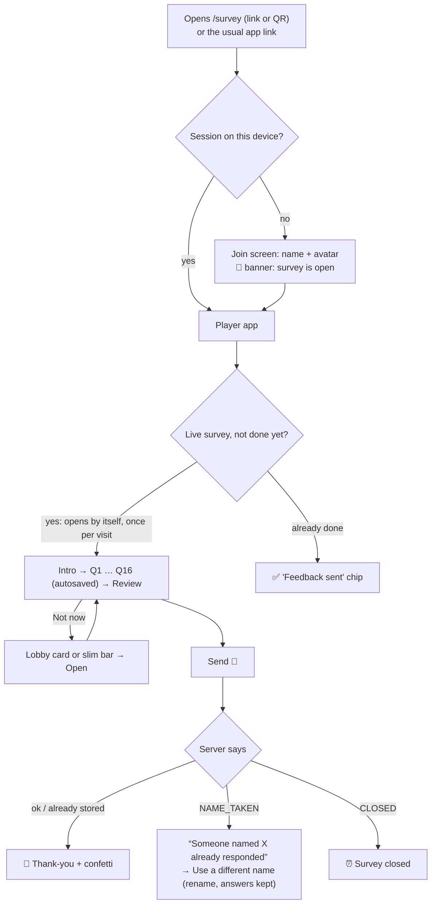
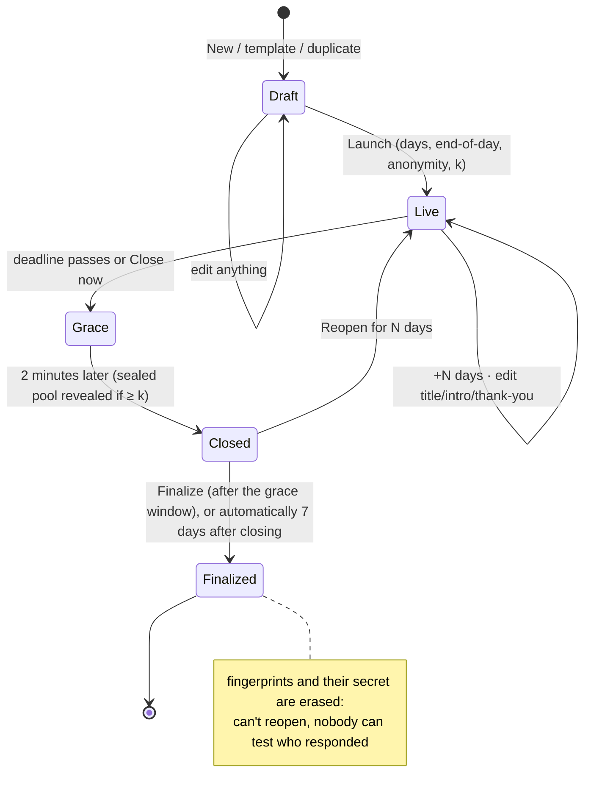
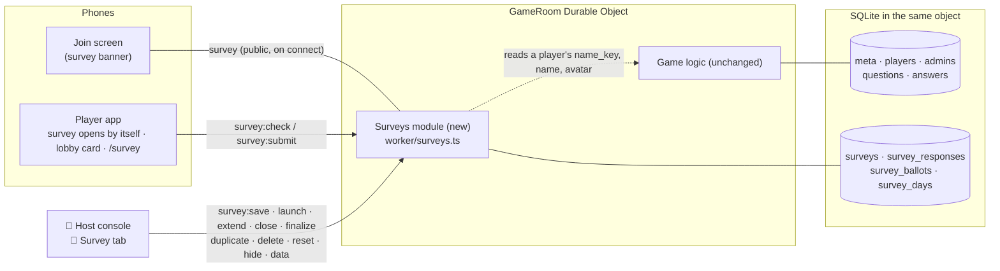
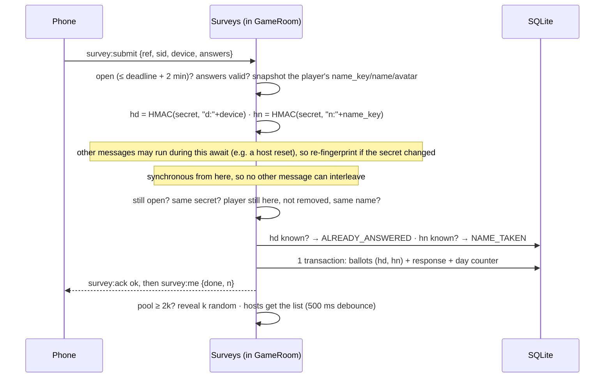

# 📝 CorpFun Day — Survey Mode · Implementation Plan

> A self-paced feedback survey inside the CorpFun Day app. The host launches it once and sets how many days it stays open. People answer whenever they open the app; nobody has to be online at the same time. Names can be kept anonymous, and one-way fingerprints of the name and device stop double responses. The host gets a live results dashboard. **The game, its events and questions, the presenter and every existing screen work exactly as before.**
>
> This file is the companion to [PLAN.md](./PLAN.md) and follows its conventions. Give it to a coding agent: it covers the decisions, the full verified backend and client-core code, UI specs, edge cases, rollout and a manual checklist.
>
> Research date: 2026-10-01. The live app was explored read-only that day. **Status of the code below:** the server module, the protocol, the client store and the helpers were built in a scratch copy of this repo, type-checked with the repo's own `tsconfig.app.json` / `tsconfig.worker.json`, and exercised end to end against `wrangler dev`: **42/42 survey checks, 8/8 game-regression checks, 4/4 restart-persistence checks and 22/22 helper checks passed** (see §18.1). An independent review then found a race between “clear responses” and an in-flight submit. It was fixed, reproduced with a forced race window, and shown to be caught by the test (§18.1).
>
> **Update, same day: survey mode is now implemented in this repo.** That covers the server module, the client core and every screen in §11–§12. It was exercised in a real browser on a desktop host console and a 390×844 phone viewport, with simulated colleagues answering over WebSockets (§18.3). §18.3 also lists the few small changes made while building it. Still to do before go-live: a rehearsal on real phones (M6). The `Zoomies.tsx` build blocker (§1.3) was fixed the same day by restoring the file from VS Code's local history.

---

## 0. TL;DR

| Topic | Decision |
|---|---|
| What | A **📝 Survey** tab in the host console. Build a survey (or start from the ready-made **“CorpFun Day — The Review 🍿”**, §3), preview it, and **launch it once for N days**. Phones show a survey card, and people respond whenever they like until the deadline. |
| Where it lives | The same Worker and the same `GameRoom` Durable Object, in a new self-contained module (`worker/surveys.ts`) with **its own SQLite tables and its own messages**. It never reads or writes game state. |
| Timeline | 1–30 days per launch (presets 1/2/3/5/7/14 days plus a custom value), optionally snapped to **11:59 pm IST**. You can **extend** (+N days), **close now**, **reopen** a closed survey, and run it for 90 days at most. Answers sent in the **2 minutes after the deadline** still count, for people who were mid-form. |
| Anonymity | A per-survey switch (default **on**). Anonymous responses store **no name, no time and no order**. Double responses are blocked by **two separate one-way fingerprints**, `HMAC-SHA-256(secret, name)` and `HMAC-SHA-256(secret, device id)`, keyed with a random 256-bit secret per survey. The fingerprints and the secret are **erased** when the host finalizes the survey, or automatically 7 days after it closes. |
| Timing protection | New anonymous answers are held in a **sealed pool** and revealed in **random groups of at least k** (default 5; the host can also pick 3 or 10, or 1 for *no* timing protection). A host who watches the dashboard while a colleague taps Send therefore can't see which answers are theirs. Every reveal contains at least k responses; if fewer than k people respond in total, their answers stay sealed. This stops a *curious* host, not one who deliberately submits fake responses (§5.6). |
| One response each | Per survey: one per **device** *and* one per **name**. A retry after a dropped connection is recognised and counts as success. |
| Host preview | KPIs, responses per day, one chart per question (reusing the game's charts, with a format switch), NPS for 0–10 ratings, every comment, individual responses (shuffled when anonymous), a hide button per response, **CSV** (Excel-safe) and **JSON** export, and a **Copy summary** for Teams. |
| Respondent UX | One question per screen with a progress bar, autosave on the device, a review step and a confetti thank-you. While a survey is live, **logging in or opening the app goes straight into the form** for anyone who hasn't answered yet. After **Not now**, a big card in the lobby (a slim bar in other phases) is the way back in. Also: a banner on the join screen and a **`/survey` deep link** (no tap screen, no splash) with a QR code and a ready-to-paste invite message. |
| Cost | Still $0. A response costs about 8 SQLite row writes; 500 responses is well under 5 % of one day's free quota (§14). |
| Before you deploy | ✅ The build blocker found during research is fixed: [src/components/Zoomies.tsx](./src/components/Zoomies.tsx) had been saved empty, and it was restored from VS Code's local history on 1 Oct (§1.3). ⚠️ The **live game is still in “Voting open”** on “Afternoon Spirit Animal” Q2; send it to the lobby before you launch the survey. |

---

## 1. Due diligence: what I found

### 1.1 The deployed app (explored read-only on 1 Oct 2026)

- **URL**: `https://cf-india-day.cf-india-day.workers.dev` (the account's `workers.dev` subdomain is `cf-india-day`; `/api/health` returns `{"ok":true}`).
- **How it was explored**: I went through the tap screen, splash and join screen, and opened the host console with a temporary host name, `Copilot_adminControl`. I launched, edited and cleared nothing. Questions were exported with the console's client-side **⬇ Export** (a Blob, no server write), and I then **logged out**, which revoked that host token on the server.
- **State at that moment**: 33 player profiles, 0 online. Four events:

| Event | Questions | What was played |
|---|---|---|
| Morning | 4 | “Did you see the sun this morning?”, “Which traffic junction did you defeat today?” (Wipro circle, Gowlidoddy, Gachibowli, WFH 😌), “What powered your morning?”, an awesome-scale vibe check |
| 1st IceBreaker | 9 | Dream-weekend word cloud, “Plot twist: your manager joins you”, “a quick 5-minute sync”, codebase as an Indian movie title, the most toxic SWE/PM trait, AI-wave mood as an HTTP status code, 3-word horror story, “Let's take this offline”, AI clone |
| Afternoon Spirit Animal | 9 | Post-lunch mode, “Which GitHub Copilot mode next?” (JUGAAD / Make No Mistakes / Trust me bro / Friday 5 PM…), 6 spirit-animal questions, “If your team was a TV show…” |
| Chai pe charcha | 0 | (empty) |

- ⚠️ The **live event is “Afternoon Spirit Animal” and its Q2 is still in “🔴 Voting open”** (untimed). Anyone who opens the app now lands on that question. §19 sends the game to the lobby first.
- The tone is playful Indian-office humour: chai, Hyderabad traffic, ICMs on Friday, Bollywood, cricket and Copilot jokes. The questionnaire in §3 deliberately calls back to those moments.

### 1.2 Codebase facts that shape the design

| Fact (file) | Consequence for surveys |
|---|---|
| One `GameRoom` Durable Object holds everything; it is a single writer with SQLite and the Hibernation API ([worker/game-room.ts](./worker/game-room.ts)) | The survey lives in the same object (same sockets and sessions, no cross-object calls). One synchronous section makes duplicate checks race-free. |
| Identity is a **name** chosen at join; the server lower-cases it into `name_key` and keeps it unique among current players ([worker/validate.ts](./worker/validate.ts)) | The name fingerprint uses `name_key`, so `Priya`, `priya` and ` PRIYA ` are the same person. |
| Session tokens live in `localStorage` and `leave()` deletes the player row, which frees the name ([src/lib/client.ts](./src/lib/client.ts)) | One response per device needs **its own device id** that survives logout (§5.3). |
| Players can only `join`, `answer`, `react`, `rename` and change their avatar; messages are capped at 4 KB with a 5 msg/s bucket | New player messages: `survey:check` and `survey:submit` only. Only `survey:submit` may exceed 4 KB (up to 32,000 characters). |
| The DO alarm is used by the game timer | Surveys need **no alarm**. Deadlines are checked when a message arrives, and phones count down locally. |
| Results charts live in `src/viz/` and take a game `Question` plus `Results` | Survey aggregates use **the same `Results` shapes**, and a 10-line adapter maps survey questions onto game types (§10.5). |
| Host console and presenter are lazy chunks; the player bundle targets < 170 kB gzip | Host survey UI goes in the admin chunk. The phone survey form is `React.lazy` (§11.4). |
| `reset('wipe')` calls `ctx.storage.deleteAll()` | Wipe also deletes surveys. The survey module re-creates its tables (`init()`), and the Danger-zone text says so (§12.8). |
| No test files, by design ([PLAN.md](./PLAN.md) §1) | Verification is done with a throwaway script kept outside the repo (Appendix A) plus a manual checklist (§18.2). |

### 1.3 Blockers and gotchas found

1. **Build was broken (pre-existing, unrelated; fixed 1 Oct).** `src/components/Zoomies.tsx` and `src/lib/zoomieSounds.ts` are the running-animals easter egg and its synthesised sounds; they're in the build deployed on 29 Sep. On 30 Sep at 14:11 both were saved as 0-byte files. These were plain VS Code saves: not a Copilot Chat edit, and no other file was saved around then. `App.tsx` still did `import Zoomies from './components/Zoomies'`, so `tsc -b` failed with `TS1192: Module … has no default export` and `npm run deploy` couldn't run. Both files were restored from VS Code's local history: the 28 Sep 21:10 and 21:07 versions. Every code string and all but one numeric constant in them appear in the deployed bundle. `npm run typecheck` now passes with 0 errors and a production build succeeds.
2. **The live game is mid-question** (§1.1). Send it to the lobby: **⏹ Close voting**, then **🏠 Lobby**.
3. **Deploying restarts the Durable Object** and disconnects every socket for a few seconds ([PLAN.md](./PLAN.md) §17.1). Deploy while no live game is running. Surveys are unaffected: drafts live on phones, and sends are retried.
4. **NFKC normalisation** (`clean()`) turns `…` into `...`, full-width characters into ASCII, and so on. The built-in templates already use `...`, so what's stored matches the source (this was caught by the template round-trip check).
5. **`CREATE TABLE IF NOT EXISTS` never alters an existing table.** Production has no survey tables yet, so this is fine today, but if a survey table changes shape after it's deployed, write an explicit migration (`ALTER TABLE`). Testing ran into exactly this with a stale local state.

### 1.4 Platform facts checked for this plan

| Fact | How it was checked |
|---|---|
| `crypto.subtle` HMAC-SHA-256 works in the DO runtime (32-byte output, 43-char base64url) | Probe worker on `wrangler dev`, compatibility date `2026-07-01` |
| `WITHOUT ROWID` tables work, have **no `rowid`**, and return rows in key order, not insertion order | Same probe (`SELECT rowid …` gives `no such column`; ids come back sorted) |
| `ctx.storage.transactionSync()` throws and **rolls back** when a `UNIQUE` constraint is violated | Same probe |
| DO WebSocket limit: 32 MiB for *received* messages, no documented limit for sends; SQL row ≤ 2 MB; ≤ 100 bound parameters | [Cloudflare DO limits](https://developers.cloudflare.com/durable-objects/platform/limits/) |
| Free plan: 100k DO requests a day (incoming WS messages billed 20:1), 100k rows written, 5M rows read, 5 GB | [PLAN.md](./PLAN.md) §2.2 and §17.2 |

---

## 2. Goals, non-goals, guarantees

**Must have (from the brief) → where it's delivered**

| Requirement | Delivered by |
|---|---|
| Fun survey questions about the event | §3: 16 questions plus a generic 5-question template |
| A dedicated survey mode in the admin console | §12: the **📝 Survey** tab (list, builder, preview, launch, manage, results) |
| Launch once; people respond whenever, no need to be live | §4 and §6: the survey stays open for days and the phone shows it whenever the app is opened |
| Timeline set as a number of days | §6: launch for 1–30 days, end-of-day snap, extend/reopen, close now |
| A nice preview of all responses in the admin panel | §12.7: results dashboard |
| Optional anonymity of names | §5: per-survey switch, default on |
| One-way hashing of the name plus a device id against double responses, in survey mode only | §5.2–§5.4: keyed HMAC fingerprints, used only by the survey module |
| Everything else unchanged | §13: exact list of touched lines; the game, presenter, events and questions are untouched |

**Extras added after due diligence** (all in scope): ready-made templates; phone-sized preview; autosaved drafts on the device; a review step; `/survey` deep link, QR code and invite text; end-of-day IST deadlines; a 2-minute grace window; sealed-pool timing protection; finalize and auto-finalize; hiding responses; CSV/JSON export; a Teams summary; NPS; per-day counts; duplicate, clear and delete; a live-survey chip in the console header; a “game is mid-question” warning at launch; on a name clash, an inline **rename** that keeps both the person's answers and their game profile.

**Non-goals (v1):** push, email or Teams notifications; SSO or real identity; branching or skip logic (optional questions with “skip if…” hints cover it); several live surveys at once; editing questions after launch; editing a submitted response (that would need a link from person to response, which breaks anonymity); survey results on the big screen; translations; print/PDF. See §21 for “later” ideas.

---

## 3. The questionnaire: “CorpFun Day — The Review 🍿”

Built into the app as a template (§10.6), so the host picks it from **📚 Templates**, tweaks anything, and launches.

- **Intro:** “Mohit came, saw and deep-dived 🤿 Now it’s your turn to review the show! About 3 minutes — your honest answers shape the next CorpFun Day 💛”. The form adds the anonymity line automatically, based on how the survey was launched.
- **Thank-you:** “Dhanyavaad! 🙏 Your review just hit the box office. Now go grab a chai ☕”
- **Length:** 16 questions, **5 required**, mostly single taps, about 3 minutes (from `surveyMinutes()`).

| # | Section | Question | Type | Options / scale | Req. | What it tells you |
|---|---|---|---|---|---|---|
| 1 | 🎬 Big picture | If CorpFun Day were a movie, what’s the box-office verdict? 🎬 | Single choice | All-time blockbuster 🏆 · Superhit 🔥 · Hit 👍 · Average 😐 · Flop 🍅 | ✅ | Overall satisfaction on a 5-point scale, framed as a box-office verdict |
| 2 | | How likely are you to recommend a CorpFun Day to a friend in another team? | Rating 0–10 (gauge) | “Not a chance 🙅” … “Already forwarding it 📨” | ✅ | **NPS**, comparable across future events |
| 3 | 🎤 Townhall | How well did the icebreaker game warm up the townhall? 🔥 | Rating 1–5 (faces) | “Still frozen 🧊” … “Room on fire 🔥” | ✅ | Did the app do its job? |
| 4 | | Your favourite icebreaker moments? ⭐ *(up to 3; skip if you missed the townhall)* | Multiple choice | ☀️ Sun this morning · 🚦 Traffic-junction showdown · 😈 Manager joins the trip · 🎬 Codebase as a movie title · 🌐 AI-wave mood as an HTTP code · 👻 3-word horror stories · 🤖 AI clone · 🐾 Spirit-animal census | — | Which content to bring back |
| 5 | 🤿 Deep dives | Your team’s deep dive with Mohit was most like... 🏏 | Single choice | A Test match: long, thorough, worth every session · A T20: fast, high-energy, over too soon ⚡ · A Super Over: intense and nail-biting 😬 · A DRS review: every slide under the microscope 🔍 · I wasn’t in one 🙈 | ✅ | Pace and intensity of the sessions (and who attended) |
| 6 | | How useful was the deep-dive conversation for your team? 🎯 *(skip if you weren’t in one)* | Rating 1–5 | “Just slides 😶” … “Game-changer 🚀” | — | Value of the sessions |
| 7 | | How heard did your team feel? 👂 *(skip if you weren’t in one)* | Rating 1–5 | “Like a muted Teams call 🔇” … “Every word landed 🎯” | — | How well the leader listened |
| 8 | | Was the deep-dive prep worth it? 🌙 | Single choice | Totally worth the late nights 🚀 · Worth it, but phew 😮‍💨 · Too much prep for the time we got ⏳ · Wasn’t part of the prep 🙋 | — | Prep effort vs. payoff |
| 9 | | One word for meeting Mohit ☁️ *(first word that comes to mind)* | One word → word cloud | — | — | First impressions of the new leader |
| 10 | 🎨 Painting | Which animal were you during the team painting? 🎨 *(skip if you missed it)* | Spirit-animal cards | 🐜 Ant · 🐝 Bee · 🦉 Owl · 🐒 Monkey · 🦚 Peacock · 🐢 Tortoise · 🐘 Elephant · 🦡 Honey Badger | — | Callback to the afternoon session; the mix of team roles |
| 11 | | Did the painting bring your team closer? 🫶 *(skip if you missed it)* | Rating 1–5 | “Still fighting over colours 🎨” … “Basically family now 🫶” | — | Bonding effect |
| 12 | 🍛 Logistics | The day’s length was... ⏱️ | Single choice | Too short, I wanted more 😩 · Just right 👌 · A bit long, my chai wore off ☕ · Too long, I aged a year 👴 | ✅ | Agenda length |
| 13 | | Rate the food 🍛 | Rating 1–5 | “Hunger games 😵” … “Shaadi-level feast 🤤” | — | Catering |
| 14 | 🚀 Next time | What should the next CorpFun Day include? 🚀 *(up to 3)* | Multiple choice | 🏏 Box-cricket · 💻 Mini hackathon · 🗺️ Treasure hunt · 🎤 Karaoke & open mic · 🍳 Cooking challenge · 🎨 Painting again · 🏔️ Day trip · 🎲 Board games & chai | — | Ideas for the next one |
| 15 | | One thing we must KEEP, and one thing to CHANGE next time ✍️ *(please don’t name colleagues)* | Comment (≤ 500 chars) | — | — | The “why” behind the numbers |
| 16 | | Sum up the whole day as an HTTP status code 🌐 *(e.g. 200 OK, 418 I’m a teapot)* | One word → word cloud | — | — | A fun closer that calls back to the icebreaker |

**Design notes**

- Only the five questions that matter most are required. Follow-ups are optional with a “skip if…” hint instead of branching logic, which keeps the form simple and the data honest.
- Answers that measure things use honest scales whose low end is a real option. The game's **awesome scale** (every step positive) is left out on purpose; feedback needs a real low end. It's still available in the builder.
- Q9 and Q15 can contain sensitive words about a named person. Read the word cloud and comments, **hide** anything inappropriate, and only then share the summary (§19).

**Second template, “Quick pulse ⚡”** (generic, 5 questions): an overall rating (1–5 faces), recommend (0–10), “The length was…” (Too short / Just right / Too long), “What should we keep, or change?” (comment) and “One word for it” (optional word cloud).

---

## 4. User experience

### 4.1 Respondent (phone)



- `/survey` deep link: **no tap screen and no splash** → join (if needed) → the form opens straight away. Afterwards the URL becomes `/` again.
- The usual app link works the same way after login. While a survey is live and this device hasn't answered it, the form **opens by itself**. That happens after joining, on every new visit, and when a survey launches while someone is in the app. It happens once per survey per visit, so **Not now** leaves the person in the game, with the lobby card or slim bar as the way back in.
- People who joined at the townhall still have their session on that phone and go straight in.
- Nothing is sent before **Send**. Drafts stay on the device (`localStorage`) and are restored on the next visit, then cleared on success and on logout.

### 4.2 Host (console)

**📝 Survey** tab → **📚 Templates → “CorpFun Day — The Review 🍿”** → edit → **👀 Preview** (phone frame) → **🚀 Launch…** (anonymous? groups of k? how many days? end of day?) → **🔗 Share** (link, QR, invite text) → watch **📊 Results** fill in → **+N days** or **⏹ Close now** → 2 minutes later everything (≥ k) is revealed → **📋 Copy summary**, **⬇ CSV** → **🔐 Finalize** (possible once those 2 minutes are over), or wait 7 days.

### 4.3 Survey lifecycle



“Grace” isn't stored; it's derived from `closesAt`. **Duplicate**, **Clear responses** (for test runs) and **Delete** are available in any state. Only **one survey can be live at a time**, which keeps the phone UI simple.

---

## 5. Anonymity and one response per person

### 5.1 What's stored

| Data | Anonymous survey | Named survey |
|---|---|---|
| Answers | ✅ (JSON per response) | ✅ |
| Name + avatar with the answers | ❌ never | ✅ snapshot at submit time |
| Submission time with the answers | ❌ never | ✅ |
| Arrival order | ❌ (random 10-character ids, `WITHOUT ROWID` tables, no autoincrement, no timestamps) | (derivable from time) |
| Per-day totals | ✅ plain counters (`survey_days`), not linked to responses | ✅ |
| Name fingerprint `HMAC(secret, "n:"+name_key)` | ✅ until finalized | ✅ until finalized |
| Device fingerprint `HMAC(secret, "d:"+deviceId)` | ✅ until finalized | ✅ until finalized |
| Link between a fingerprint and a response | ❌ none (separate table, random order, no shared key) | ❌ none |
| Released or sealed flag | ✅ (needed for the pool) | always released |
| Raw name or device id in survey tables | ❌ never | name only in the response snapshot |

### 5.2 Fingerprints (the “one-way hash”)

- **Keyed, not plain.** A plain `SHA-256(name)` would be reversible for anyone who hashes the org's ~150 names. Each survey therefore gets a random **256-bit secret** at launch (`surveys.salt`, server-only, never sent to any client), and fingerprints are `HMAC-SHA-256(secret, …)` encoded as base64url.
- **Two separate fingerprints, not one combined hash.** `hash(name + device)` would let someone answer twice just by changing one of them. Storing `n:` and `d:` fingerprints as independent rows blocks a repeat by **either**.
- **Per survey.** The same person's fingerprints differ between surveys, so there's no cross-survey tracking.
- **Erased.** **🔐 Finalize** (manual, once closed) or **auto-finalize 7 days after closing** deletes every fingerprint and the secret. After that nobody, including the host or anyone with database access, can test whether a given name responded, and the survey can't be reopened.

### 5.3 The device id

`src/lib/device.ts`: a random 128-bit id (22 base64url characters) in `localStorage['cfid.device.v1']`, created on first use and **kept across logouts**. It is **not** a hardware or browser fingerprint (no canvas or UA tricks): clearing site data, private mode or another browser gives a new id. If storage is blocked, the tab keeps an in-memory id. The raw id only travels over `wss://` and is HMAC'd on arrival.

### 5.4 Duplicate rules

| Situation | Server reply | Phone shows |
|---|---|---|
| New device, new name | `survey:ack ok` | 🎉 thank-you |
| Same device (any name), e.g. a retry after a dropped connection, or a second person on a shared laptop | `ALREADY_ANSWERED` | Opening the survey already shows “✅ You've already shared your feedback” (the device check runs first). If a Send still gets this reply, e.g. a retry or a second tab, it counts as done: 🎉 thank-you |
| Same name (any case) on another device | `NAME_TAKEN` | “Someone named “Rahul” already responded. If that wasn't you, use your full name (e.g. “Rahul K”).” plus an inline **Use a different name** field. It sends the game's existing `rename`, so the game profile, score and answers all stay, and then Send is retried |
| The player renamed, left or was removed while their Send was being processed | `BAD_REQUEST` | “Hmm, that didn't work — please check your answers”; Send again |
| Survey closed (after grace), finalized or deleted | `CLOSED` | ⏰ closed screen |

`survey:check` (“has this device responded?”) checks **only the device**. A name check there would let anyone with the link find out whether a colleague has responded.

### 5.5 Sealed pool: protecting *when* someone answered

On a live dashboard, “a new response appeared right after Rahul tapped Send” would identify Rahul. So anonymous responses go into a **sealed pool**:

- While live, once the pool reaches **2k**, **k random responses** from it are revealed. The pool therefore always keeps at least k.
- Once nobody can submit any more (deadline plus the 2-minute grace), the whole pool is revealed together, **if it holds at least k**. Otherwise those responses stay sealed for good.
- With k = 1 (or a named survey), everything is visible instantly, with **no** timing protection. The launch dialog says so.
- Example, k = 5: responses 1–9 are sealed (the dashboard says “9 received · results unlock at 10”). At the 10th, 5 random ones are revealed. At the 15th, 5 more. The survey closes at 43 → 35 visible and 8 sealed → 2 minutes later all 43 are visible. If only 4 people ever respond, nothing is shown.
- **Guarantee:** every reveal the host can observe contains at least k responses, so a response can't be pinned to the moment someone tapped Send. Counts (total and per day) are always visible, because counts aren't answers.
- **Scope:** this protects against a *curious* host (one who watches the dashboard), not a *malicious* one. A host who submits k−1 fake responses of their own can subtract them from a reveal and isolate the one real response (an “n−1 attack”). With honour-system names, no design can stop that (§5.6).

### 5.6 Threat model and honest limits

| Risk | Status |
|---|---|
| Host reads who said what (anonymous mode) | ❌ Prevented: names are never stored with answers |
| A curious host spots a colleague's answer by timing (watching the dashboard) | ❌ Prevented by the sealed pool (§5.5), as long as k > 1 |
| A **malicious** host floods fake responses to isolate one person's answers (n−1 attack) | ⚠️ Possible: the host is trusted, just as they are trusted not to misuse reset or named surveys. The flood shows up in the response counts and per-day totals. |
| Someone reverses the stored hashes into names | ❌ Prevented while the secret exists, unless they also have the secret (server only); impossible after finalize |
| Anyone with Cloudflare-account access before finalize: take the secret, HMAC known names, learn **who responded** (not what they said) | ⚠️ Possible until **Finalize** or auto-finalize. Finalize as soon as you're done. Auto-finalize runs on the first survey activity (any phone or host message) after the 7 days, so with no activity at all it can happen later. |
| Free text or rare answer combinations identify someone in a small group | ⚠️ Inherent to any survey. The comment hint says “don't name colleagues”. |
| Someone answers twice using **a new browser *and* a new name** | ⚠️ Possible, since identity is honour-system just like the game ([PLAN.md](./PLAN.md) §16). Two fingerprints stop casual double voting, not a determined person. |
| Someone joins as “Mohit” first and blocks the real Mohit's name | ⚠️ Same honour-system limit as the game. The real Mohit can use “Mohit S”. |
| A prober submits a full response under a colleague's name to see `NAME_TAKEN` | ⚠️ Reveals participation (not content) and is itself a response, so it only works once. The name is only available if that colleague isn't currently logged in. |

---

## 6. Timeline (number of days)

| Control | Behaviour |
|---|---|
| **Launch** | Pick **1–30 days** (chips 1, 2, 3, 5, 7, 14 plus a custom field). **“Close at 11:59 pm IST”** is on by default: the deadline becomes the end of that IST day. So 2 days launched on Wed at 6 pm closes on **Fri at 11:59 pm IST**, not Fri at 6 pm. The dialog previews the exact time (“Closes Sat, 3 Oct, 11:59 pm IST · in 2 days 6 h”). |
| **+N days** | Moves the deadline N × 24 h later, snapped to 11:59 pm IST if the survey was launched that way. |
| **Close now** | The deadline becomes now. Phones hide the survey straight away. |
| **One survey at a time** | A new survey can be launched (or another reopened) only when no survey is live **or within its 2-minute grace window**, so a late answer to the previous survey can never be swapped for the new one. |
| **Finalize** | Only once the grace window is over. It first reveals the sealed pool (if it holds ≥ k), so finalized results never change afterwards. |
| **Grace** | Answers that arrive up to **2 minutes** after the deadline (or after Close now) still count, for people who were mid-form. Phones that were mid-form show “⏰ The survey just closed — send now and it still counts”. |
| **Reopen** | A closed (not finalized) survey can be reopened for N days. Fingerprints persist, so earlier respondents stay blocked. |
| **Limits** | 30 days per launch or extension; **90 days** from launch to the final deadline. |
| **Clock** | The server clock decides. Phones correct their countdowns with the server offset that's already in `client.ts`. Times are shown in **IST** to everyone (India has no DST; it's always UTC+5:30). |

---

## 7. Architecture





| # | Decision | Reason |
|---|---|---|
| S1 | Same DO, separate module and tables | Reuses sockets, sessions and the single-writer guarantee; zero risk to game state; no new bindings or migrations in `wrangler.jsonc`. |
| S2 | Separate messages (`survey`, `survey:*`, `surveys`) instead of extending `ViewMsg`/`AdminMsg` | The game's personalised fan-out and 250 ms batching stay byte-for-byte the same. |
| S3 | Public survey goes to **every** non-host socket, including ones that haven't joined | The join screen can show the banner. It's deduplicated: phones only hear about real changes. |
| S4 | Host results are **pulled** (`survey:data`) when `rev` changes | The list broadcast stays small; the heavy payload only goes to the host that has results open. |
| S5 | Questions are frozen at launch | Answers reference question ids; changing a launched question would corrupt results. **Duplicate** to change them. |
| S6 | One survey at a time, counting the 2-minute grace window | Simple phone UI with no picker, and a late answer to the old survey can't be swapped for a new one. |
| S7 | No DO alarm | The game timer owns the single alarm. Deadlines are evaluated lazily; settling and auto-finalize happen on the next survey message, host read or wake. |
| S8 | `WITHOUT ROWID` + random ids + no timestamps (anonymous) | Data at rest carries no order or time to correlate with fingerprints or people. |
| S9 | The survey reuses the game's `Results` shapes and charts | No new chart code; consistent visuals. |
| S10 | Device-only `survey:check` | No participation probing by name (§5.4). |
| S11 | Respondents join with a name even in anonymous mode | The name fingerprint is half of the double-response protection (the brief's design); the name itself is never stored with answers. |
| S12 | Sealed pool with “at least k per reveal” | Timing protection with an exact guarantee and no stored order (§5.5). |
| S13 | Re-validate everything after each `await` in the DO | Crypto awaits let other messages run (input gates only cover storage). The secret is re-checked (and fingerprints re-taken if a reset swapped it) and the player identity re-resolved before the synchronous check-and-insert. This race was reproduced and fixed (§18.1). |

---

## 8. Data model and wire protocol

### 8.1 SQLite (created by `Surveys.init()` with `IF NOT EXISTS`; no `wrangler.jsonc` change)

| Table | Columns | Notes |
|---|---|---|
| `surveys` | `id` PK, `data` (JSON `AdminSurvey`), `salt` (base64url secret or NULL) | The secret is NULL for drafts and after finalize. `data` never contains the secret. |
| `survey_responses` | (`sid`, `id`) PK, `released`, `at` (NULL if anonymous), `who` (JSON or NULL if anonymous), `answers` (JSON), `hidden` — `WITHOUT ROWID` | Index `survey_sealed (sid, released)` |
| `survey_ballots` | (`sid`, `h`) PK — `WITHOUT ROWID` | One row per fingerprint; erased on finalize |
| `survey_days` | (`sid`, `day`) PK, `n` — `WITHOUT ROWID` | IST date → count |

### 8.2 Messages

| Direction | Message | Who | Purpose |
|---|---|---|---|
| S→C | `survey {now, survey: PublicSurvey \| null}` | every non-host socket, on connect, welcome and change | the live survey (or none) |
| C→S | `survey:check {sid, device}` | players | “did this device respond?” |
| S→C | `survey:me {sid, done, n}` | that player | status plus the total so far (social proof) |
| C→S | `survey:submit {ref, sid, device, answers}` | players | ≤ 32,000 characters (a legitimate one is ≤ ~12,000: at most 5 comments × 500) |
| S→C | `survey:ack {ref, ok, code?}` | that player | `ALREADY_ANSWERED` = done; `NAME_TAKEN`, `CLOSED`, `BAD_REQUEST`, `LIMIT` |
| C→S | `survey:save {survey}` · `launch {id, days, endOfDay, anonymous, k}` · `extend {id, days}` · `close` · `finalize` · `duplicate` · `delete` · `reset` · `hide {rid, hidden}` · `data {id}` | hosts | management |
| S→C | `surveys {now, list: AdminSurvey[]}` | hosts, on welcome plus a 500 ms debounce after changes | list and lifecycle. Host actions have no per-action ack: the UI confirms an action by watching this list (§12.5), and failures arrive as the existing `error` toast |
| S→C | `survey:data {now, data: SurveyData}` | the requesting host | results |

---

## 9. Server code (complete, verified)

### 9.1 `shared/survey.ts` (new)

```ts
import type { Display, ErrorCode, Results } from './protocol';
import { ANIMALS, ANIMAL_KEYS, AWESOME } from './constants';

// Survey mode: a self-paced feedback form that stays open for days. It shares the socket, the join flow and the
// visualisations with the live game, but none of the game's state: its own tables, messages and screens.

export type SurveyType = 'poll' | 'multi' | 'scale' | 'awesome' | 'animal' | 'wordcloud' | 'open';

export interface SurveyQuestion {
  id: string; // unique within its survey (assigned by the server)
  type: SurveyType;
  text: string;
  hint: string; // optional line under the question
  required: boolean;
  options: string[]; // poll/multi: 2–8 labels; animal: 2–12 keys of ANIMALS; otherwise []
  maxPicks: number; // multi: 2..options.length; otherwise 1
  maxEntries: number; // wordcloud: 1–3; otherwise 1
  min: number; // scale: 0 or 1; awesome: 1
  max: number; // scale: min + 2 … 10; awesome: 5
  minLabel: string; // scale end labels
  maxLabel: string;
  display: Display; // default chart in the host's results
}

// One answer per question; a skipped optional question is simply absent from SurveyAnswers.
export type SurveyAnswer =
  | { choice: number } // poll, animal
  | { choices: number[] } // multi: unique, ascending
  | { rating: number } // scale, awesome
  | { texts: string[] } // wordcloud: 1..maxEntries entries
  | { text: string }; // open

export type SurveyAnswers = Record<string, SurveyAnswer>;

// The editable part of a survey (what the builder sends).
export interface SurveyDraft {
  id: string; // '' = create
  title: string;
  intro: string;
  thanks: string;
  questions: SurveyQuestion[];
}

export type SurveyStatus = 'draft' | 'live' | 'closed';

// Hosts: the definition plus its lifecycle. Never contains the fingerprint key.
export interface AdminSurvey extends SurveyDraft {
  createdAt: number;
  anonymous: boolean;
  k: number; // anonymous: responses are revealed in groups of at least k (1 = instantly)
  days: number; // planned duration in days (closesAt is the source of truth)
  endOfDay: boolean; // deadlines snap to 11:59 pm IST
  opensAt: number | null; // null = draft
  closesAt: number | null;
  finalized: boolean; // closed for good: the respondent fingerprints are erased, so it can't reopen
  rev: number; // bumps on every change; a host's screen refetches results when it changes
  n: number; // responses received, including hidden and sealed ones
  pending: number; // anonymous: sealed responses, waiting to be revealed with others
}

// Respondents: only the live survey, only what the form needs.
export interface PublicSurvey {
  id: string;
  title: string;
  intro: string;
  thanks: string;
  anonymous: boolean;
  k: number;
  closesAt: number;
  questions: SurveyQuestion[];
}

export interface SurveyCard {
  id: string; // random, so listing anonymous responses by id is a stable shuffle
  hidden: boolean;
  who: { name: string; avatar: string } | null; // null when anonymous
  at: number | null; // submission time; null when anonymous
  answers: SurveyAnswers;
}

export interface SurveyData {
  sid: string;
  rev: number;
  n: number; // all responses
  released: number; // responses the host may see
  sealed: number; // anonymous: not revealed yet (they wait for a group of k)
  hidden: number; // released but hidden by a host; excluded from results and exports
  perDay: { day: string; n: number }[]; // IST dates, all responses, counts only
  questions: { qid: string; answered: number; results: Results }[]; // over released, visible responses
  cards: SurveyCard[]; // released responses (hidden ones flagged)
}

export type SurveyClientMsg =
  // players
  | { t: 'survey:check'; sid: string; device: string } // "did this device respond?" (never checks names)
  | { t: 'survey:submit'; ref: string; sid: string; device: string; answers: SurveyAnswers }
  // hosts
  | { t: 'survey:save'; survey: SurveyDraft }
  | { t: 'survey:launch'; id: string; days: number; endOfDay: boolean; anonymous: boolean; k: number }
  | { t: 'survey:extend'; id: string; days: number } // live: push the deadline; closed: reopen
  | { t: 'survey:close'; id: string }
  | { t: 'survey:finalize'; id: string }
  | { t: 'survey:duplicate'; id: string }
  | { t: 'survey:delete'; id: string }
  | { t: 'survey:reset'; id: string } // delete its responses and fingerprints (after a test run)
  | { t: 'survey:hide'; id: string; rid: string; hidden: boolean }
  | { t: 'survey:data'; id: string };

export type SurveyServerMsg =
  | { t: 'survey'; now: number; survey: PublicSurvey | null } // every socket, including ones that haven't joined
  | { t: 'survey:me'; sid: string; done: boolean; n: number }
  | { t: 'survey:ack'; ref: string; ok: boolean; code?: ErrorCode }
  | { t: 'surveys'; now: number; list: AdminSurvey[] } // hosts
  | { t: 'survey:data'; now: number; data: SurveyData }; // hosts, on request

export const isSurveyClientMsg = (m: { t: string }): m is SurveyClientMsg => m.t.startsWith('survey:');

export const SURVEY_LIMITS = {
  surveys: 10, // kept at once (drafts + live + closed)
  questions: 20,
  openQuestions: 5, // comment questions per survey: keeps a response under ~3.5 KB
  title: 60,
  intro: 300,
  thanks: 200,
  hint: 120,
  option: 120,
  optionsMax: 8,
  text: 500, // comment length
  responses: 1500, // per survey (= the player cap: one response per person)
  days: 30, // per launch or extension
  totalDays: 90, // from launch to the final deadline
};

export const DAY_MS = 86_400_000;
export const IST_MS = 19_800_000; // UTC+5:30 all year (India has no daylight saving)
export const DAY_PRESETS = [1, 2, 3, 5, 7, 14];
export const K_CHOICES = [1, 3, 5, 10];
export const DEFAULT_K = 5;
export const SURVEY_GRACE_MS = 120_000; // answers still count this long after the deadline (people mid-submit)
export const AUTO_FINALIZE_DAYS = 7; // fingerprints are erased this long after closing
export const DEVICE_RE = /^[A-Za-z0-9_-]{16,64}$/;

export const SURVEY_FORMATS: Record<SurveyType, Display[]> = {
  poll: ['bars', 'columns', 'donut', 'bubbles', 'versus'],
  multi: ['bars', 'columns', 'bubbles'], // no donut: picks add up to more than 100 %
  animal: ['bars', 'columns', 'donut', 'bubbles'],
  scale: ['histogram', 'gauge', 'average'],
  awesome: ['histogram', 'gauge', 'average'],
  wordcloud: ['cloud', 'bubbles', 'list'],
  open: ['wall'], // shown as a full comment list; "wall" is only the stored default
};

export const SURVEY_TYPE_INFO: Record<SurveyType, { label: string; icon: string; hint: string }> = {
  poll: { label: 'Single choice', icon: '📊', hint: 'Pick one option' },
  multi: { label: 'Multiple choice', icon: '☑️', hint: 'Pick up to N options' },
  scale: { label: 'Rating', icon: '🎚️', hint: 'Emoji faces (1–5) or 0–10' },
  awesome: { label: 'Awesome scale', icon: '🤩', hint: 'Five levels of awesome' },
  animal: { label: 'Spirit animal', icon: '🐾', hint: 'Pick an animal card' },
  wordcloud: { label: 'One word', icon: '☁️', hint: 'A word or two → word cloud' },
  open: { label: 'Comment', icon: '💬', hint: `Free text, up to ${SURVEY_LIMITS.text} characters` },
};

export function defaultSurveyQuestion(type: SurveyType): SurveyQuestion {
  const base: SurveyQuestion = {
    id: '', type, text: '', hint: '', required: type !== 'open', options: [], maxPicks: 1, maxEntries: 1,
    min: 1, max: 5, minLabel: '', maxLabel: '', display: SURVEY_FORMATS[type][0],
  };
  switch (type) {
    case 'poll':
      return { ...base, options: ['', ''] };
    case 'multi':
      return { ...base, options: ['', '', ''], maxPicks: 2 };
    case 'scale':
      return { ...base, minLabel: 'Meh', maxLabel: 'Loved it!' };
    case 'animal':
      return { ...base, options: [...ANIMAL_KEYS] };
    default:
      return base; // awesome (1–5), wordcloud (1 entry), open
  }
}

export function surveyStatus(s: { opensAt: number | null; closesAt: number | null }, now: number): SurveyStatus {
  if (s.opensAt === null || s.closesAt === null) return 'draft';
  return now < s.closesAt ? 'live' : 'closed';
}

const SECONDS: Record<SurveyType, number> = { poll: 8, multi: 12, scale: 6, awesome: 6, animal: 10, wordcloud: 15, open: 40 };
export const surveyMinutes = (qs: SurveyQuestion[]) => Math.max(1, Math.round(qs.reduce((sum, q) => sum + SECONDS[q.type], 20) / 60));

export const istDay = (ms: number) => new Date(ms + IST_MS).toISOString().slice(0, 10);
// 11:59 pm IST on the IST day that contains `ms`.
export const endOfIstDay = (ms: number) => Math.floor((ms + IST_MS) / DAY_MS) * DAY_MS - IST_MS + DAY_MS - 60_000;

export const animalLabel = (key: string | undefined) => (key && ANIMALS[key] ? `${ANIMALS[key].emoji} ${ANIMALS[key].name}` : '');

// Human-readable answer, used by the review step, response cards, CSV export and the summary.
export function answerLabel(q: SurveyQuestion, a: SurveyAnswer | undefined): string {
  if (!a) return '';
  if ('choice' in a) return q.type === 'animal' ? animalLabel(q.options[a.choice]) : (q.options[a.choice] ?? '');
  if ('choices' in a) return a.choices.map((i) => q.options[i] ?? '').join(' | ');
  if ('rating' in a) {
    const level = q.type === 'awesome' ? AWESOME[a.rating - 1] : undefined;
    return level ? `${level.emoji} ${level.label}` : String(a.rating);
  }
  if ('texts' in a) return a.texts.join(' | ');
  return a.text;
}
```

### 9.2 `shared/protocol.ts` (3 small additions)

```diff
--- a/shared/protocol.ts
+++ b/shared/protocol.ts
@@ -1,2 +1,4 @@
+import type { SurveyClientMsg, SurveyServerMsg } from './survey';
+
 export type QuestionType = 'poll' | 'quiz' | 'wordcloud' | 'open' | 'scale' | 'awesome' | 'number' | 'animal';
 
@@ -176,5 +178,6 @@ export type ServerMsg =
   | { t: 'celebrate'; at: number } // host asked the big screens to replay the celebration
   | { t: 'ack'; ref: string; ok: boolean; code?: ErrorCode }
-  | { t: 'error'; code: ErrorCode; message: string };
+  | { t: 'error'; code: ErrorCode; message: string }
+  | SurveyServerMsg;
 
 export type ClientMsg =
@@ -210,3 +213,5 @@ export type ClientMsg =
   | { t: 'draw:clear' }
   | { t: 'celebrate' }
-  | { t: 'reset'; scope: 'answers' | 'players' | 'wipe' };
+  | { t: 'reset'; scope: 'answers' | 'players' | 'wipe' }
+  // survey mode (players: check/submit; hosts: everything else)
+  | SurveyClientMsg;
```

### 9.3 `worker/survey-validate.ts` (new)

```ts
import type { Display } from '../shared/protocol';
import type { SurveyAnswer, SurveyAnswers, SurveyDraft, SurveyQuestion, SurveyType } from '../shared/survey';
import { SURVEY_FORMATS, SURVEY_LIMITS, defaultSurveyQuestion } from '../shared/survey';
import { ANIMALS, LIMITS } from '../shared/constants';
import { clean, cut, len } from './validate';

const ID_RE = /^[a-z0-9]{1,16}$/;
const int = (v: unknown, min: number, max: number, fallback: number) =>
  Number.isInteger(v) && (v as number) >= min && (v as number) <= max ? (v as number) : fallback;

export function parseSurveyQuestion(raw: unknown): SurveyQuestion | null {
  if (!raw || typeof raw !== 'object') return null;
  const o = raw as Record<string, unknown>;
  if (typeof o.type !== 'string' || !Object.hasOwn(SURVEY_FORMATS, o.type)) return null;
  const q = defaultSurveyQuestion(o.type as SurveyType);
  q.id = typeof o.id === 'string' && ID_RE.test(o.id) ? o.id : '';
  q.text = clean(o.text);
  if (!q.text || len(q.text) > LIMITS.question) return null;
  q.hint = cut(clean(o.hint), SURVEY_LIMITS.hint);
  if (typeof o.required === 'boolean') q.required = o.required;

  if (q.type === 'poll' || q.type === 'multi') {
    const opts = Array.isArray(o.options) ? o.options.map(clean) : [];
    if (opts.length < LIMITS.optionsMin || opts.length > SURVEY_LIMITS.optionsMax) return null;
    if (opts.some((x) => !x || len(x) > SURVEY_LIMITS.option)) return null;
    q.options = opts;
  }
  if (q.type === 'multi') q.maxPicks = int(o.maxPicks, 2, q.options.length, Math.min(2, q.options.length));
  if (q.type === 'animal') {
    const keys = Array.isArray(o.options) ? o.options.filter((k): k is string => typeof k === 'string' && Object.hasOwn(ANIMALS, k)) : [];
    q.options = [...new Set(keys)];
    if (q.options.length < LIMITS.optionsMin) return null;
  }
  if (q.type === 'wordcloud') q.maxEntries = int(o.maxEntries, 1, 3, q.maxEntries);
  if (q.type === 'scale') {
    q.min = int(o.min, 0, 1, q.min);
    q.max = int(o.max, q.min + 2, 10, q.max);
    q.minLabel = cut(clean(o.minLabel), LIMITS.label);
    q.maxLabel = cut(clean(o.maxLabel), LIMITS.label);
  }
  const d = o.display as Display;
  if (SURVEY_FORMATS[q.type].includes(d) && !(d === 'versus' && q.options.length !== 2)) q.display = d;
  return q;
}

// All or nothing, so a save is never half-applied. Questions without a valid unique id get a fresh one.
export function parseSurveyDraft(raw: unknown, newId: () => string): SurveyDraft | null {
  if (!raw || typeof raw !== 'object') return null;
  const o = raw as Record<string, unknown>;
  const title = clean(o.title);
  if (!title || len(title) > SURVEY_LIMITS.title) return null;
  const list = Array.isArray(o.questions) ? o.questions : [];
  if (list.length > SURVEY_LIMITS.questions) return null;
  const questions: SurveyQuestion[] = [];
  const seen = new Set<string>();
  for (const r of list) {
    const q = parseSurveyQuestion(r);
    if (!q) return null;
    if (!q.id || seen.has(q.id)) q.id = newId();
    seen.add(q.id);
    questions.push(q);
  }
  if (questions.filter((q) => q.type === 'open').length > SURVEY_LIMITS.openQuestions) return null;
  return {
    id: typeof o.id === 'string' && ID_RE.test(o.id) ? o.id : '',
    title,
    intro: cut(clean(o.intro), SURVEY_LIMITS.intro),
    thanks: cut(clean(o.thanks), SURVEY_LIMITS.thanks),
    questions,
  };
}

// Text that is empty once cleaned counts as skipped, so stray invisible characters never block a submission.
type Parsed = SurveyAnswer | 'empty' | null;

function parseOne(q: SurveyQuestion, raw: unknown): Parsed {
  if (!raw || typeof raw !== 'object') return null;
  const o = raw as Record<string, unknown>;
  switch (q.type) {
    case 'poll':
    case 'animal':
      return Number.isInteger(o.choice) && (o.choice as number) >= 0 && (o.choice as number) < q.options.length
        ? { choice: o.choice as number }
        : null;
    case 'multi': {
      const c = o.choices;
      if (!Array.isArray(c) || c.length < 1 || c.length > q.maxPicks) return null;
      if (!c.every((i) => Number.isInteger(i) && i >= 0 && i < q.options.length)) return null;
      const picks = [...new Set(c as number[])].sort((a, b) => a - b);
      return picks.length === c.length ? { choices: picks } : null;
    }
    case 'scale':
    case 'awesome':
      return Number.isInteger(o.rating) && (o.rating as number) >= q.min && (o.rating as number) <= q.max
        ? { rating: o.rating as number }
        : null;
    case 'wordcloud': {
      if (!Array.isArray(o.texts) || o.texts.length > q.maxEntries) return null;
      const seen = new Set<string>();
      const texts: string[] = [];
      for (const t of o.texts.map(clean)) {
        if (len(t) > LIMITS.word) return null;
        if (!t || seen.has(t.toLowerCase())) continue;
        seen.add(t.toLowerCase());
        texts.push(t);
      }
      return texts.length > 0 ? { texts } : 'empty';
    }
    case 'open': {
      const text = clean(o.text);
      if (len(text) > SURVEY_LIMITS.text) return null;
      return text ? { text } : 'empty';
    }
  }
}

// Unknown keys are ignored; a missing required answer or any invalid answer rejects the whole submission.
export function parseSurveyAnswers(questions: SurveyQuestion[], raw: unknown): SurveyAnswers | null {
  if (!raw || typeof raw !== 'object' || Array.isArray(raw)) return null;
  const o = raw as Record<string, unknown>;
  const out: SurveyAnswers = {};
  for (const q of questions) {
    const v = Object.hasOwn(o, q.id) ? o[q.id] : undefined;
    const a = v === undefined || v === null ? 'empty' : parseOne(q, v);
    if (a === null) return null;
    if (a === 'empty') {
      if (q.required) return null;
      continue;
    }
    out[q.id] = a;
  }
  return out;
}
```

### 9.4 `worker/surveys.ts` (new)

```ts
import type { ErrorCode, Results, ServerMsg } from '../shared/protocol';
import type { AdminSurvey, PublicSurvey, SurveyAnswers, SurveyCard, SurveyClientMsg, SurveyData, SurveyQuestion } from '../shared/survey';
import {
  AUTO_FINALIZE_DAYS, DAY_MS, DEFAULT_K, DEVICE_RE, K_CHOICES, SURVEY_GRACE_MS, SURVEY_LIMITS, endOfIstDay, istDay, surveyStatus,
} from '../shared/survey';
import { cut } from './validate';
import { parseSurveyAnswers, parseSurveyDraft } from './survey-validate';

// What the survey module needs from the GameRoom. It never reads or writes game state.
export interface SurveyHost {
  sockets(): { ws: WebSocket; kind: 'anon' | 'player' | 'admin' }[];
  player(pid: string): { name: string; key: string; avatar: string; kicked: boolean } | null;
}

export type SurveyCaller = { kind: 'player'; pid: string } | { kind: 'admin' };

// Stored as JSON in surveys.data. The fingerprint key lives only in surveys.salt and never leaves this file.
type Rec = AdminSurvey;

// sql.exec<T> needs `type` aliases (PLAN.md §22.3).
type SurveyRow = { data: string; salt: string | null };
type IdRow = { id: string };
type DayRow = { day: string; n: number };
type ResponseRow = { id: string; released: number; at: number | null; who: string | null; answers: string; hidden: number };

interface Resp {
  id: string;
  released: boolean;
  at: number | null;
  who: { name: string; avatar: string } | null;
  answers: SurveyAnswers;
  hidden: boolean;
}

// WITHOUT ROWID + random keys: no table keeps insertion order, so fingerprints can't be lined up with responses,
// and anonymous responses carry no time at all (per-day totals are plain counters).
const SURVEY_SCHEMA = [
  'CREATE TABLE IF NOT EXISTS surveys (id TEXT PRIMARY KEY, data TEXT NOT NULL, salt TEXT)',
  'CREATE TABLE IF NOT EXISTS survey_responses (sid TEXT NOT NULL, id TEXT NOT NULL, released INTEGER NOT NULL, at INTEGER, who TEXT, answers TEXT NOT NULL, hidden INTEGER NOT NULL DEFAULT 0, PRIMARY KEY (sid, id)) WITHOUT ROWID',
  'CREATE INDEX IF NOT EXISTS survey_sealed ON survey_responses (sid, released)',
  'CREATE TABLE IF NOT EXISTS survey_ballots (sid TEXT NOT NULL, h TEXT NOT NULL, PRIMARY KEY (sid, h)) WITHOUT ROWID',
  'CREATE TABLE IF NOT EXISTS survey_days (sid TEXT NOT NULL, day TEXT NOT NULL, n INTEGER NOT NULL, PRIMARY KEY (sid, day)) WITHOUT ROWID',
];

const ID_CHARS = 'abcdefghijkmnpqrstuvwxyz23456789';
const randomId = () => Array.from(crypto.getRandomValues(new Uint8Array(10)), (b) => ID_CHARS[b % 32]).join('');
const randomInt = (n: number) => crypto.getRandomValues(new Uint32Array(1))[0] % n;
const b64 = (bytes: Uint8Array) => btoa(String.fromCharCode(...bytes)).replace(/\+/g, '-').replace(/\//g, '_').replace(/=+$/, '');
function fromB64(s: string): Uint8Array {
  const t = s.replace(/-/g, '+').replace(/_/g, '/');
  return Uint8Array.from(atob(t + '='.repeat((4 - (t.length % 4)) % 4)), (c) => c.charCodeAt(0));
}
const newSalt = () => b64(crypto.getRandomValues(new Uint8Array(32)));

const toResp = (r: ResponseRow): Resp => ({
  id: r.id,
  released: r.released === 1,
  at: r.at,
  who: r.who ? (JSON.parse(r.who) as Resp['who']) : null,
  answers: JSON.parse(r.answers) as SurveyAnswers,
  hidden: r.hidden === 1,
});

export class Surveys {
  private list: Rec[] = [];
  private salts = new Map<string, string>(); // survey id -> secret, only while launched and not finalized
  private keys = new Map<string, Promise<CryptoKey>>(); // secret -> imported HMAC key
  private cache = new Map<string, Resp[]>(); // parsed responses, loaded when a host first asks
  private timer: ReturnType<typeof setTimeout> | null = null;
  private lastPublic = ''; // the live survey as phones last saw it

  constructor(
    private ctx: DurableObjectState,
    private sql: SqlStorage,
    private host: SurveyHost,
  ) {
    this.init();
  }

  // Constructor, and again after "Wipe everything" (deleteAll drops these tables too).
  init() {
    for (const s of SURVEY_SCHEMA) this.sql.exec(s);
    this.list = [];
    this.salts.clear();
    for (const r of this.sql.exec<SurveyRow>('SELECT data, salt FROM surveys')) {
      const s = JSON.parse(r.data) as Rec;
      this.list.push(s);
      if (r.salt) this.salts.set(s.id, r.salt);
    }
    this.list.sort((a, b) => a.createdAt - b.createdAt);
    this.cache.clear();
    this.keys.clear();
    this.lastPublic = '';
    this.sweep();
  }

  // ---------- greetings (called from GameRoom.fetch / welcome) ----------

  helloPublic(ws: WebSocket) {
    this.send(ws, { t: 'survey', now: Date.now(), survey: this.publicOf(this.live()) });
  }

  helloAdmin(ws: WebSocket) {
    this.sweep();
    this.send(ws, this.listMsg());
  }

  // After a wipe: everyone learns there is no survey any more.
  announce() {
    this.changed(true);
  }

  // ---------- messages ----------

  async onMessage(ws: WebSocket, caller: SurveyCaller, msg: SurveyClientMsg) {
    this.sweep(); // auto-finalize happens on the first activity after it is due
    if (caller.kind === 'player') {
      const p = this.host.player(caller.pid);
      if (!p || p.kicked) return;
      if (msg.t === 'survey:check') return this.check(ws, msg.sid, msg.device);
      if (msg.t === 'survey:submit') return this.submit(ws, caller.pid, msg);
      return this.fail(ws, 'NOT_ALLOWED', 'Not allowed');
    }
    switch (msg.t) {
      case 'survey:save':
        return this.save(ws, msg.survey);
      case 'survey:launch':
        return this.launch(ws, msg);
      case 'survey:extend':
        return this.extend(ws, msg.id, msg.days);
      case 'survey:close':
        return this.close(msg.id);
      case 'survey:finalize': {
        const s = this.byId(msg.id);
        if (!s || s.finalized || s.closesAt === null) return;
        if (Date.now() <= s.closesAt + SURVEY_GRACE_MS) {
          return this.fail(ws, 'NOT_ALLOWED', 'Close the survey first (late answers still count for 2 minutes after closing)');
        }
        return this.finalize(s);
      }
      case 'survey:duplicate':
        return this.duplicate(ws, msg.id);
      case 'survey:delete':
        return this.remove(msg.id);
      case 'survey:reset':
        return this.reset(msg.id);
      case 'survey:hide':
        return this.hide(msg.id, msg.rid, msg.hidden);
      case 'survey:data': {
        const s = this.byId(msg.id);
        if (s) this.send(ws, { t: 'survey:data', now: Date.now(), data: this.dataOf(s) });
        return;
      }
      default:
        return this.fail(ws, 'NOT_ALLOWED', 'Unknown action');
    }
  }

  // ---------- respondents ----------

  // Device only: checking a name would let anyone test whether a colleague has responded.
  private async check(ws: WebSocket, sid: unknown, device: unknown) {
    if (typeof device !== 'string' || !DEVICE_RE.test(device)) return;
    const s = this.byId(sid);
    if (!s || s.opensAt === null) return;
    const fp = await this.fingerprints(s, [`d:${device}`]);
    this.send(ws, { t: 'survey:me', sid: s.id, done: fp !== null && this.hasBallot(s.id, fp.hs[0]), n: s.n });
  }

  private async submit(ws: WebSocket, pid: string, msg: Extract<SurveyClientMsg, { t: 'survey:submit' }>) {
    const { ref, device } = msg;
    if (typeof ref !== 'string' || !ref || ref.length > 40) return;
    const ack = (ok: boolean, code?: ErrorCode) => this.send(ws, { t: 'survey:ack', ref, ok, code });
    if (typeof device !== 'string' || !DEVICE_RE.test(device)) return ack(false, 'BAD_REQUEST');
    const s = this.byId(msg.sid);
    if (!s || !this.accepting(s, Date.now())) return ack(false, 'CLOSED');
    const answers = parseSurveyAnswers(s.questions, msg.answers);
    if (!answers) return ack(false, 'BAD_REQUEST');
    const who = this.host.player(pid);
    if (!who) return;
    const me = { key: who.key, name: who.name, avatar: who.avatar }; // one snapshot for the ballot and the named response

    // Fingerprinting awaits crypto, and other messages can run meanwhile (input gates only cover storage). If a reset
    // swapped the secret during the await, fingerprint again with the new one, so dedupe never uses a stale key.
    let fp: { salt: string; hs: string[] } | null = null;
    for (let i = 0; i < 3 && (fp === null || this.salts.get(s.id) !== fp.salt); i++) {
      fp = await this.fingerprints(s, [`d:${device}`, `n:${me.key}`]);
      if (!fp) break;
    }

    // Synchronous from here on: no other message can run between the checks and the insert.
    const now = Date.now();
    if (!fp || this.salts.get(s.id) !== fp.salt || this.byId(s.id) !== s || !this.accepting(s, now)) return ack(false, 'CLOSED');
    const p = this.host.player(pid);
    if (!p || p.kicked || p.key !== me.key) return ack(false, 'BAD_REQUEST'); // left, removed or renamed meanwhile: send again
    const [hd, hn] = fp.hs;
    if (this.hasBallot(s.id, hd)) return ack(false, 'ALREADY_ANSWERED'); // this device (also a retry whose ack got lost)
    if (this.hasBallot(s.id, hn)) return ack(false, 'NAME_TAKEN'); // someone with this name, on another device
    if (s.n >= SURVEY_LIMITS.responses) return ack(false, 'LIMIT');
    const sealed = s.anonymous && s.k > 1;
    const r: Resp = {
      id: randomId(),
      released: !sealed,
      at: s.anonymous ? null : now,
      who: s.anonymous ? null : { name: me.name, avatar: me.avatar },
      answers,
      hidden: false,
    };
    this.ctx.storage.transactionSync(() => {
      this.sql.exec('INSERT INTO survey_ballots (sid, h) VALUES (?, ?), (?, ?)', s.id, hd, s.id, hn);
      this.sql.exec(
        'INSERT INTO survey_responses (sid, id, released, at, who, answers) VALUES (?, ?, ?, ?, ?, ?)',
        s.id, r.id, r.released ? 1 : 0, r.at, r.who ? JSON.stringify(r.who) : null, JSON.stringify(answers),
      );
      this.sql.exec('INSERT INTO survey_days (sid, day, n) VALUES (?, ?, 1) ON CONFLICT (sid, day) DO UPDATE SET n = n + 1', s.id, istDay(now));
    });
    this.cache.get(s.id)?.push(r);
    s.n++;
    if (sealed) s.pending++;
    // Keep at least k sealed while live, so every reveal (the last one at closing too) holds k or more responses.
    if (sealed && s.pending >= 2 * s.k) this.reveal(s, s.k);
    this.bump(s);
    ack(true);
    this.send(ws, { t: 'survey:me', sid: s.id, done: true, n: s.n });
    this.toAdminsSoon();
  }

  private accepting(s: Rec, now: number): boolean {
    return s.opensAt !== null && s.closesAt !== null && !s.finalized && now <= s.closesAt + SURVEY_GRACE_MS;
  }

  // The one survey phones can answer: live, or within its grace period (late answers still count).
  private busy(now = Date.now()): Rec | undefined {
    return this.list.find((s) => this.accepting(s, now));
  }

  private busyMessage(s: Rec): string {
    return surveyStatus(s, Date.now()) === 'live'
      ? `“${s.title}” is live — close it first`
      : `“${s.title}” just closed — late answers count for 2 more minutes, then try again`;
  }

  // Keyed one-way fingerprints: HMAC-SHA-256 with the survey's random secret.
  private async fingerprints(s: Rec, texts: string[]): Promise<{ salt: string; hs: string[] } | null> {
    const salt = this.salts.get(s.id);
    if (!salt) return null; // draft or finalized
    let key = this.keys.get(salt);
    if (!key) {
      key = crypto.subtle.importKey('raw', fromB64(salt), { name: 'HMAC', hash: 'SHA-256' }, false, ['sign']);
      this.keys.set(salt, key);
    }
    const k = await key;
    const enc = new TextEncoder();
    const hs = await Promise.all(texts.map(async (t) => b64(new Uint8Array(await crypto.subtle.sign('HMAC', k, enc.encode(t))))));
    return { salt, hs };
  }

  // The survey's secret, in SQL and in memory: a new one at launch and on reset, none for drafts and once finalized.
  private setSalt(sid: string, salt: string | null) {
    const old = this.salts.get(sid);
    if (old) this.keys.delete(old);
    if (salt) this.salts.set(sid, salt);
    else this.salts.delete(sid);
    this.sql.exec('UPDATE surveys SET salt = ? WHERE id = ?', salt, sid);
  }

  private hasBallot(sid: string, h: string): boolean {
    return this.sql.exec('SELECT 1 FROM survey_ballots WHERE sid = ? AND h = ?', sid, h).toArray().length > 0;
  }

  // Reveals `count` random sealed responses (all of them when count >= pending). Caller bumps.
  private reveal(s: Rec, count: number) {
    const ids = this.sql.exec<IdRow>('SELECT id FROM survey_responses WHERE sid = ? AND released = 0', s.id).toArray().map((r) => r.id);
    for (let i = ids.length - 1; i > 0; i--) {
      const j = randomInt(i + 1);
      [ids[i], ids[j]] = [ids[j], ids[i]];
    }
    const pick = new Set(ids.slice(0, count));
    this.ctx.storage.transactionSync(() => {
      for (const id of pick) this.sql.exec('UPDATE survey_responses SET released = 1 WHERE sid = ? AND id = ?', s.id, id);
    });
    for (const r of this.cache.get(s.id) ?? []) if (pick.has(r.id)) r.released = true;
    s.pending = ids.length - pick.size;
  }

  // Once nobody can submit any more (deadline + grace), the sealed responses are revealed together, if there are
  // at least k of them. Fewer than k stay sealed for good: revealing them would point at the last few people.
  private settle(s: Rec): boolean {
    if (s.pending < s.k || s.closesAt === null || Date.now() <= s.closesAt + SURVEY_GRACE_MS) return false;
    this.reveal(s, s.pending);
    this.bump(s);
    return true;
  }

  // Closed for a week: reveal what can be revealed, then erase the fingerprints.
  private sweep() {
    const now = Date.now();
    let moved = false;
    for (const s of this.list) {
      if (s.closesAt === null || now <= s.closesAt + SURVEY_GRACE_MS) continue;
      moved = this.settle(s) || moved;
      if (!s.finalized && now > s.closesAt + AUTO_FINALIZE_DAYS * DAY_MS) {
        this.finalize(s);
        moved = true;
      }
    }
    if (moved) this.toAdminsSoon();
  }

  // ---------- hosts ----------

  private save(ws: WebSocket, raw: unknown) {
    const d = parseSurveyDraft(raw, randomId);
    if (!d) return this.fail(ws, 'BAD_REQUEST', 'Please check the survey — it needs a title, and every question needs its text and options');
    const s = this.byId(d.id);
    if (!s) {
      if (this.list.length >= SURVEY_LIMITS.surveys) return this.fail(ws, 'LIMIT', `Up to ${SURVEY_LIMITS.surveys} surveys — delete an old one first`);
      const rec: Rec = {
        ...d, id: randomId(), createdAt: Date.now(), anonymous: true, k: DEFAULT_K, days: 3, endOfDay: true,
        opensAt: null, closesAt: null, finalized: false, rev: 0, n: 0, pending: 0,
      };
      this.list.push(rec);
      this.sql.exec('INSERT INTO surveys (id, data, salt) VALUES (?, ?, NULL)', rec.id, JSON.stringify(rec));
      return this.toAdminsSoon();
    }
    // Once launched, answers point at the questions, so only the wording around them can change.
    Object.assign(s, { title: d.title, intro: d.intro, thanks: d.thanks }, s.opensAt === null ? { questions: d.questions } : {});
    this.bump(s);
    this.changed();
  }

  private launch(ws: WebSocket, msg: Extract<SurveyClientMsg, { t: 'survey:launch' }>) {
    const s = this.byId(msg.id);
    if (!s) return;
    if (s.opensAt !== null) return this.fail(ws, 'NOT_ALLOWED', 'Already launched — extend it, or duplicate it for a new run');
    if (s.questions.length === 0) return this.fail(ws, 'BAD_REQUEST', 'Add at least one question first');
    const other = this.busy();
    if (other) return this.fail(ws, 'NOT_ALLOWED', this.busyMessage(other));
    const days = msg.days;
    if (!Number.isInteger(days) || days < 1 || days > SURVEY_LIMITS.days) return this.fail(ws, 'BAD_REQUEST', `Pick 1–${SURVEY_LIMITS.days} days`);
    const now = Date.now();
    const anonymous = msg.anonymous !== false;
    const endOfDay = msg.endOfDay !== false;
    const closesAt = endOfDay ? endOfIstDay(now + days * DAY_MS) : now + days * DAY_MS;
    const patch: Partial<Rec> = {
      anonymous,
      k: anonymous ? (K_CHOICES.includes(msg.k) ? msg.k : DEFAULT_K) : 1,
      days: Math.ceil((closesAt - now) / DAY_MS),
      endOfDay,
      opensAt: now,
      closesAt,
      finalized: false,
    };
    Object.assign(s, patch);
    this.setSalt(s.id, newSalt()); // the secret is born at launch
    this.bump(s);
    this.changed();
  }

  private extend(ws: WebSocket, id: unknown, days: unknown) {
    const s = this.byId(id);
    if (!s || s.opensAt === null || s.closesAt === null) return;
    if (!Number.isInteger(days) || (days as number) < 1 || (days as number) > SURVEY_LIMITS.days) {
      return this.fail(ws, 'BAD_REQUEST', `Pick 1–${SURVEY_LIMITS.days} days`);
    }
    if (s.finalized) return this.fail(ws, 'NOT_ALLOWED', 'This survey was finalized — duplicate it to run it again');
    const now = Date.now();
    const other = this.busy(now);
    if (other && other !== s) return this.fail(ws, 'NOT_ALLOWED', this.busyMessage(other));
    const target = Math.max(s.closesAt, now) + (days as number) * DAY_MS;
    const closesAt = s.endOfDay ? endOfIstDay(target) : target;
    if (closesAt - s.opensAt > SURVEY_LIMITS.totalDays * DAY_MS) {
      return this.fail(ws, 'LIMIT', `A survey can run for up to ${SURVEY_LIMITS.totalDays} days`);
    }
    Object.assign(s, { closesAt, days: Math.ceil((closesAt - s.opensAt) / DAY_MS) });
    this.bump(s);
    this.changed();
  }

  private close(id: unknown) {
    const s = this.byId(id);
    if (!s || surveyStatus(s, Date.now()) !== 'live') return;
    s.closesAt = Date.now();
    this.bump(s);
    this.changed();
  }

  // Erases the fingerprints and their secret: nobody can ever check who responded, and the survey can't reopen.
  // Callers make sure the grace period is over; whatever can be revealed is revealed first, so results stop changing.
  private finalize(s: Rec) {
    this.settle(s);
    this.ctx.storage.transactionSync(() => {
      this.sql.exec('DELETE FROM survey_ballots WHERE sid = ?', s.id);
      this.setSalt(s.id, null);
    });
    s.finalized = true;
    this.bump(s);
    this.changed();
  }

  private duplicate(ws: WebSocket, id: unknown) {
    const s = this.byId(id);
    if (!s) return;
    if (this.list.length >= SURVEY_LIMITS.surveys) return this.fail(ws, 'LIMIT', `Up to ${SURVEY_LIMITS.surveys} surveys — delete an old one first`);
    const copy: Rec = {
      id: randomId(), title: cut(`${s.title} (copy)`, SURVEY_LIMITS.title), intro: s.intro, thanks: s.thanks,
      questions: structuredClone(s.questions), createdAt: Date.now(), anonymous: s.anonymous, k: s.k, days: s.days,
      endOfDay: s.endOfDay, opensAt: null, closesAt: null, finalized: false, rev: 0, n: 0, pending: 0,
    };
    this.list.push(copy);
    this.sql.exec('INSERT INTO surveys (id, data, salt) VALUES (?, ?, NULL)', copy.id, JSON.stringify(copy));
    this.toAdminsSoon();
  }

  private remove(id: unknown) {
    const s = this.byId(id);
    if (!s) return;
    this.ctx.storage.transactionSync(() => {
      for (const t of ['survey_responses', 'survey_ballots', 'survey_days']) this.sql.exec(`DELETE FROM ${t} WHERE sid = ?`, s.id);
      this.sql.exec('DELETE FROM surveys WHERE id = ?', s.id);
    });
    this.list = this.list.filter((x) => x !== s);
    this.cache.delete(s.id);
    const salt = this.salts.get(s.id);
    if (salt) this.keys.delete(salt);
    this.salts.delete(s.id);
    this.changed();
  }

  // For test runs: responses, fingerprints and counters go (with a fresh secret); the survey and its deadline stay.
  private reset(id: unknown) {
    const s = this.byId(id);
    if (!s) return;
    this.ctx.storage.transactionSync(() => {
      for (const t of ['survey_responses', 'survey_ballots', 'survey_days']) this.sql.exec(`DELETE FROM ${t} WHERE sid = ?`, s.id);
      if (s.opensAt !== null && !s.finalized) this.setSalt(s.id, newSalt());
    });
    this.cache.delete(s.id);
    Object.assign(s, { n: 0, pending: 0 });
    this.bump(s);
    this.changed(true); // phones re-check, so "already responded" clears
  }

  private hide(id: unknown, rid: unknown, hidden: unknown) {
    const s = this.byId(id);
    if (!s || typeof rid !== 'string') return;
    const on = hidden === true;
    // Only revealed responses can be hidden: the host never gets ids of sealed ones.
    const hit = this.sql.exec('UPDATE survey_responses SET hidden = ? WHERE sid = ? AND id = ? AND released = 1 RETURNING id', on ? 1 : 0, s.id, rid).toArray();
    if (hit.length === 0) return;
    const r = this.cache.get(s.id)?.find((x) => x.id === rid);
    if (r) r.hidden = on;
    this.bump(s);
    this.toAdminsSoon();
  }

  // ---------- views ----------

  private byId(id: unknown): Rec | undefined {
    return typeof id === 'string' ? this.list.find((s) => s.id === id) : undefined;
  }

  private live(): Rec | undefined {
    const now = Date.now();
    return this.list.find((s) => surveyStatus(s, now) === 'live');
  }

  private publicOf(s: Rec | undefined): PublicSurvey | null {
    if (!s || s.closesAt === null) return null;
    return { id: s.id, title: s.title, intro: s.intro, thanks: s.thanks, anonymous: s.anonymous, k: s.k, closesAt: s.closesAt, questions: s.questions };
  }

  private listMsg(): ServerMsg {
    return { t: 'surveys', now: Date.now(), list: this.list };
  }

  private responses(sid: string): Resp[] {
    let list = this.cache.get(sid);
    if (!list) {
      list = this.sql
        .exec<ResponseRow>('SELECT id, released, at, who, answers, hidden FROM survey_responses WHERE sid = ?', sid)
        .toArray()
        .map(toResp);
      this.cache.set(sid, list);
    }
    return list;
  }

  private dataOf(s: Rec): SurveyData {
    if (this.settle(s)) this.toAdminsSoon();
    const released = this.responses(s.id)
      .filter((r) => r.released)
      .sort((a, b) => (s.anonymous ? (a.id < b.id ? -1 : 1) : (b.at ?? 0) - (a.at ?? 0)));
    const visible = released.filter((r) => !r.hidden);
    const perDay = this.sql.exec<DayRow>('SELECT day, n FROM survey_days WHERE sid = ? ORDER BY day', s.id).toArray();
    const cards: SurveyCard[] = released.map((r) => ({ id: r.id, hidden: r.hidden, who: r.who, at: r.at, answers: r.answers }));
    return {
      sid: s.id,
      rev: s.rev,
      n: s.n,
      released: released.length,
      sealed: s.pending,
      hidden: released.length - visible.length,
      perDay,
      questions: s.questions.map((q) => ({ qid: q.id, ...aggregate(q, visible) })),
      cards,
    };
  }

  // ---------- fan-out ----------

  private bump(s: Rec) {
    s.rev++;
    this.sql.exec('UPDATE surveys SET data = ? WHERE id = ?', JSON.stringify(s), s.id);
  }

  // Hosts get the (small) list and refetch results whose rev moved. Phones only hear about the live survey, and only
  // when what they'd see changed (or when forced, so they re-check "already responded" after a reset).
  private changed(forcePlayers = false) {
    this.toPlayers(forcePlayers);
    this.toAdminsSoon();
  }

  private toPlayers(force = false) {
    const survey = this.publicOf(this.live());
    const key = JSON.stringify(survey);
    if (!force && key === this.lastPublic) return;
    this.lastPublic = key;
    const m = JSON.stringify({ t: 'survey', now: Date.now(), survey } satisfies ServerMsg);
    for (const c of this.host.sockets()) if (c.kind !== 'admin') this.raw(c.ws, m);
  }

  private toAdminsSoon() {
    this.timer ??= setTimeout(() => {
      this.timer = null;
      const m = JSON.stringify(this.listMsg());
      for (const c of this.host.sockets()) if (c.kind === 'admin') this.raw(c.ws, m);
    }, 500);
  }

  private send(ws: WebSocket, m: ServerMsg) {
    this.raw(ws, JSON.stringify(m));
  }

  private raw(ws: WebSocket, s: string) {
    try {
      ws.send(s);
    } catch {
      // closing; the reconnect resyncs it
    }
  }

  private fail(ws: WebSocket, code: ErrorCode, message: string) {
    this.send(ws, { t: 'error', code, message });
  }
}

// Same shapes as the live game's results, so the existing charts render them unchanged.
function aggregate(q: SurveyQuestion, rs: Resp[]): { answered: number; results: Results } {
  const got = rs.flatMap((r) => (r.answers[q.id] ? [r.answers[q.id]] : []));
  const answered = got.length;
  switch (q.type) {
    case 'poll':
    case 'animal':
    case 'multi': {
      const counts = q.options.map(() => 0);
      for (const a of got) {
        for (const i of 'choice' in a ? [a.choice] : 'choices' in a ? a.choices : []) if (i >= 0 && i < counts.length) counts[i]++;
      }
      return { answered, results: { kind: 'choice', counts, total: answered, fastest: null } };
    }
    case 'scale':
    case 'awesome': {
      const counts = Array.from({ length: q.max - q.min + 1 }, () => 0);
      let sum = 0;
      for (const a of got) {
        if (!('rating' in a) || a.rating < q.min || a.rating > q.max) continue;
        counts[a.rating - q.min]++;
        sum += a.rating;
      }
      const total = counts.reduce((x, y) => x + y, 0);
      return { answered, results: { kind: 'scale', counts, avg: total ? Math.round((sum / total) * 10) / 10 : 0, total } };
    }
    case 'wordcloud': {
      const words = new Map<string, { text: string; count: number }>();
      let total = 0;
      for (const a of got) {
        if (!('texts' in a)) continue;
        for (const t of a.texts) {
          total++;
          const lower = t.toLowerCase();
          const key = lower.replace(/^[\p{P}\s]+|[\p{P}\s]+$/gu, '') || lower;
          const hit = words.get(key);
          if (hit) hit.count++;
          else words.set(key, { text: t, count: 1 });
        }
      }
      return { answered, results: { kind: 'words', words: [...words.values()].sort((x, y) => y.count - x.count).slice(0, 80), total } };
    }
    case 'open': {
      // The comment list is built from the response cards (so each comment can be hidden); this is only the count.
      return { answered, results: { kind: 'texts', items: [], total: answered } };
    }
  }
}
```

### 9.5 `worker/game-room.ts` (surgical wiring, about 20 lines)

```diff
--- a/worker/game-room.ts
+++ b/worker/game-room.ts
@@ -5,5 +5,7 @@ import type {
 } from '../shared/protocol';
 import { AVATARS, DEFAULT_ADMIN_SUFFIX, FLUSH_MS, FORMATS, GRACE_MS, LIMITS, REACTIONS } from '../shared/constants';
+import { isSurveyClientMsg } from '../shared/survey';
 import { clean, len, parseAnswer, parseName, parseQuestion } from './validate';
+import { Surveys } from './surveys';
 
 type Att = { kind: 'anon'; joins: number } | { kind: 'player'; pid: string } | { kind: 'admin'; token: string; name: string };
@@ -91,4 +93,5 @@ export class GameRoom extends DurableObject<Env> {
   private rx: Record<string, number> = {};
   private buckets = new WeakMap<WebSocket, { tokens: number; at: number }>();
+  private surveys: Surveys;
 
   constructor(ctx: DurableObjectState, env: Env) {
@@ -115,4 +118,8 @@ export class GameRoom extends DurableObject<Env> {
     this.ensureEvents();
     if (this.game.qid) this.loadAnswers(this.game.qid);
+    this.surveys = new Surveys(ctx, this.sql, {
+      sockets: () => this.conns().map(({ ws, att }) => ({ ws, kind: att?.kind ?? 'anon' })),
+      player: (pid) => this.players.get(pid) ?? null,
+    });
     ctx.setWebSocketAutoResponse(new WebSocketRequestResponsePair('ping', 'pong'));
   }
@@ -126,4 +133,5 @@ export class GameRoom extends DurableObject<Env> {
     if (att) this.welcome(server, att);
     else if (token) this.fail(server, this.byToken.has(token) ? 'KICKED' : 'SESSION_INVALID', 'Please join again');
+    if (!att) this.surveys.helloPublic(server); // the join screen can mention the open survey
     return new Response(null, { status: 101, webSocket: client });
   }
@@ -131,5 +139,6 @@ export class GameRoom extends DurableObject<Env> {
   async webSocketMessage(ws: WebSocket, raw: string | ArrayBuffer) {
     const att = ws.deserializeAttachment() as Att | null;
-    if (!att || typeof raw !== 'string' || raw.length > (att.kind === 'admin' ? 512_000 : 4_000)) return;
+    // A survey with long comments can be up to ~22 KB; every other player message keeps the 4 KB cap (checked below).
+    if (!att || typeof raw !== 'string' || raw.length > (att.kind === 'admin' ? 512_000 : 32_000)) return;
     if (att.kind !== 'admin' && !this.allow(ws)) return;
     let msg: ClientMsg;
@@ -140,4 +149,5 @@ export class GameRoom extends DurableObject<Env> {
     }
     if (!msg || typeof msg.t !== 'string') return;
+    if (att.kind !== 'admin' && raw.length > 4_000 && msg.t !== 'survey:submit') return;
     try {
       if (att.kind === 'anon') {
@@ -145,4 +155,7 @@ export class GameRoom extends DurableObject<Env> {
         return;
       }
+      if (isSurveyClientMsg(msg)) {
+        return await this.surveys.onMessage(ws, att.kind === 'admin' ? { kind: 'admin' } : { kind: 'player', pid: att.pid }, msg);
+      }
       if (msg.t === 'sync') return this.welcome(ws, att);
       if (msg.t === 'leave') return this.leave(ws, att);
@@ -236,4 +249,5 @@ export class GameRoom extends DurableObject<Env> {
       this.send(ws, { t: 'welcome', token: att.token, role: 'admin', id: 'host', name: att.name, avatar: '🎤' });
       this.raw(ws, this.adminMsg(true));
+      this.surveys.helloAdmin(ws);
     } else if (att.kind === 'player') {
       const p = this.players.get(att.pid);
@@ -241,4 +255,5 @@ export class GameRoom extends DurableObject<Env> {
       this.send(ws, { t: 'welcome', token: p.token, role: 'player', id: p.id, name: p.name, avatar: p.avatar });
       this.raw(ws, this.viewMsg(p));
+      this.surveys.helloPublic(ws);
       this.touch('players', 'live');
     }
@@ -787,4 +802,5 @@ export class GameRoom extends DurableObject<Env> {
       await this.ctx.storage.deleteAll();
       for (const s of SCHEMA) this.sql.exec(s);
+      this.surveys.init();
       this.questions = [];
       this.admins.clear();
@@ -824,4 +840,5 @@ export class GameRoom extends DurableObject<Env> {
     this.broadcast();
     this.touch('questions', 'players');
+    if (scope === 'wipe') this.surveys.announce();
   }
 
```

What the diff does: constructs `Surveys` after the caches are loaded; greets non-joined sockets, players and hosts; routes `survey:*` **before** `sync`/`leave` (anonymous sockets still only reach `join`); allows only `survey:submit` up to 32,000 characters (every other player message keeps the 4 KB cap); after a wipe it re-creates the survey tables and tells phones there is no survey.

---

## 10. Client core (complete, verified)

### 10.1 `src/lib/client.ts`

```diff
--- a/src/lib/client.ts
+++ b/src/lib/client.ts
@@ -2,4 +2,7 @@ import { useSyncExternalStore } from 'react';
 import { WebSocket as ReconnectingWebSocket } from 'partysocket';
 import type { AdminState, AnswerValue, ClientMsg, ErrorCode, ServerMsg, ViewMsg } from '../../shared/protocol';
+import type { AdminSurvey, PublicSurvey, SurveyAnswers, SurveyData } from '../../shared/survey';
+import { clearDraft, clearDrafts } from '../survey/draft';
+import { deviceId } from './device';
 
 export interface Session {
@@ -19,4 +22,9 @@ export interface ClientState {
   offset: number; // serverNow - Date.now()
   pending: Record<string, true>; // answer refs awaiting ack
+  survey: PublicSurvey | null; // the live survey (sent to every socket, joined or not)
+  surveyMe: Record<string, { done: boolean; n: number }>; // per survey id: has this device responded? (+ total so far)
+  surveySending: { ref: string; sid: string } | null; // a submission awaiting its ack
+  surveys: AdminSurvey[] | null; // hosts
+  surveyData: SurveyData | null; // hosts: results of the survey that is open
 }
 
@@ -49,4 +57,11 @@ const FRIENDLY: Partial<Record<ErrorCode, string>> = {
 };
 
+const SURVEY_FRIENDLY: Partial<Record<ErrorCode, string>> = {
+  CLOSED: 'Sorry, this survey has closed ⏰',
+  NAME_TAKEN: 'Someone with your name already responded 🤔',
+  LIMIT: 'This survey is full',
+  BAD_REQUEST: "Hmm, that didn't work — please check your answers",
+};
+
 // Not security-sensitive: only used to de-duplicate retried answers.
 const randomRef = () => Math.random().toString(36).slice(2, 10) + Date.now().toString(36);
@@ -55,4 +70,5 @@ class GameClient {
   state: ClientState = {
     status: 'connecting', session: loadSession(), view: null, admin: null, error: null, offset: 0, pending: {},
+    survey: null, surveyMe: {}, surveySending: null, surveys: null, surveyData: null,
   };
   private listeners = new Set<() => void>();
@@ -145,8 +161,30 @@ class GameClient {
   }
 
+  // Players only: the server answers with survey:me. Anonymous sockets can't ask (they haven't joined).
+  surveyCheck() {
+    const s = this.state.survey;
+    if (s && this.state.session?.role === 'player') this.send({ t: 'survey:check', sid: s.id, device: deviceId() });
+  }
+
+  // `sid` comes from the form, which keeps working for a moment after the survey closes (the server's grace period).
+  surveySubmit(sid: string, answers: SurveyAnswers) {
+    const ref = randomRef();
+    const msg: ClientMsg = { t: 'survey:submit', ref, sid, device: deviceId(), answers };
+    this.set({ surveySending: { ref, sid }, error: null });
+    this.send(msg);
+    setTimeout(() => {
+      if (this.state.surveySending?.ref === ref) this.send(msg); // a retry of a stored response comes back ALREADY_ANSWERED = done
+    }, 5000);
+    setTimeout(() => {
+      if (this.state.surveySending?.ref !== ref) return;
+      this.set({ surveySending: null, error: { code: 'BAD_REQUEST', message: "Couldn't reach the game — check your connection and tap Send again", at: Date.now() } });
+    }, 12_000);
+  }
+
   leave() {
     if (this.state.session) this.send({ t: 'leave' });
     saveSession(null);
-    this.set({ session: null, view: null, admin: null });
+    clearDrafts();
+    this.set({ session: null, view: null, admin: null, surveyMe: {}, surveySending: null, surveys: null, surveyData: null });
     this.ws.reconnect();
   }
@@ -235,4 +273,30 @@ class GameClient {
         this.celebrateListeners.forEach((fn) => fn());
         return;
+      case 'survey':
+        this.set({ survey: m.survey, offset });
+        this.surveyCheck(); // also after a host reset, so a stale "done" clears
+        return;
+      case 'survey:me':
+        this.set({ surveyMe: { ...this.state.surveyMe, [m.sid]: { done: m.done, n: m.n } } });
+        return;
+      case 'survey:ack': {
+        const sending = this.state.surveySending;
+        if (sending?.ref !== m.ref) return;
+        if (m.ok || m.code === 'ALREADY_ANSWERED') {
+          clearDraft(sending.sid);
+          const n = this.state.surveyMe[sending.sid]?.n ?? 0; // survey:me with the real total follows the ack
+          this.set({ surveySending: null, surveyMe: { ...this.state.surveyMe, [sending.sid]: { done: true, n } } });
+        } else {
+          const code = m.code ?? 'BAD_REQUEST';
+          this.set({ surveySending: null, error: { code, message: SURVEY_FRIENDLY[code] ?? 'Something went wrong', at: Date.now() } });
+        }
+        return;
+      }
+      case 'surveys':
+        this.set({ surveys: m.list, offset });
+        return;
+      case 'survey:data':
+        this.set({ surveyData: m.data, offset });
+        return;
       case 'ack': {
         const pending = { ...this.state.pending };
@@ -245,5 +309,9 @@ class GameClient {
         if (m.code === 'SESSION_INVALID' || m.code === 'KICKED') {
           saveSession(null);
-          this.set({ session: null, view: null, admin: null, error: { code: m.code, message: m.message, at: Date.now() } });
+          clearDrafts();
+          this.set({
+            session: null, view: null, admin: null, surveyMe: {}, surveySending: null, surveys: null, surveyData: null,
+            error: { code: m.code, message: m.message, at: Date.now() },
+          });
         } else {
           this.set({ error: { code: m.code, message: m.message, at: Date.now() } });
```

`surveyMe` is keyed by survey id, so a status or count can never be shown against the wrong survey. A successful send clears only that survey's draft. Every logout, including a forced one (`KICKED`, `SESSION_INVALID`), clears all drafts so the next person on a shared device never sees them.

### 10.2 `src/lib/device.ts` (new)

```ts
import { DEVICE_RE } from '../../shared/survey';

// A random id for this browser, kept across logouts so a device can answer a survey only once. It is not a hardware
// fingerprint: clearing site data, private mode or another browser gives a new one (the name check still applies).
const DEVICE_KEY = 'cfid.device.v1';
let memory: string | null = null;

// getRandomValues also works on plain-http LAN testing (randomUUID needs a secure context, PLAN.md §22.6).
const fresh = () =>
  btoa(String.fromCharCode(...crypto.getRandomValues(new Uint8Array(16)))).replace(/\+/g, '-').replace(/\//g, '_').replace(/=+$/, '');

export function deviceId(): string {
  try {
    const saved = localStorage.getItem(DEVICE_KEY);
    if (saved && DEVICE_RE.test(saved)) return saved;
  } catch {
    // storage blocked
  }
  memory ??= fresh();
  try {
    localStorage.setItem(DEVICE_KEY, memory);
  } catch {
    // private mode: this tab keeps an in-memory id
  }
  return memory;
}
```

### 10.3 `src/survey/draft.ts` (new)

```ts
import type { SurveyAnswer, SurveyAnswers, SurveyQuestion } from '../../shared/survey';

// Answers in progress stay on this device only (nothing is sent before Send), so people can finish later.
const PREFIX = 'cfid.survey.';
const KEY = (sid: string) => `${PREFIX}v1.${sid}`;

export type SurveyStep = 'intro' | 'review' | number; // number = question index

export interface Draft {
  answers: SurveyAnswers;
  step: SurveyStep;
}

// Drafts come from localStorage, so they are untrusted: keep answers that fit their (current) question, clamp the step.
function fits(q: SurveyQuestion, a: unknown): a is SurveyAnswer {
  if (!a || typeof a !== 'object') return false;
  const o = a as Record<string, unknown>;
  const index = (v: unknown) => Number.isInteger(v) && (v as number) >= 0 && (v as number) < q.options.length;
  switch (q.type) {
    case 'poll':
    case 'animal':
      return index(o.choice);
    case 'multi':
      return Array.isArray(o.choices) && o.choices.length <= q.maxPicks && o.choices.every(index);
    case 'scale':
    case 'awesome':
      return Number.isInteger(o.rating) && (o.rating as number) >= q.min && (o.rating as number) <= q.max;
    case 'wordcloud':
      return Array.isArray(o.texts) && o.texts.length <= q.maxEntries && o.texts.every((t) => typeof t === 'string');
    case 'open':
      return typeof o.text === 'string';
  }
}

export function loadDraft(sid: string, questions: SurveyQuestion[]): Draft | null {
  try {
    const raw = JSON.parse(localStorage.getItem(KEY(sid)) ?? 'null') as { answers?: unknown; step?: unknown } | null;
    if (!raw || typeof raw !== 'object' || !raw.answers || typeof raw.answers !== 'object') return null;
    const saved = raw.answers as Record<string, unknown>;
    const answers: SurveyAnswers = {};
    for (const q of questions) if (fits(q, saved[q.id])) answers[q.id] = saved[q.id] as SurveyAnswer;
    const step: SurveyStep =
      raw.step === 'review' ? 'review' : Number.isInteger(raw.step) ? Math.min(Math.max(raw.step as number, 0), questions.length - 1) : 'intro';
    return { answers, step };
  } catch {
    return null;
  }
}

export function saveDraft(sid: string, d: Draft) {
  try {
    localStorage.setItem(KEY(sid), JSON.stringify(d));
  } catch {
    // storage full or blocked: the draft lives in memory only
  }
}

// After that survey's response is stored.
export function clearDraft(sid: string) {
  try {
    localStorage.removeItem(KEY(sid));
  } catch {
    // ignore
  }
}

// On every logout, forced ones included, so the next person on a shared device never sees them.
export function clearDrafts() {
  try {
    for (const k of Object.keys(localStorage)) if (k.startsWith(PREFIX)) localStorage.removeItem(k);
  } catch {
    // ignore
  }
}
```

### 10.4 `src/survey/time.ts` (new)

```ts
// Deadlines are shown in IST for everyone: the org is in India, and visitors from abroad still get one unambiguous time.
export const istDateTime = (ms: number) =>
  `${new Date(ms).toLocaleString('en-IN', { timeZone: 'Asia/Kolkata', weekday: 'short', day: 'numeric', month: 'short', hour: 'numeric', minute: '2-digit' })} IST`;

// Rounded up to the minute, then split, so "2 days 23 h 59 min" left reads "3 days", not "2 days".
export function timeLeft(ms: number): string {
  if (ms <= 0) return 'closed';
  const m = Math.ceil(ms / 60_000);
  if (m < 60) return `${m} min`;
  const h = Math.floor(m / 60);
  if (h < 24) return `${h} h${m % 60 ? ` ${m % 60} min` : ''}`;
  const d = Math.floor(h / 24);
  return `${d} day${d === 1 ? '' : 's'}${h % 24 ? ` ${h % 24} h` : ''}`;
}
```

### 10.5 `src/admin/survey/results.ts` (new: chart adapter, NPS, CSV, JSON, summary, comments, download)

```ts
import type { Question, Results } from '../../../shared/protocol';
import type { AdminSurvey, SurveyData, SurveyQuestion } from '../../../shared/survey';
import { defaultQuestion } from '../../../shared/constants';
import { IST_MS, animalLabel, answerLabel } from '../../../shared/survey';

// The live game's charts (ResultView) take a game Question; survey questions map onto the closest game type.
export function asGameQuestion(q: SurveyQuestion): Question {
  const type = q.type === 'multi' || q.type === 'animal' ? 'poll' : q.type;
  return {
    ...defaultQuestion(type),
    id: q.id,
    text: q.text,
    options: q.type === 'animal' ? q.options.map(animalLabel) : q.options,
    min: q.min,
    max: q.max,
    minLabel: q.minLabel,
    maxLabel: q.maxLabel,
    display: q.display,
  };
}

// Net Promoter Score for 0–10 ratings: % of 9–10 minus % of 0–6.
export function nps(q: SurveyQuestion, r: Results): number | null {
  if (q.type !== 'scale' || q.min !== 0 || q.max !== 10 || r.kind !== 'scale' || r.total === 0) return null;
  const promoters = r.counts[9] + r.counts[10];
  const detractors = r.counts.slice(0, 7).reduce((a, b) => a + b, 0);
  return Math.round(((promoters - detractors) / r.total) * 100);
}

export const istTime = (ms: number) => `${new Date(ms + IST_MS).toISOString().slice(0, 16).replace('T', ' ')} IST`;

// Excel reads UTF-8 (emoji, Hindi) correctly with a BOM. Cells that look like formulas get a ' so they stay text.
const cell = (v: string) => {
  const s = /^[=+\-@\t\r]/.test(v) ? `'${v}` : v;
  return /[",\r\n]/.test(s) ? `"${s.replace(/"/g, '""')}"` : s;
};

// One row per visible response. Anonymous surveys have no name or time columns, and rows are in random order.
export function surveyCsv(s: AdminSurvey, d: SurveyData): string {
  const head = ['Response', ...(s.anonymous ? [] : ['Name', 'Submitted']), ...s.questions.map((q, i) => `Q${i + 1}. ${q.text}`)];
  const rows = d.cards
    .filter((c) => !c.hidden)
    .map((c) => [
      c.id,
      ...(s.anonymous ? [] : [c.who?.name ?? '', c.at ? istTime(c.at) : '']),
      ...s.questions.map((q) => answerLabel(q, c.answers[q.id])),
    ]);
  return `\uFEFF${[head, ...rows].map((r) => r.map(cell).join(',')).join('\r\n')}`;
}

const pct = (n: number, total: number) => `${total ? Math.round((n / total) * 100) : 0}%`;

// Plain text for pasting into Teams or an email. Comments are counted, never quoted.
export function surveySummary(s: AdminSurvey, d: SurveyData): string {
  const days = d.perDay.length ? ` · ${d.perDay[0].day} → ${d.perDay[d.perDay.length - 1].day}` : '';
  const shown = d.released - d.hidden;
  const out = [`📝 ${s.title}`, `${shown} responses${d.sealed ? ` (+${d.sealed} sealed for anonymity)` : ''}${days}`, ''];
  s.questions.forEach((q, i) => {
    const row = d.questions.find((x) => x.qid === q.id);
    if (!row) return;
    const r = row.results;
    let line = '';
    if (r.kind === 'choice') {
      const labels = q.type === 'animal' ? q.options.map(animalLabel) : q.options;
      line = labels
        .map((label, j) => ({ label, n: r.counts[j] ?? 0 }))
        .sort((a, b) => b.n - a.n)
        .slice(0, 3)
        .filter((x) => x.n > 0)
        .map((x) => `${x.label} ${pct(x.n, r.total)}`)
        .join(' · ');
    } else if (r.kind === 'scale') {
      const score = nps(q, r);
      line = r.total ? `avg ${r.avg}/${q.max}${score === null ? '' : ` · NPS ${score > 0 ? '+' : ''}${score}`}` : '';
    } else if (r.kind === 'words') {
      line = r.words.slice(0, 5).map((w) => (w.count > 1 ? `${w.text} ×${w.count}` : w.text)).join(' · ');
    } else if (r.kind === 'texts') {
      line = `${row.answered} comment${row.answered === 1 ? '' : 's'} (read them in the app)`;
    }
    out.push(`${i + 1}. ${q.text}`, `   ${line || '—'}${row.answered && r.kind !== 'texts' ? `  (${row.answered} answered)` : ''}`);
  });
  return out.join('\n');
}

// Exports leave hidden responses out, like the charts. (The dashboard still lists them, dimmed, so they can be unhidden.)
export function surveyJson(s: AdminSurvey, d: SurveyData): string {
  return JSON.stringify({ survey: s, data: { ...d, cards: d.cards.filter((c) => !c.hidden) } }, null, 2);
}

// Every comment for an open question, with its response id (for Hide) and, in named surveys, who wrote it and when.
export function commentsOf(q: SurveyQuestion, d: SurveyData) {
  return d.cards.flatMap((c) => {
    const a = c.answers[q.id];
    return a && 'text' in a ? [{ rid: c.id, text: a.text, hidden: c.hidden, who: c.who, at: c.at }] : [];
  });
}

export function download(name: string, text: string, type: string) {
  const url = URL.createObjectURL(new Blob([text], { type }));
  const a = document.createElement('a');
  a.href = url;
  a.download = name;
  a.click();
  setTimeout(() => URL.revokeObjectURL(url), 1000);
}

export const slug = (s: string) => s.toLowerCase().replace(/[^a-z0-9]+/g, '-').replace(/^-|-$/g, '') || 'survey';
```

### 10.6 `src/admin/survey/templates.ts` (new: the questionnaire from §3)

```ts
import type { SurveyDraft, SurveyQuestion, SurveyType } from '../../../shared/survey';
import { defaultSurveyQuestion } from '../../../shared/survey';

const q = (type: SurveyType, patch: Partial<SurveyQuestion>): SurveyQuestion => ({ ...defaultSurveyQuestion(type), ...patch });

// Feedback for the townhall + icebreaker, the deep dives with Mohit and the team painting. Wording and in-jokes match
// the questions people played on the day.
export const CORPFUN_REVIEW: SurveyDraft = {
  id: '',
  title: 'CorpFun Day — The Review 🍿',
  intro: 'Mohit came, saw and deep-dived 🤿 Now it’s your turn to review the show! About 3 minutes — your honest answers shape the next CorpFun Day 💛',
  thanks: 'Dhanyavaad! 🙏 Your review just hit the box office. Now go grab a chai ☕',
  questions: [
    // 🎬 The big picture
    q('poll', {
      text: 'If CorpFun Day were a movie, what’s the box-office verdict? 🎬',
      options: ['All-time blockbuster 🏆', 'Superhit 🔥', 'Hit 👍', 'Average 😐', 'Flop 🍅'],
    }),
    q('scale', {
      text: 'How likely are you to recommend a CorpFun Day to a friend in another team?',
      hint: '0 = not a chance · 10 = absolutely',
      min: 0, max: 10, minLabel: 'Not a chance 🙅', maxLabel: 'Already forwarding it 📨', display: 'gauge',
    }),
    // 🎤 Townhall & icebreakers
    q('scale', { text: 'How well did the icebreaker game warm up the townhall? 🔥', minLabel: 'Still frozen 🧊', maxLabel: 'Room on fire 🔥' }),
    q('multi', {
      text: 'Your favourite icebreaker moments? ⭐',
      hint: 'Pick up to 3 · skip if you missed the townhall',
      required: false,
      maxPicks: 3,
      options: [
        '☀️ Did you see the sun this morning?',
        '🚦 The traffic-junction showdown',
        '😈 Plot twist: your manager joins the trip',
        '🎬 Our codebase as an Indian movie title',
        '🌐 My AI-wave mood as an HTTP status code',
        '👻 3-word horror stories for SWEs & PMs',
        '🤖 What I’d do if an AI clone did my job',
        '🐾 The spirit-animal census',
      ],
    }),
    // 🤿 Deep dives with Mohit
    q('poll', {
      text: 'Your team’s deep dive with Mohit was most like... 🏏',
      options: [
        'A Test match: long, thorough, worth every session',
        'A T20: fast, high-energy, over too soon ⚡',
        'A Super Over: intense and nail-biting 😬',
        'A DRS review: every slide under the microscope 🔍',
        'I wasn’t in one 🙈',
      ],
    }),
    q('scale', {
      text: 'How useful was the deep-dive conversation for your team? 🎯',
      hint: 'Skip if you weren’t in one',
      required: false, minLabel: 'Just slides 😶', maxLabel: 'Game-changer 🚀',
    }),
    q('scale', {
      text: 'How heard did your team feel? 👂',
      hint: 'Skip if you weren’t in one',
      required: false, minLabel: 'Like a muted Teams call 🔇', maxLabel: 'Every word landed 🎯',
    }),
    q('poll', {
      text: 'Was the deep-dive prep worth it? 🌙',
      required: false,
      options: ['Totally worth the late nights 🚀', 'Worth it, but phew 😮‍💨', 'Too much prep for the time we got ⏳', 'Wasn’t part of the prep 🙋'],
    }),
    q('wordcloud', { text: 'One word for meeting Mohit ☁️', hint: 'First word that comes to mind', required: false }),
    // 🎨 Team painting
    q('animal', {
      text: 'Which animal were you during the team painting? 🎨',
      hint: 'Skip if you missed the painting',
      required: false,
      options: ['ant', 'bee', 'owl', 'monkey', 'peacock', 'tortoise', 'elephant', 'badger'],
      display: 'bars',
    }),
    q('scale', {
      text: 'Did the painting bring your team closer? 🫶',
      hint: 'Skip if you missed it',
      required: false, minLabel: 'Still fighting over colours 🎨', maxLabel: 'Basically family now 🫶',
    }),
    // 🍛 Logistics
    q('poll', {
      text: 'The day’s length was... ⏱️',
      options: ['Too short, I wanted more 😩', 'Just right 👌', 'A bit long, my chai wore off ☕', 'Too long, I aged a year 👴'],
    }),
    q('scale', { text: 'Rate the food 🍛', required: false, minLabel: 'Hunger games 😵', maxLabel: 'Shaadi-level feast 🤤' }),
    // 🚀 Next time
    q('multi', {
      text: 'What should the next CorpFun Day include? 🚀',
      hint: 'Pick up to 3',
      required: false,
      maxPicks: 3,
      options: [
        '🏏 Box-cricket tournament',
        '💻 Mini hackathon',
        '🗺️ Office treasure hunt',
        '🎤 Karaoke & open mic',
        '🍳 Cooking challenge',
        '🎨 Another painting session',
        '🏔️ Day trip / offsite',
        '🎲 Board games & chai',
      ],
    }),
    q('open', {
      text: 'One thing we must KEEP, and one thing to CHANGE next time ✍️',
      hint: 'Please don’t name colleagues — focus on the event',
    }),
    q('wordcloud', { text: 'Sum up the whole day as an HTTP status code 🌐', hint: 'e.g. 200 OK, 201 Created, 418 I’m a teapot', required: false }),
  ],
};

// A short generic pulse for any future event.
export const QUICK_PULSE: SurveyDraft = {
  id: '',
  title: 'Quick pulse ⚡',
  intro: 'Five quick taps — tell us how it went.',
  thanks: 'Thanks! 🙌',
  questions: [
    q('scale', { text: 'How was it, overall?', minLabel: 'Not great 😕', maxLabel: 'Loved it! 🤩' }),
    q('scale', { text: 'How likely are you to recommend it to a colleague?', min: 0, max: 10, minLabel: 'Not at all', maxLabel: 'Absolutely', display: 'gauge' }),
    q('poll', { text: 'The length was...', options: ['Too short', 'Just right', 'Too long'] }),
    q('open', { text: 'What should we keep, or change?' }),
    q('wordcloud', { text: 'One word for it', required: false }),
  ],
};

export const SURVEY_TEMPLATES = [CORPFUN_REVIEW, QUICK_PULSE];
```

### 10.7 `src/admin/survey/SurveyChart.tsx` (new)

```tsx
import type { Display } from '../../../shared/protocol';
import type { SurveyData, SurveyQuestion } from '../../../shared/survey';
import ResultView from '../../viz/ResultView';
import { asGameQuestion, nps } from './results';

// One question's chart in the host's results, drawn by the live game's visualisations.
export default function SurveyChart({ q, row, display }: { q: SurveyQuestion; row: SurveyData['questions'][number]; display: Display }) {
  const score = nps(q, row.results);
  return (
    <div className="flex flex-col gap-2">
      <ResultView q={asGameQuestion(q)} results={row.results} display={display} revealed size="sm" />
      {score !== null && <p className="text-sm font-bold">NPS {score > 0 ? `+${score}` : score}</p>}
    </div>
  );
}
```

---

## 11. Respondent UI spec (`src/survey/`)

General rules: same look as the game (dark `night` background, `font-display` headings, saffron primary, `Button`, `animate-pop`/`boing`, `puffFrom` emoji puffs). All text inputs are ≥ 16 px (iOS zoom, [PLAN.md](./PLAN.md) §22.5). Touch targets are ≥ 48 px. Everything works with `prefers-reduced-motion` (the existing `calm()`/confetti handle it). No `dangerouslySetInnerHTML`.

### 11.1 `src/App.tsx` (3 lines)

```tsx
const presenter = location.pathname.startsWith('/present');
const surveyLink = location.pathname.startsWith('/survey'); // shared link straight to the survey: no tap screen, no splash
const [entered, setEntered] = useState(() => surveyLink || client.state.session !== null);
const [tapped, setTapped] = useState(
  () => presenter || surveyLink || client.state.session !== null || !matchMedia('(hover: none) and (pointer: coarse)').matches,
);
// …
{!entered ? <Splash onEnter={() => setEntered(true)} /> : session ? <PlayerApp surveyLink={surveyLink} /> : <Join />}
```

A host who opens `/survey` still gets the host console (that branch comes first). SPA routing already serves `index.html` for `/survey` (`not_found_handling: single-page-application`).

### 11.2 `src/player/PlayerApp.tsx`

```tsx
const SurveyApp = lazy(() => import('../survey/SurveyApp')); // phones only download it when opened

export default function PlayerApp({ surveyLink = false }: { surveyLink?: boolean }) {
  const view = useGame((s) => s.view);
  const survey = useGame((s) => s.survey);
  const me = useGame((s) => (s.survey ? s.surveyMe[s.survey.id] : undefined));
  const [surveyOpen, setSurveyOpen] = useState(surveyLink);
  const autoOpened = useRef(new Set<string>());
  // A live survey this device hasn't answered opens by itself, once per survey per visit (the banner is the way
  // back after "Not now"). Waiting for `me`, the "already answered?" check, keeps people who are done in the lobby.
  useEffect(() => {
    if (!survey || !me || me.done || autoOpened.current.has(survey.id)) return;
    if (Date.now() + client.state.offset >= survey.closesAt) return;
    autoOpened.current.add(survey.id);
    setSurveyOpen(true);
  }, [survey, me]);
  const closeSurvey = () => {
    setSurveyOpen(false);
    if (location.pathname !== '/') history.replaceState(history.state, '', '/'); // keeps App's history marker
  };
  // … existing effects unchanged …
  // <main>:
  {surveyOpen ? (
    <Suspense fallback={<p className="pt-10 text-center text-xl">Loading the survey… 📝</p>}>
      <SurveyApp onExit={closeSurvey} />
    </Suspense>
  ) : (
    <>
      <SurveyBanner lobby={view.game.phase === 'lobby'} onOpen={() => setSurveyOpen(true)} />
      <Phase view={view} />
    </>
  )}
  // Reaction bar and MadeWith padding: use `view.game.reactions && !surveyOpen` instead of `view.game.reactions`.
}
```

### 11.3 `src/survey/SurveyBanner.tsx`

Reads `survey` and `surveyMe` from the store and `useServerNow(30_000)`. It renders nothing if there's no survey or `now ≥ closesAt`. Below, `me = surveyMe[survey.id]`. The form opens by itself for anyone who hasn't answered (§11.2), so the banner is mainly the way back in after **Not now**.

- **Done** (`me?.done`): lobby only, a small chip “✅ Feedback sent — thank you! 💛”.
- **Lobby**: a big card (`animate-pop`, `animate-glow` ring): “📝 **{title}**” · “Takes ~{surveyMinutes} min · closes in {timeLeft} ⏳” · mode line (“🕶️ Anonymous” or “👤 Your name is shown”) · when `me.n ≥ 3`, “🎉 {me.n} colleagues have already shared” · a big primary button **Share your feedback ▶**.
- **Other phases**: a slim bar under the top bar, “📝 Feedback survey open · {timeLeft} left”, with an **Open** button.

### 11.4 `src/survey/SurveyApp.tsx` (default export, lazy)

State:

- `snap: PublicSurvey | null` is **pinned to the survey the form was opened with**. It starts from `client.state.survey`. Later it updates only from a non-null survey **with the same id**, for example a wording edit. It's kept after the survey disappears, for the grace window. If a different survey shows up, it's offered only after this one is exited.
- `me = useGame(s => s.surveyMe)[snap.id]`.
- `checked` is true once `me` exists, or after a 3-second fallback.
- `closed` becomes true after an error with code `CLOSED` that arrives after a send.
- `renaming` is true while the inline rename field is open.

| Condition | Screen |
|---|---|
| no `snap` | “No survey is open right now 🙂” + **Back** |
| `!checked` | “Checking… 📝” (avoids flashing the form for someone who's done) |
| `me?.done` | **Done**. After a Send *from this screen*: `burst()` once, big 🎉, `snap.thanks` (or “Thank you! 💛”), “You're one of **{me.n}** people who've shared feedback” (“You're the first to share feedback” when n = 1). Otherwise, answered earlier: ✅ “You've already shared your feedback”, no confetti. Either way, **Back to the party 🏠**. Decide by whether this screen sent, not by the state at mount: the “already responded?” reply can arrive after the screen opens. |
| `closed` | **Closed**: “⏰ This survey has closed. Thanks anyway!” + **Back** |
| otherwise | `<SurveyForm survey={snap} sending={!!surveySending} closing={!survey \|\| survey.id !== snap.id} n={me?.n} onSubmit={(a) => client.surveySubmit(snap.id, a)} onExit={onExit} />` |

Extra rules:

- If `view.game.phase === 'question'`, show a slim bar: “🎮 A live question is open · **Jump to it**”. That calls `onExit` (the draft is already saved). The wording fits both cases: a question starting mid-survey, and the form opening by itself while one was already live.
- **`NAME_TAKEN`** after a send: an inline card, “Someone named “{session.name}” already responded. If that wasn't you, use your full name.” It has a name field (`maxLength` 40, prefilled with the current name) and a **Save & send** button.
  - **Save & send** sends the game's own `client.send({ t: 'rename', name })`. **Never log out**: logging out deletes the player's game profile and points.
  - When `session.name` changes, the form re-sends with `client.surveySubmit(snap.id, answers)`.
  - A rename error (`NAME_TAKEN` / `NAME_INVALID` arriving after the rename) shows inline, using the same messages as the lobby's name editor.
- `LIMIT` → “This survey is full”. `BAD_REQUEST` and timeouts → the existing `Toast`, and the person stays on the review step with **Send** enabled again.

### 11.5 `src/survey/SurveyForm.tsx` (also used for the host's preview)

Props: `{ survey: PublicSurvey; preview?: boolean; sending?: boolean; closing?: boolean; n?: number; onSubmit(a: SurveyAnswers): void; onExit(): void }`.

- **Steps**: `SurveyStep` (`'intro' | 'review' | number`, exported by `draft.ts`), plus `answers: SurveyAnswers` and `returnToReview: boolean`.
- **Draft** (not in preview): load with `loadDraft(survey.id, survey.questions)`. It keeps only answers that fit their question and clamps the step, so a broken or old draft is safe. Save on every change with `saveDraft(survey.id, { answers, step })`. A restored `'review'` step opens the review screen; a restored number opens that question.
- **Intro**: title, intro text, chips “⏱ ~{surveyMinutes} min” and “❓ {questions.length} questions”, the mode explanation, the deadline “⏳ Closes {istDateTime(closesAt)} · in {timeLeft}”, and the buttons **Start ▶** (or **Continue where you left off ▶** when a draft exists) and **Not now**.
  - Anonymous: “🕶️ **Anonymous** — your name is never saved with your answers{k > 1 ? `, and answers are only revealed in groups of ${k}+` : ''}.”
  - Named: “👤 Your name will be shown with your answers.”
- **Question screen**:
  - Header: a progress track (`role="progressbar"`, `aria-valuenow`) with 🏃 moving towards 🏁, “Question {i+1} of {total}”, an **Optional** chip when `!required`, the question text (font-display, 2xl) and the hint (70 % opacity).
  - Inputs by type:
    - `poll`: full-width buttons (`bg-white/10`; selected `bg-saffron text-night ring-4 ring-white` with ✓). Up to 8 options, so no game colours or shapes.
    - `multi`: the same buttons with a ☐/☑ mark, “{picked} of {maxPicks} picked”; the others dim once the maximum is reached.
    - `scale`: grid as in `AnswerScale`. Faces 😴😐🙂😀🤩 for 1–5; 0–10 as numbers in 2 rows; min/max labels underneath.
    - `awesome`: the five `AWESOME` rows (colours and emojis as in `AnswerScale`).
    - `animal`: a two-column `AnimalCard` grid.
    - `wordcloud`: `maxEntries` inputs (`maxLength` 25), with “＋ another word” revealing the next one.
    - `open`: a `textarea` (`maxLength` 500, 5 rows, `text-base`) with a counter “123/500”.
  - Single-tap types (`poll`, `scale`, `awesome`, `animal`) show a `puffFrom` emoji and **auto-advance after 450 ms**, or return to the review step when editing from it.
  - Navigation: **◀ Back** (from Q1 back to the intro); **Next ▶**, **Skip ▶** (optional and unanswered) or **Review ▶** (last question). Next is disabled while a required question is unanswered. A text answer counts as answered once it's non-empty after trimming.
- **Review**: one row per question with the text (2-line clamp) and `answerLabel(q, a)`, or “— skipped” at 60 % opacity. Tap a row to edit it, then **Back to review**. The anonymous footnote reads “🕶️ Sent without your name”. The primary button is **Send it 🚀** (big; “Sending…” while `sending`).
- **`closing` banner**: “⏰ The survey just closed — send now and it still counts for 2 minutes.”
- **Preview mode**: a top banner “👀 Preview — nothing is sent”. **Send** shows the Done screen locally with “(preview)”, and no draft is saved.

---

## 12. Host UI spec (`src/admin/survey/`)

### 12.1 `src/admin/AdminApp.tsx`

- `type Tab = 'live' | 'questions' | 'people' | 'survey' | 'more'`; add `{ id: 'survey', label: '📝 Survey' }` before `more`.
- Right column: `{right === 'survey' && <SurveyPanel admin={admin} />}`. On laptops, Live stays on the left exactly as today.
- Phone bottom nav: `grid-cols-4` → `grid-cols-5`, and the buttons' `text-sm` → `text-xs`, so five labels fit at 360 px.
- Header: after “🟢 x online · y joined”, a `<LiveSurveyChip>` button: “📝 Survey live · {n} responses · {timeLeft} left”. It's only shown while a survey is live, and clicking it does `setTab('survey')`.

### 12.2 `SurveyPanel.tsx`: list plus detail

Store selectors: `useGame(s => s.surveys)` and `useGame(s => s.surveyData)` (existing references only, as in [PLAN.md](./PLAN.md) §22.4; filter and find **outside** the selector).

**List**: a header “📝 Surveys”, **＋ New survey** (prompts for a title, sends `survey:save` with no questions, then opens the newest survey, the same pattern as `QuestionList`'s new event) and **📚 Templates** (a modal with both templates, question counts and a **Use this** button). One card per survey: title · status badge (📝 Draft / 🟢 Live · closes in … / ⏳ Closing… (grace) / 🔒 Closed {date} / 🗄️ Finalized) · “{n} responses” · a mode chip (🕶️ Anonymous · groups of k / 👤 Named). Buttons by status:

| Status | Buttons |
|---|---|
| Draft | ✏️ Edit · 👀 Preview · 🚀 Launch… · ⧉ Duplicate · 🗑 Delete |
| Live | 📊 Results · ⚙️ Manage · 🔗 Share · ⏹ Close now |
| Closed (within the 2-minute grace) | 📊 Results (shown as “⏳ Closing…”; Finalize and Reopen stay disabled until it's over) |
| Closed | 📊 Results · 🔁 Reopen… · 🔐 Finalize · ⧉ Duplicate · 🗑 Delete |
| Finalized | 📊 Results · ⧉ Duplicate · 🗑 Delete |

Confirmations: Close now (`confirm`), Finalize (`confirm` explaining that it's permanent and erases fingerprints), Delete (`confirm` when the survey has no responses; `prompt('Type DELETE …')` when responses would be lost), **🧹 Clear responses** (in Manage, only while `n > 0`; `prompt('Type CLEAR …')`; meant for test runs).

### 12.3 `SurveyBuilder.tsx` + `SurveyQuestionEditor.tsx`

- **Builder (draft)**: title (≤ 60), intro (≤ 300) and thank-you (≤ 200) save on blur. The question list shows the type icon, text, a **Required** toggle, ✏️ ⧉ ↑ ↓ 🗑, and **＋ Add question** (≤ 20). Every change sends the whole draft with `survey:save`, mirroring how the game persists per action.
- **Launched**: only title, intro and thank-you are editable. Questions are read-only, with the note: “Questions are locked once a survey is launched, so every answer matches its question. Duplicate the survey to change them.”
- **Question editor (modal)**, modelled on `QuestionEditor`. It has a type grid (7 types with `SURVEY_TYPE_INFO`), text (≤ 200), hint (≤ 120), required, and these fields per type:
  - poll/multi: 2–8 options, each ≤ 120; multi also gets a max-picks select from 2 to the number of options.
  - animal: the animal picker from `QuestionEditor`.
  - scale: from 0/1, to min+2…10, and labels ≤ 30.
  - wordcloud: 1–3 entries.
  - All types: a default display chosen from `SURVEY_FORMATS`.

  A problems list mirrors `parseSurveyQuestion`, so a save is never silently rejected.

### 12.4 Preview

A wide `Modal` with a phone frame (`max-w-sm`, `h-[640px]`, `overflow-y-auto`, rounded, ring) that renders `<SurveyForm preview survey={…} />` from the draft. For display, `closesAt` is the real deadline once launched. Before launch it's what launching now would give: now + the survey's `days`, snapped to 11:59 pm IST when `endOfDay` is on.

### 12.5 `LaunchDialog.tsx`

1. **Who sees names?** Two large radio cards. **🕶️ Anonymous (recommended)**: “Names are never stored with answers. One-way fingerprints of the name and device only stop double responses, and are erased 7 days after closing.” **👤 Named**: “You'll see who said what, and when.”
2. **Anonymous only, “Reveal answers in groups of”**: chips **1 — instantly (no timing protection)** / 3 / **5** / 10, with the help text “Answers appear in random groups of {k} while the survey runs, so nobody can be spotted by when they submitted. Results unlock at {2k} responses. When it closes, everything is revealed if at least {k} people responded.”
3. **Open for**: chips 1/2/**3**/5/7/14 days plus a custom number (1–30), and the checkbox **Close at 11:59 pm IST** (on by default). Live preview: “Closes {istDateTime} · in {timeLeft}”, computed on the client with the server offset and `endOfIstDay`.
4. **Game check**: if `admin.game.phase !== 'lobby'`, a warning card: “🎮 The game is still on ‘{current question}’. People who open the app still go straight to the survey, but they'll land there when they finish or skip it. **🏠 Send everyone to the lobby**” (sends `{ t: 'phase', phase: 'lobby' }`).
5. **Cancel** · **🚀 Launch survey**. This sends `survey:launch` and shows “Launching…”.
   - **Success**: the next `surveys` list shows this survey with `opensAt !== null`. The dialog then closes and the Share modal opens.
   - **Failure**: an `error` arrives after the send (for example, another survey is live or closing). The dialog stays open with the message.
   - There's no per-action ack for host messages, so the list *is* the confirmation.

### 12.6 Manage and Share

- **Manage (launched)**: a status line “🟢 Live · closes {istDateTime} · in {timeLeft}”; buttons **+1 day**, **+3 days** and **+N days…** (prompt for 1–30); **⏹ Close now**; once closed *and* past the 2-minute grace, **🔁 Reopen for N days…** and **🔐 Finalize**; and **🧹 Clear responses**.
- **Share (modal)**: the link `${location.origin}/survey` with **Copy link**; a QR code (`QRCodeSVG`, 320 px, as in the existing QR modal); and **Copy invite message**, which copies:

  ```text
  📝 {title}
  Tell us how it went: about {m} minutes{anonymous ? ', and it’s anonymous 🕶️' : ''}.
  👉 {origin}/survey
  ⏳ Closes {istDateTime(closesAt)}
  ```

  Use the clipboard with a `prompt()` fallback, like `copyLink` in `AdminApp`.

### 12.7 `SurveyResults.tsx`: the dashboard

- **Data**: on open, send `{ t: 'survey:data', id }`. Refetch when the list's `rev` for this survey differs from `surveyData.rev`, at most every 2 s (with a trailing timer). Refetch once more at `closesAt + 2 min + 1 s`, so the final reveal shows without a click. Also offer a **↻ Refresh** button.
- **KPI row**: Responses `n` · Visible `released − hidden` · 🔒 Sealed `sealed` (anonymous) · Hidden `hidden` · a mini column chart from `perDay` (IST dates).
- **Banners**:
  - Anonymous and `released === 0` while live: “🔒 {n} received — results unlock at {2k} responses (anonymity).”
  - `sealed > 0` while live: “🔒 {sealed} more responses are sealed. They're revealed in random groups of {k}, and all together when the survey closes.”
  - Closed with sealed responses left: “{sealed} responses stay sealed: fewer than {k} arrived after the last reveal.”
- **Toolbar**:
  - **⬇ CSV** → `download('corpfun-survey-{slug}-{yyyy-mm-dd}.csv', surveyCsv(s, d), 'text/csv;charset=utf-8')`.
  - **⬇ JSON** → `download('…json', surveyJson(s, d), 'application/json')`. Like the CSV, it **leaves hidden responses out**.
  - **📋 Copy summary** → `surveySummary(s, d)`.
- **One card per question, in order**: “Q{i} · {icon} {label} · {answered} of {visible} answered” and the text. Format chips come from `SURVEY_FORMATS[type]`; the choice is local state per question, initialised from `q.display`. Then `<SurveyChart>`; scales add “avg x/max” and NPS for 0–10.
- **Comment questions** (`open`): instead of a chart, **every** comment from `commentsOf(q, d)`, so each one has its response id. They come with a search box and **Copy all comments**, which copies only non-hidden comments. Each comment has **Hide response** / **Unhide**, which sends `survey:hide` and drops the whole response from results and exports. Hidden comments stay listed, dimmed, so they can be unhidden. Named surveys show the avatar, name and time.
- **👥 Individual responses ({released})**: collapsible cards with every answer through `answerLabel`. Named: avatar, name and IST time, newest first. Anonymous: “Response · shown in random order”. Each card has a Hide/Unhide toggle; hidden ones are dimmed and labelled.

### 12.8 `src/admin/DangerZone.tsx` (copy only)

“Wipe everything” description: *“Deletes questions, players, answers, **surveys (with their responses)** and host sessions (logs everyone out). Use after the event.”* The other two resets don't touch surveys.

---

## 13. File map

| File | Change |
|---|---|
| `shared/survey.ts` | **new** (§9.1) |
| `shared/protocol.ts` | +1 import, `ServerMsg \| SurveyServerMsg`, `ClientMsg \| SurveyClientMsg` (§9.2) |
| `worker/survey-validate.ts` | **new** (§9.3) |
| `worker/surveys.ts` | **new** (§9.4) |
| `worker/game-room.ts` | ~20 lines of wiring (§9.5) |
| `src/lib/client.ts` | survey state (`surveyMe` keyed by survey id), 2 methods, 5 message cases, drafts cleared on every logout (§10.1) |
| `src/lib/device.ts`, `src/survey/draft.ts`, `src/survey/time.ts` | **new** (§10.2–§10.4) |
| `src/survey/SurveyApp.tsx`, `SurveyForm.tsx`, `SurveyInputs.tsx`, `SurveyBanner.tsx` | **new** (§11) |
| `src/admin/survey/results.ts`, `templates.ts`, `SurveyChart.tsx` | **new** (§10.5–§10.7) |
| `src/admin/survey/SurveyPanel.tsx` (list, detail, Manage, header chip), `SurveyBuilder.tsx`, `SurveyQuestionEditor.tsx`, `LaunchDialog.tsx`, `SurveyShare.tsx`, `SurveyResults.tsx` | **new** (§12) |
| `src/App.tsx` | `/survey` deep link (§11.1) |
| `src/player/PlayerApp.tsx` | banner, lazy survey, reaction bar hidden while the survey is open (§11.2) |
| `src/screens/Join.tsx` | a banner above the form when a survey is open (`useGame(s => s.survey)` and `now < closesAt`): “📝 **{title}** is open — join below to share your feedback” |
| `src/admin/AdminApp.tsx` | tab, header chip, 5-column phone nav (§12.1) |
| `src/admin/DangerZone.tsx` | wipe description (§12.8) |
| **Unchanged** | everything else: the game flow, scoring, events, questions, templates, presenter, visualisations, splash, music, reactions, lucky draw, moderation, `wrangler.jsonc`, `public/_headers`, `package.json` (no new dependencies) |

---

## 14. Capacity and cost (Workers Free)

| Metric | Per response | 500 responses | Daily free limit |
|---|---|---|---|
| SQLite rows written | ~8 (2 ballots, the response + index, day counter, survey record; reveals amortised) | ~4,000 | 100,000 |
| SQLite rows read | ~5 (check + submit) | ~2,500, plus the response cache loaded once per host visit (n rows) | 5,000,000 |
| DO requests (incoming WS messages ÷ 20) | ~0.15 (check, submit, maybe a retry) | ~75 | 100,000 |
| Storage | 0.3–3.5 KB (at most 5 comment questions × 500 characters) | < 2 MB | 5 GB |
| Host payload | — | ~0.5 KB per response per refetch (only the host with results open); worst case at the 1,500-response cap ≈ 5 MB, realistic (150 people) ≈ 75 KB | — |

Hibernation still applies: open phones cost nothing while idle (pings are auto-answered without waking the object). The response cache in the object is at most 1,500 parsed responses (a few MB, well inside the 128 MB isolate).

---

## 15. Security and privacy review

| Control | Implementation |
|---|---|
| Roles | Host survey actions are only reachable from a socket whose attachment says `admin`. Players get `NOT_ALLOWED`. Sockets that haven't joined can only `join`. |
| Validation | `parseSurveyDraft` (all or nothing) and `parseSurveyAnswers` (types, ranges, uniqueness, required, sizes); NFKC cleaning; limits in `SURVEY_LIMITS`. |
| Message size | Only `survey:submit` may exceed 4 KB, up to 32,000 characters; the rate limiter is unchanged. |
| Secrets | The per-survey secret never leaves `surveys.ts`. `AdminSurvey` and `PublicSurvey` don't contain it, and sealed responses are never sent. |
| Concurrency | Everything is re-validated after each `await` (secret version, survey still open, player still present with the same name) before the synchronous check-and-insert (S13). |
| Output | React text nodes only. CSV cells starting with `= + - @` or a tab/CR get a `'` prefix (formula-injection guard), and the summary never quotes comments. |
| Privacy | §5 (no names, times or order for anonymous responses; sealed pool; finalize and auto-finalize). Drafts never leave the device; they're cleared per survey on submit and entirely on any logout, forced ones included. |
| CSP | Unchanged: same origin; the Blob downloads already worked for question export. |
| Logs | The existing `console.error('message failed', msg.t, err)` logs the type only, never answers or names. |
| Moderation | Hide or unhide any revealed response (excluded from results and exports). |

---

## 16. Edge cases

| Case | Behaviour |
|---|---|
| Phone offline at **Send** | Retried after 5 s with the same `ref`. If the first one landed, the retry gets `ALREADY_ANSWERED`, which counts as done. After 12 s: “Couldn't reach the game”, and Send is enabled again. |
| App deployed (DO restart) while someone is mid-form | The socket reconnects; the draft is safe on the device. |
| Survey closes while someone is mid-form | “⏰ just closed — send now” banner; accepted for 2 minutes, then the closed screen. The form stays pinned to its survey even if the host launches another one later. |
| Host tries **Finalize** or a new **Launch** during the 2-minute grace window | Refused with a message (“late answers count for 2 more minutes”); try again afterwards. |
| Host clicks **🧹 Clear responses** while someone's Send is being processed | The submission re-fingerprints with the new secret (S13), so that person still can't respond twice. |
| Player renames, logs out or is removed while their Send is being processed | `BAD_REQUEST`; they tap Send again (with their new name). |
| Host deletes the survey while someone is mid-form | Same banner; Send gets `CLOSED` and shows the closed screen. |
| Host edits the title, intro or thank-you of a live survey | Phones update live; answers are unaffected (questions are frozen). |
| “Remove all players” or a kick | Survey responses stay. A kicked player can't submit; a removed player re-joins (and if it's the same device or name, they're recognised as done). |
| Wipe | All surveys deleted; phones are told there's no survey. **Export first.** |
| Same name, two different people | The second one gets `NAME_TAKEN` and renames inline to “Rahul K”, keeping their answers and game profile. |
| Shared laptop | One response per device: the second person sees “✅ You've already shared your feedback”. Use a phone. |
| Private mode or storage blocked | Tab-only device id and no drafts; the name check still applies. |
| Fewer than k anonymous responses in total | Nothing is shown (the dashboard explains why). |
| Survey launched while the game is mid-question | The form still opens by itself, with “🎮 A live question is open · Jump to it” on top; after the survey, people land on the question. The launch dialog warns and offers to send everyone to the lobby. |
| A game question starts while someone is in the survey | “🎮 A live question is open · Jump to it”. Jumping doesn't reopen the form in that visit; the slim bar does. |
| 1,501st response | `LIMIT`, “This survey is full”. |
| 11th survey, or a 6th comment question | `LIMIT` (“delete an old one first”) / the builder blocks it (max 5 comment questions). |
| A second survey launched while one is live | `NOT_ALLOWED`, “close it first”. |
| Back button after a `/survey` visit | The URL may still read `/survey` after the leave prompt is cancelled. That's harmless: a reload simply reopens the survey form. |

---

## 17. Build order

| Milestone | Work | Done when |
|---|---|---|
| **M0** | Fix the build (§1.3) | `npm run build` passes on the unmodified repo |
| **M1** | §9 (shared + worker) | `npm run typecheck` passes; Appendix A says **ALL PASSED** against `npm run dev` (with the 2 test constants, then reverted) |
| **M2** | §10 (client core) | Typecheck passes; logging in and out still works; `localStorage` has `cfid.device.v1` after the first survey visit |
| **M3** | §11 (respondent UI) | Checklist §18.2, phone part |
| **M4** | §12.1–§12.6 (host UI) | Checklist §18.2, host part |
| **M5** | §12.7 (results + exports) | CSV opens in Excel with emojis intact; the summary pastes into Teams cleanly |
| **M6** | Rehearsal | §18.2 complete on 2 phones + 1 laptop (LAN via `npm run dev`); optional staging worker (§19) |

**Status (1 Oct 2026):** M0 is done (Zoomies restored, §1.3), and M1–M5 are implemented in this repo and browser-tested (§18.3). One step is left: **M6**, a rehearsal on real phones.

---

## 18. Verification

### 18.1 Done for this plan (scratch copy of the repo, local `wrangler dev`, compatibility date 2026-07-01)

| Check | Result |
|---|---|
| `tsc -p tsconfig.worker.json` (worker + shared, with the survey code) | ✅ 0 errors |
| `tsc -p tsconfig.app.json` (whole app + survey client code; the empty `Zoomies.tsx` stubbed **in scratch only**) | ✅ 0 errors |
| Runtime probe: `WITHOUT ROWID`, no `rowid`, key order, `transactionSync` rollback on `UNIQUE`, HMAC-SHA-256 | ✅ |
| Survey e2e over real WebSockets (Appendix A): templates round-trip unchanged, end-of-day deadline = 23:59 IST, both duplicate rules, no name probing, validation, the sealed pool (reveal at 2k, k at a time), hide, close → grace → settle, finalize refused during grace, no launch during another survey's grace, small pool stays sealed, reopen, finalize settles first, named mode, the reset-vs-submit race, the comment-question cap, reset, auto-finalize, wipe | ✅ **42/42** (with the 2 test constants) |
| The reset-vs-submit race from the independent review, with a test-only 60 ms delay inside fingerprinting so the reset reliably lands mid-submit | ✅ 12/12 races hit and handled (`ok/ALREADY_ANSWERED`, one stored response each). **With the fix removed (mutation run) the same check fails** (`ok/ok`, two stored responses), so the check is meaningful. |
| Game regression with the survey code in place: host snapshot, save question, join, launch, answer + ack, reactions, close → results | ✅ **8/8** |
| Restart persistence (worker restarted, state kept): survey, counts, fingerprint secret and results rebuilt | ✅ **4/4** |
| Helpers: NPS, adapter, CSV (BOM, escaping, formula guard, hidden excluded, IST times), JSON without hidden responses, `commentsOf`, summary, `istDateTime`, `timeLeft`, draft validation, step clamping and per-survey clearing | ✅ **22/22** |
| **Not verified** | Real phones (the UI was tested in a desktop browser and a phone-sized viewport, §18.3), the production deploy |

### 18.2 Manual acceptance checklist

**Phone**

- [ ] `/survey` on a fresh phone: no tap screen and no splash → join → the form opens. On exit the URL is `/`.
- [ ] A phone that joined at the townhall opens the app → the survey form opens by itself. **Not now** → the lobby card. A reload opens the form again until it's answered.
- [ ] Every question type works with touch only; Next stays disabled until a required question is answered; optional ones can be skipped.
- [ ] Kill the tab mid-form and reopen it: “Continue where you left off” restores the answers and the step.
- [ ] Review shows every answer; tapping one edits it and returns to the review.
- [ ] Send → confetti, the thank-you text and “one of N”. Reload → “✅ Feedback sent”.
- [ ] Log out, re-join with a new name on the same phone → the survey opens on “✅ You've already shared your feedback” (no form, no confetti).
- [ ] Same name on another phone → `NAME_TAKEN` card → inline rename to “Name K” → Send succeeds. The player's game score and avatar are unchanged.
- [ ] Airplane mode at Send → the error toast after about 12 s → reconnect → Send works.
- [ ] Reduced motion: no confetti, puffs or bouncing.

**Host**

- [ ] **Templates → The Review** creates a draft with 16 questions; **Preview** works and sends nothing.
- [ ] Launch: anonymous, groups of 5, 3 days, end of day → the closing time shows 11:59 pm IST. The game-mid-question warning appears if relevant.
- [ ] The header chip shows live/responses/time left; Share copies the link and invite and shows the QR code.
- [ ] With k = 5: 9 responses show “unlock at 10”; the 10th reveals 5; individual cards are shuffled with no names or times.
- [ ] Hiding a comment removes that response from the charts, CSV and summary; unhide restores it.
- [ ] Close now → the phones' card disappears; Finalize and a new Launch are refused for 2 minutes; then everything is revealed.
- [ ] Reopen +1 day → earlier respondents still see “done”.
- [ ] Finalize → can't reopen; results remain and don't change afterwards.
- [ ] The CSV and JSON exports leave hidden responses out; the CSV opens in Excel with emojis and Hindi intact; a comment starting with `=` shows as text.
- [ ] A named survey shows names and IST times, and the CSV has Name/Submitted columns.
- [ ] Game regression: run a poll, a quiz and the lucky draw; the presenter looks exactly as before.

### 18.3 Implemented and browser-tested (1 Oct 2026)

At first the repo couldn't start because `Zoomies.tsx` was empty (§1.3), so the code was run with `vite dev` in a scratch copy of the repo where only that file was stubbed. After Zoomies was restored, the same setup was re-run with the real file. The setup was the host console on a desktop browser, phone contexts at 390×844, and simulated colleagues answering over WebSockets.

| Area | What was checked | Result |
|---|---|---|
| Types and build | Repo, with Zoomies restored: `npm run typecheck` (`tsc -b`) passes with 0 errors, and `vite build` succeeds. The survey screens are lazy chunks (SurveyApp ≈ 4.5 kB, SurveyForm ≈ 12 kB). The restored running animals still work on top of the new screens: a dash 35 s after Enter, no console errors. | ✅ |
| Phone | `/survey` deep link skips the tap screen and splash; join banner; every question type; autosave and “Continue where you left off”; review; Send → confetti and thank-you; “Back to the party” → `/` with the “✅ Feedback sent” chip. | ✅ |
| Phone, duplicates | Reload on the same phone → “✅ You've already shared your feedback”. Log out and re-join under another name on the same phone → the same screen. Same name on a new device → the `NAME_TAKEN` card → rename to “Name K” → resend → thank-you, with the new name in the header. A fresh device → normal thank-you. No console errors. | ✅ |
| Phone, opens by itself | Tap screen → splash → join → the survey's first screen, with no lobby card in between. **Not now** → the lobby card; no reopen after 4 s. Reload → the form again. Send → thank-you → lobby with “✅ Feedback sent”; a reload stays in the lobby. Game on a live question → join → the form with “🎮 A live question is open”; **Jump to it** → the question with the slim bar; no reopen. No console errors. | ✅ |
| Host, building | Templates → The Review (16 questions); preview; question editor (edit text, add an option; an empty option disables Save; the change persists); duplicate; new survey; delete (confirm for an empty draft, typed DELETE once there are responses). | ✅ |
| Host, launch | Launch dialog defaults; the warning when the game isn't in the lobby, and **Send everyone to the lobby**; Share modal (link, invite, QR); header chip with live count and time left. | ✅ |
| Sealed pool (k = 3) | 4 responses → “unlock at 6”, exports disabled. 7 responses → 3 visible, 4 sealed. Close now → “⏳ Closing…”, Finalize hidden. After 2 min all 7 are revealed automatically. | ✅ |
| Lifecycle | +1 day; Close now; Reopen (the same prompt as **+N days…**); Clear responses (typed CLEAR); Finalize (no reopen; results kept). | ✅ |
| Results | KPIs and per-day bars. Chart format switches: Bars, Columns, Donut and Bubbles for choices; Histogram, Gauge and Big average for ratings. NPS and the word cloud. Comments with search (“No matches.”) and Copy all. Hide/Unhide updates KPIs, charts and counts. CSV: BOM, CRLF, no name or time columns when anonymous, hidden responses left out. JSON: `who`/`at` null when anonymous, hidden left out. Copy summary. | ✅ |
| Not covered | Real phones, opening the CSV in Excel, pasting into Teams, reduced motion, offline Send, the named-mode screens (named mode is covered by the e2e in §18.1). | Rehearsal (M6) |

Changes from the spec, made while building (§10.4 and §11–§12 above already reflect them):

1. `timeLeft` derives days from rounded hours, so 2 days 23 h 50 min reads “3 days”, not “2 days”.
2. The host's preview snaps the deadline to 11:59 pm IST, like a real launch.
3. Done screen: “You're the first to share feedback” when n = 1, instead of “one of 1 people”.
4. Done screen: the 🎉 thank-you is shown only after a Send from that screen; otherwise ✅ “already shared”. This fixes a race found in testing: the “already responded?” reply can arrive after the screen opens, as it did after a log-out-and-rejoin on the same phone, and the person used to get confetti for a response they didn't just send.
5. The sealed-pool note says “N **more** responses are sealed”. Reveals are random, so the sealed ones aren't necessarily the newest.
6. Delete asks for a typed DELETE only when responses would be lost; an empty draft just needs a confirm.
7. Requested after the first deploy: instead of only a banner, the form **opens by itself** for anyone who hasn't answered. That happens on login, on every new visit, and when a survey launches while they're in the app, once per survey per visit. The in-form game bar now says “A live question is open”, because the form can open while a question is already running. The launch dialog's game warning was updated to match.

---

## 19. Rollout and runbook (launch this evening, collect for 3 days)

**Before**

1. M0–M5 done and checklist §18.2 passed locally (LAN phones via `npm run dev`).
2. *(Optional staging)* `npm run build` then `npx wrangler deploy --name cf-india-day-staging`. That's a separate Worker with its own Durable Object and storage, so it's fully isolated from production. Check `https://cf-india-day-staging.cf-india-day.workers.dev/api/health`, rehearse, then `npx wrangler delete --name cf-india-day-staging`.
3. In production, **send the game to the lobby** (⏹ Close voting, then 🏠 Lobby). It's currently on Afternoon Spirit Animal Q2.
4. `npm run deploy` while no live game is running. Phones reconnect within seconds.

**Launch**

5. Host console → **📝 Survey** → **📚 Templates** → **CorpFun Day — The Review 🍿** → adjust the wording → **👀 Preview** on your phone.
6. **🚀 Launch…** → Anonymous · groups of **5** · **3 days** · ✅ 11:59 pm IST.
7. **🔗 Share** → **Copy invite message** → post it in the org's Teams channel or email. Put the QR on office screens or the next deck. Example:

   ```text
   📝 CorpFun Day — The Review 🍿
   Mohit’s visit, the townhall icebreakers, the deep dives, the painting: how was it?
   About 3 minutes, and it’s anonymous 🕶️
   👉 https://cf-india-day.cf-india-day.workers.dev/survey
   ⏳ Closes Sun, 4 Oct, 11:59 pm IST
   ```

**During**

8. Watch the header chip. On day 2, send a gentle reminder. Use **+1 day** if needed (90 days at most in total).

**After**

9. Once it closes, wait 2 minutes. Read the comments and the word clouds and **hide** anything inappropriate. Then **📋 Copy summary** for the leadership update, and **⬇ CSV + JSON** for the archive.
10. **🔐 Finalize** once the 2-minute grace is over (or let auto-finalize run on the first activity after 7 days).
11. Teardown: delete the survey, or **Wipe everything** (which now includes surveys) after exporting.

---

## 20. Known pitfalls (survey-specific)

1. **Don't break anonymity by accident.** Never add timestamps, autoincrement ids, `rowid` tables or insertion-ordered lists to anonymous responses, and never send sealed responses or the secret to any client. `dataOf()` is the only way responses get out.
2. Keep `survey:check` **device-only** (§5.4).
3. Questions are **frozen** after launch; the server ignores question edits, and the UI says why.
4. **Wipe deletes surveys.** Export first.
5. `CREATE TABLE IF NOT EXISTS` won't change an existing table, so future schema changes need `ALTER TABLE` (§1.3, item 5).
6. NFKC changes `…` to `...` (§1.3, item 4).
7. Don't use the DO alarm for surveys; the game timer owns it.
8. Only `survey:submit` may exceed 4 KB.
9. **Re-validate after every `await` in the Durable Object** (S13). Crypto awaits let other messages run, so check the secret, the survey and the player again before writing. The first version of this plan missed exactly that (§18.1).
10. `useGame` selectors must return existing references: no `.filter()` or `.map()` inside selectors ([PLAN.md](./PLAN.md) §22.4). Read `surveyMe` as a whole and index it by survey id outside the selector.
11. Survey text inputs need ≥ 16 px fonts on iOS.
12. `Zoomies` (the running-animals easter egg) also runs over the survey screens. The animals ignore taps (`pointer-events: none`) and are gone within a few seconds, so they're left as is; pause them while `SurveyApp` is open if they turn out to be distracting.
13. Never call `client.leave()` from survey flows: logging out deletes the player's game profile and points. Name clashes use `rename` (§11.4).

---

## 21. Decisions and defaults (nothing left open)

| Decision | Default | Where to change |
|---|---|---|
| Anonymous by default | On | Launch dialog |
| Reveal group size k | 5 (choices 1 = no timing protection / 3 / 5 / 10) | `DEFAULT_K`, `K_CHOICES` |
| Duration | 3 days, end-of-day IST on | Launch dialog; `DAY_PRESETS` |
| Grace after the deadline | 2 minutes (Finalize and new launches wait for it) | `SURVEY_GRACE_MS` |
| Auto-finalize | On the first survey activity ≥ 7 days after closing | `AUTO_FINALIZE_DAYS` |
| Surveys open at a time | 1, counting the grace window | server `busy()` |
| Limits | 10 surveys · 20 questions (≤ 5 comment questions) · 8 options · 500-character comments · 1,500 responses · 30 days per launch · 90 days total | `SURVEY_LIMITS` |
| Questions after launch | Frozen (title, intro and thank-you stay editable) | server `save()` |
| Editing a submitted response | Not possible (keeps anonymity simple) | — |
| Name entry in anonymous mode | Required (the name fingerprint) | — |
| Name clash on submit | Inline rename (the game's `rename`), never a logout | §11.4 |
| Host-action confirmation | Watch the `surveys` list (no per-action ack) | §12.5 |
| Times shown | IST for everyone | `src/survey/time.ts` |
| Exports | CSV (BOM, formula-safe), JSON, text summary (no comments quoted) | `results.ts` |

**Later ideas (not in v1):** skip logic (`showIf`); a “survey reveal” slideshow on `/present` at the next townhall; Teams/email reminders; segment results by team (would need a team field, which weakens anonymity); real sign-in, which is the only real fix for the honour-system limits in §5.6; a Hindi/English toggle; print/PDF.

---

## Appendix A — Survey smoke test (optional, keep it outside the repo)

<details>
<summary>survey-smoke.mjs (42 checks)</summary>

```js
// Survey smoke test. Keep it OUTSIDE the repo: the project has no test files by design.
// 1. In shared/survey.ts temporarily set SURVEY_GRACE_MS = 2_000 and AUTO_FINALIZE_DAYS = 8 / 86_400 (revert after!).
// 2. npm run dev   (or `npx wrangler dev` and set WS=ws://127.0.0.1:8787/api/ws).
// 3. npx esbuild src/admin/survey/templates.ts --bundle --format=esm --platform=neutral --outfile=../survey-smoke/templates.bundle.mjs
// 4. node ../survey-smoke/survey-smoke.mjs   → expect "ALL PASSED" (42 checks). It wipes the LOCAL game at the end.
import { CORPFUN_REVIEW, QUICK_PULSE } from './templates.bundle.mjs';

const BASE = process.env.WS ?? 'ws://localhost:5173/api/ws';
const DAY = 86_400_000;
const IST = 19_800_000;
let failures = 0;
const ok = (cond, label, extra = '') => {
  if (!cond) failures++;
  console.log(`${cond ? 'PASS' : 'FAIL'}  ${label}${extra ? `  — ${extra}` : ''}`);
};
const sleep = (ms) => new Promise((r) => setTimeout(r, ms));
const dev = (c) => c.repeat(22);

class Client {
  constructor() {
    this.msgs = [];
    this.cursor = 0;
  }
  async open() {
    this.ws = new WebSocket(BASE);
    this.ws.onmessage = (e) => e.data !== 'pong' && this.msgs.push(JSON.parse(e.data));
    await new Promise((res, rej) => ((this.ws.onopen = res), (this.ws.onerror = rej)));
    return this;
  }
  send(m) {
    this.ws.send(JSON.stringify(m));
  }
  async next(pred, ms = 3000) {
    const end = Date.now() + ms;
    while (Date.now() < end) {
      for (let i = this.cursor; i < this.msgs.length; i++) if (pred(this.msgs[i])) return ((this.cursor = i + 1), this.msgs[i]);
      await sleep(20);
    }
    return null;
  }
  async join(name) {
    this.send({ t: 'join', name, avatar: '🦁' });
    return this.next((m) => m.t === 'welcome' || m.t === 'error');
  }
}

async function main() {
  const host = await new Client().open();
  ok((await host.join('tester_adminControl'))?.role === 'admin', 'host joins');
  await host.next((m) => m.t === 'surveys');
  const list = async (pred) => (await host.next((m) => m.t === 'surveys' && pred(m.list)))?.list;

  // ---------- templates go through the real validator untouched ----------
  for (const tpl of [CORPFUN_REVIEW, QUICK_PULSE]) {
    host.send({ t: 'survey:save', survey: tpl });
    const l = await list((xs) => xs.some((x) => x.title === tpl.title));
    const saved = l?.find((x) => x.title === tpl.title);
    const same =
      !!saved &&
      saved.intro === tpl.intro &&
      saved.thanks === tpl.thanks &&
      saved.questions.length === tpl.questions.length &&
      saved.questions.every((q, i) => {
        const t = tpl.questions[i];
        return q.type === t.type && q.text === t.text && q.hint === t.hint && q.required === t.required && q.minLabel === t.minLabel &&
          q.maxLabel === t.maxLabel && q.min === t.min && q.max === t.max && q.maxPicks === t.maxPicks && q.display === t.display &&
          JSON.stringify(q.options) === JSON.stringify(t.options);
      });
    ok(same, `template “${tpl.title}” saved without any truncation (${tpl.questions.length} questions)`);
    host.send({ t: 'survey:delete', id: saved.id });
    await list((xs) => !xs.some((x) => x.id === saved.id));
  }

  // ---------- test survey ----------
  host.send({
    t: 'survey:save',
    survey: {
      id: '', title: 'Test', intro: '', thanks: '',
      questions: [
        { type: 'awesome', text: 'Vibe?' },
        { type: 'multi', text: 'Best bits?', options: ['Townhall', 'Deep dives', 'Painting', 'Food'], maxPicks: 2 },
        { type: 'wordcloud', text: 'One word', maxEntries: 2 },
        { type: 'open', text: 'Anything else?' },
      ],
    },
  });
  const s = (await list((xs) => xs.some((x) => x.title === 'Test'))).find((x) => x.title === 'Test');
  const [qAw, qMu, qWo, qOp] = s.questions.map((q) => q.id);

  host.send({ t: 'survey:launch', id: s.id, days: 2, endOfDay: true, anonymous: true, k: 3 });
  const L = (await list((xs) => xs.find((x) => x.id === s.id)?.opensAt !== null)).find((x) => x.id === s.id);
  ok((L.closesAt + IST) % DAY === DAY - 60_000, 'end-of-day deadline lands on 11:59 pm IST', new Date(L.closesAt).toISOString());
  ok(L.closesAt - L.opensAt > 2 * DAY - 60_000 && L.closesAt - L.opensAt < 3 * DAY, '2 days + rest of that IST day');

  const answers = (rating = 5) => ({ [qAw]: { rating }, [qMu]: { choices: [0, 2] }, [qWo]: { texts: ['Fun'] } });
  const players = {};
  const submit = async (name, d, rating = 5, extra = {}) => {
    const p = players[name] ?? (players[name] = await new Client().open());
    if (!p.joined) {
      p.joined = (await p.join(name))?.t === 'welcome';
    }
    p.send({ t: 'survey:submit', ref: `r${Math.random()}`, sid: s.id, device: dev(d), answers: { ...answers(rating), ...extra } });
    const ack = await p.next((m) => m.t === 'survey:ack');
    if (ack?.ok) await p.next((m) => m.t === 'survey:me');
    return ack;
  };
  const data = async (id = s.id) => {
    host.send({ t: 'survey:data', id });
    return (await host.next((m) => m.t === 'survey:data'))?.data;
  };

  ok((await submit('Priya', 'A', 5, { [qOp]: { text: 'x'.repeat(500) } }))?.ok, 'Priya submits (500-char comment)');
  const pr = players.Priya;
  pr.send({ t: 'survey:check', sid: s.id, device: dev('A') });
  const me = await pr.next((m) => m.t === 'survey:me');
  ok(me?.done === true && me.n === 1, 'device check: done, and n is reported');
  pr.send({ t: 'leave' });
  await sleep(150);

  const twin = await new Client().open();
  await twin.join('Priya Two');
  twin.send({ t: 'survey:submit', ref: 't1', sid: s.id, device: dev('A'), answers: answers() });
  ok((await twin.next((m) => m.t === 'survey:ack'))?.code === 'ALREADY_ANSWERED', 'same device, new name → ALREADY_ANSWERED');

  const probe = await new Client().open();
  await probe.join('PRIYA');
  probe.send({ t: 'survey:check', sid: s.id, device: dev('Z') });
  ok((await probe.next((m) => m.t === 'survey:me'))?.done === false, 'check never reveals whether a NAME responded (no probing)');
  probe.send({ t: 'survey:submit', ref: 'p1', sid: s.id, device: dev('Z'), answers: answers() });
  ok((await probe.next((m) => m.t === 'survey:ack'))?.code === 'NAME_TAKEN', 'same name, new device → NAME_TAKEN');

  // ---------- sealed pool (k = 3) ----------
  for (const [n, d] of [['Rahul', 'B'], ['Anu', 'C'], ['Vikram', 'D'], ['Meera', 'E']]) await submit(n, d, n === 'Rahul' ? 3 : 5);
  let d1 = await data();
  ok(d1.n === 5 && d1.released === 0 && d1.sealed === 5 && d1.cards.length === 0, 'pool < 2k: nothing revealed yet', `n=${d1.n} released=${d1.released}`);
  ok(d1.perDay.length === 1 && d1.perDay[0].n === 5, 'per-day counter counts every response');
  await submit('Kabir', 'F');
  d1 = await data();
  ok(d1.n === 6 && d1.released === 3 && d1.sealed === 3, 'pool hits 2k: k random responses revealed, k stay sealed');
  ok(d1.cards.every((c) => c.who === null && c.at === null), 'anonymous cards: no name, no time');
  ok(d1.questions[0].answered === 3 && d1.questions[0].results.total === 3, 'results cover revealed responses only');
  await submit('Zoya', 'G');
  d1 = await data();
  ok(d1.released === 3 && d1.sealed === 4, 'the 7th waits in the pool');

  host.send({ t: 'survey:hide', id: s.id, rid: 'nonexistent', hidden: true });
  const victim = d1.cards[0].id;
  host.send({ t: 'survey:hide', id: s.id, rid: victim, hidden: true });
  await sleep(150);
  d1 = await data();
  ok(d1.hidden === 1 && d1.questions[0].answered === 2, 'hidden response flagged and left out of results');
  host.send({ t: 'survey:hide', id: s.id, rid: victim, hidden: false });
  await sleep(100);

  // ---------- close → grace → settle ----------
  host.send({ t: 'survey:close', id: s.id });
  ok(!!(await twin.next((m) => m.t === 'survey' && m.survey === null)), 'phones told the survey closed');
  d1 = await data();
  ok(d1.released === 3 && d1.sealed === 4, 'inside the grace window nothing new is revealed');
  ok((await submit('Late Lata', 'H'))?.ok, 'late answer inside the grace window counts');
  await sleep(2300);
  d1 = await data();
  ok(d1.released === 8 && d1.sealed === 0, 'after grace: the whole pool (≥ k) is revealed together');
  const aw = d1.questions[0].results;
  ok(aw.counts[4] === 7 && aw.counts[2] === 1 && aw.avg === 4.8 && d1.questions[3].answered === 1, 'final aggregates over all 8', JSON.stringify(aw));
  ok(JSON.stringify(d1.questions[1].results.counts) === '[8,0,8,0]', 'multi counts', JSON.stringify(d1.questions[1].results.counts));

  // ---------- reopen, then finalize ----------
  host.send({ t: 'survey:extend', id: s.id, days: 1 });
  ok(!!(await twin.next((m) => m.t === 'survey' && m.survey?.id === s.id)), 'extend reopens a closed survey');
  twin.send({ t: 'survey:check', sid: s.id, device: dev('A') });
  ok((await twin.next((m) => m.t === 'survey:me'))?.done === true, 'fingerprints survive close/reopen');
  host.send({ t: 'survey:close', id: s.id });
  await twin.next((m) => m.t === 'survey' && m.survey === null);
  host.send({ t: 'survey:finalize', id: s.id });
  ok((await host.next((m) => m.t === 'error'))?.code === 'NOT_ALLOWED', 'finalize is refused inside the grace window');
  host.send({ t: 'survey:duplicate', id: s.id });
  const small = (await list((xs) => xs.length === 2)).find((x) => x.id !== s.id);
  host.send({ t: 'survey:launch', id: small.id, days: 1, endOfDay: false, anonymous: true, k: 3 });
  const busyErr = await host.next((m) => m.t === 'error');
  ok(busyErr?.code === 'NOT_ALLOWED' && /just closed/.test(busyErr.message), 'no new launch while another survey is in its grace window', busyErr?.message);
  await sleep(2300);
  host.send({ t: 'survey:finalize', id: s.id });
  ok(!!(await list((xs) => xs.find((x) => x.id === s.id)?.finalized)), 'finalize after the grace window');
  ok((await submit('After', 'I'))?.code === 'CLOSED', 'finalized: refuses submissions');
  host.send({ t: 'survey:extend', id: s.id, days: 1 });
  ok((await host.next((m) => m.t === 'error'))?.code === 'NOT_ALLOWED', 'finalized: cannot reopen');
  const fin = await data();
  ok(fin.released === 8 && fin.sealed === 0, 'finalized results are settled and complete');

  // ---------- fewer than k at closing stay sealed ----------
  host.send({ t: 'survey:launch', id: small.id, days: 1, endOfDay: false, anonymous: true, k: 3 });
  const sm = (await list((xs) => xs.find((x) => x.id === small.id)?.opensAt !== null)).find((x) => x.id === small.id);
  ok(Math.abs(sm.closesAt - sm.opensAt - DAY) < 2000, 'endOfDay off: exactly N × 24 h');
  const smallQ = sm.questions.map((q) => q.id);
  const a2 = { [smallQ[0]]: { rating: 4 }, [smallQ[1]]: { choices: [1] }, [smallQ[2]]: { texts: ['Ok'] } };
  for (const [name, d] of [['Sam', 'J'], ['Tara', 'K']]) {
    const p = await new Client().open();
    await p.join(name);
    p.send({ t: 'survey:submit', ref: name, sid: small.id, device: dev(d), answers: a2 });
    await p.next((m) => m.t === 'survey:ack');
  }
  host.send({ t: 'survey:close', id: small.id });
  await sleep(2300);
  const sd = await data(small.id);
  ok(sd.n === 2 && sd.released === 0 && sd.sealed === 2, 'only 2 (< k) at closing: they stay sealed for good');

  // ---------- named survey ----------
  host.send({ t: 'survey:duplicate', id: s.id });
  const named = (await list((xs) => xs.length === 3)).find((x) => x.id !== s.id && x.id !== small.id);
  host.send({ t: 'survey:launch', id: named.id, days: 1, endOfDay: true, anonymous: false, k: 5 });
  const nm = (await list((xs) => xs.find((x) => x.id === named.id)?.opensAt !== null)).find((x) => x.id === named.id);
  ok(nm.k === 1 && !nm.anonymous, 'named survey: k forced to 1');
  const nq = nm.questions.map((q) => q.id);
  const np = await new Client().open();
  await np.join('Named Neha');
  np.send({ t: 'survey:submit', ref: 'n1', sid: named.id, device: dev('L'), answers: { [nq[0]]: { rating: 4 }, [nq[1]]: { choices: [3] }, [nq[2]]: { texts: ['Fun'] } } });
  ok((await np.next((m) => m.t === 'survey:ack'))?.ok, 'named survey accepts');
  await np.next((m) => m.t === 'survey:me');
  const nd = await data(named.id);
  ok(nd.released === 1 && nd.cards[0].who?.name === 'Named Neha' && typeof nd.cards[0].at === 'number', 'named: who and when, instantly');

  // ---------- reset racing a submit never leaves a stale fingerprint behind ----------
  const named2 = { [nq[0]]: { rating: 3 }, [nq[1]]: { choices: [0] }, [nq[2]]: { texts: ['Race'] } };
  let raceBad = 0;
  const outcomes = {};
  for (let i = 0; i < 12; i++) {
    const name = `Racer ${i}`;
    const rp = await new Client().open();
    await rp.join(name);
    const rd = dev(String.fromCharCode(77 + i)); // M, N, O, ...
    rp.send({ t: 'survey:submit', ref: `a${i}`, sid: named.id, device: rd, answers: named2 });
    host.send({ t: 'survey:reset', id: named.id });
    const first = await rp.next((m) => m.t === 'survey:ack');
    await sleep(120);
    rp.send({ t: 'survey:submit', ref: `b${i}`, sid: named.id, device: rd, answers: named2 });
    const second = await rp.next((m) => m.t === 'survey:ack');
    await sleep(80);
    const rdata = await data(named.id);
    const mine = rdata.cards.filter((c) => c.who?.name === name).length;
    const key = `${first?.ok ? 'ok' : first?.code}/${second?.ok ? 'ok' : second?.code}`;
    outcomes[key] = (outcomes[key] ?? 0) + 1;
    if (mine !== 1) raceBad++;
    rp.ws.close();
  }
  ok(raceBad === 0, 'reset vs submit: exactly one stored response per person every time', JSON.stringify(outcomes));

  // ---------- comment-question cap ----------
  host.send({
    t: 'survey:save',
    survey: { id: '', title: 'Too many comments', intro: '', thanks: '', questions: Array.from({ length: 6 }, (_, i) => ({ type: 'open', text: `C${i}` })) },
  });
  ok((await host.next((m) => m.t === 'error'))?.code === 'BAD_REQUEST', 'more than 5 comment questions is rejected');

  host.send({ t: 'survey:reset', id: named.id });
  ok(!!(await np.next((m) => m.t === 'survey' && m.survey?.id === named.id)), 'reset re-announces the survey to phones');
  np.send({ t: 'survey:check', sid: named.id, device: dev('L') });
  ok((await np.next((m) => m.t === 'survey:me' && m.sid === named.id))?.done === false, 'reset clears fingerprints');

  // ---------- auto-finalize (TEST: 8 s after closing) ----------
  host.send({ t: 'survey:close', id: named.id });
  await sleep(8600);
  const h2 = await new Client().open();
  await h2.join('again_adminControl');
  const swept = await h2.next((m) => m.t === 'surveys');
  ok(swept?.list.find((x) => x.id === named.id)?.finalized === true, 'auto-finalize erases fingerprints a while after closing');

  host.send({ t: 'reset', scope: 'wipe' });
  ok(!!(await np.next((m) => m.t === 'survey' && m.survey === null)), 'wipe: phones told there is no survey');
  console.log(failures === 0 ? '\nALL PASSED' : `\n${failures} FAILED`);
  process.exit(failures === 0 ? 0 : 1);
}

main().catch((e) => {
  console.error(e);
  process.exit(1);
});
```

</details>
